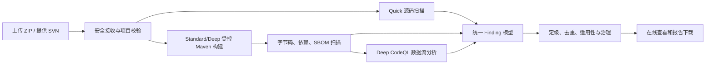

# Java 代码审计平台研究成果汇报摘要

> 汇报对象：技术管理者、项目负责人、安全与研发负责人 
> 汇报日期：2026-08-18 
> 详细版：[Java 代码审计平台研究与能力说明](java-code-audit-platform-research-report.md)

## 一、研究结论

本项目已从“调研若干开源扫描器”推进到一套可以本机部署、通过 Web/API 使用的 Java 代码审计工具。用户可以上传一个 Java Maven 项目 ZIP，或提供 SVN 地址，选择扫描档位；平台完成受控构建和多引擎扫描后，提供在线结果以及 HTML、JSON、SARIF、SBOM 和归档报告下载。

当前成果可以用以下数字概括：

| 指标 | 当前结果 |
|---|---:|
| 逻辑扫描引擎 | 15 个 |
| 实际工具家族 | 13 个 |
| 代码审计能力 | 9 类 |
| 统一问题分类 | 12 类 |
| 扫描档位 | Quick 6 / Standard 14 / Deep 15 |
| 主要目标 | Java 17 + Maven + Web 项目 |
| 部署方式 | 一个 Java 服务 JAR + 本地工具和数据目录 |
| 外部基础设施 | 不需要数据库、Redis、消息队列或 Kubernetes |
| AI 依赖 | 核心扫描、定级和报告不依赖 AI |

这 15 个引擎覆盖：Java 潜在 Bug、Web 漏洞与污点路径、代码规范、依赖漏洞、密钥泄露、重复代码、Maven 工程治理、SBOM/许可/供应链、配置与 IaC 安全。

## 二、平台由哪些扫描能力组成

| 档位 | 引擎 | 主要作用 |
|---|---|---|
| Quick | Gitleaks | 密钥、Token、私钥等泄露 |
| Quick | Semgrep | Java 危险调用和可扩展源码规则 |
| Quick | PMD | 空判断、异常、资源、API 误用等 AST 问题 |
| Quick | PMD CPD | 大段重复代码 |
| Quick | Checkstyle | 可机器判定的 Java 编码规范 |
| Quick | Trivy Repository | Docker/Kubernetes/Terraform 等配置、密钥、许可资产 |
| Standard | SpotBugs | 编译后字节码中的空指针、并发、资源和正确性 Bug 模式 |
| Standard | FindSecBugs | Java Web/框架安全 detector |
| Standard | Dependency-Check | 基于本地 NVD 数据的组件 CVE 检查 |
| Standard | OSV-Scanner | 基于 Maven 坐标的 OSV/GHSA 漏洞检查 |
| Standard | Maven Dependency Analysis | 未声明依赖和疑似未使用依赖 |
| Standard | Maven Enforcer | 依赖版本收敛等构建治理 |
| Standard | CycloneDX | 生成本次构建的软件物料清单 SBOM |
| Standard | Trivy Artifact | 使用 SBOM 和本地漏洞库检查直接/传递依赖 |
| Deep | CodeQL | 跨方法数据流、Source 到 Sink 的深度安全分析 |

Quick 不要求构建，适合上传后的快速反馈；Standard 增加 Maven 构建、字节码、依赖树和 SBOM；Deep 再增加 CodeQL，适合高风险项目或正式发布前审计。

## 三、系统如何工作

平台不是把 15 份原始报告简单打包，而是将不同工具的结果转换成统一问题模型，保留：文件和代码位置、规则、原始严重性、统一优先级、证据、组件 PURL/CVE、数据流路径、工具版本和原始产物。

当多个漏洞工具命中同一个依赖漏洞时，平台只报告一个逻辑问题，同时保留多套证据。这样既避免重复统计，也不丢失可追溯性。

## 四、扫描准确性如何理解

静态扫描器发现的是“符合风险模式的证据”，不是直接宣布“线上已经发生故障或已经可以被攻击”。需要把四件事分开：

1. 工具发现了什么模式或受影响组件；
2. 如果问题成立，技术影响多大；
3. 当前项目是否满足触发条件、路径是否可达；
4. 最终是立即修复、条件性处理、建议改进还是确认误报。

平台为此引入三个治理结论：

- `ACTIONABLE`：证据足以要求当前处理；
- `CONDITIONAL`：风险事实存在，但仍需确认触发条件；
- `ADVISORY`：低优先级改进，或当前项目不变量已降低风险。

项目曾对一次报告的 48 条 P1/P2 证据逐条复核：

- 15 条依赖漏洞证据中，受影响组件版本均真实存在；去重后为 14 个漏洞-组件组合，其中 7 个未找到触发条件，另 7 个有项目证据判定当前不适用；
- 33 条 SpotBugs 空指针证据中，25 条被当前构造/校验不变量排除，8 条是已确认的边界健壮性缺陷但正常 Web 入口暂不可达；
- 去重和治理后为 47 个逻辑问题：立即行动 0、条件性风险 15、建议项 32；
- 另有 547 条 P3 代码规范/质量结果保留为建议项，没有将其宣传为漏洞。

这说明扫描器本身有价值：它把人工很难全量检查的风险位置快速缩小；但报告必须经过统一定级、适用性和项目规则治理，不能直接用原始命中数评价代码质量。

## 五、规则如何扩展和形成自己的标准

规则治理分三层：

| 层次 | 解决的问题 | 示例 |
|---|---|---|
| 检测规则 | 扫描器找什么 | Semgrep 规则、Checkstyle module、CodeQL query |
| 组织政策 | 找到后如何定级和门禁 | 哪类 P1 阻断、哪些只检查新增代码 |
| 项目适用性 | 这条结果在当前项目是否成立 | 精确误报、触发条件、临时豁免和到期日 |

新增规则不应以“命中越多越好”为目标。正确流程是：明确真实缺陷 → 选择合适引擎 → 准备正例和安全反例 → 跑真实项目试验 → 统计确认率/误报率 → 先观察后门禁 → 在 Git 中版本化 → 定期复盘。

可以内置《阿里巴巴 Java 开发手册》相关规则，但建议做成独立的 `java-alibaba-baseline` 可选规则包：

- 排版、导入、命名、大括号等由 Checkstyle 承载；
- 集合、异常、并发和 API 误用由 PMD/SpotBugs 承载；
- 禁用 API 和框架安全用法由 Semgrep 承载；
- 跨方法安全约束由 CodeQL 承载；
- 无法可靠机器判定的设计原则仍保留为人工评审清单。

存量项目应先建立 baseline，优先管理新增违规，避免第一次上线就产生数千条规范噪声。

## 六、当前工程化程度

当前已完成的不只是扫描适配器，还包括：

- ZIP/SVN 两类源码接入；
- 单模块和 Maven reactor 多模块构建；
- 有界队列、公平调度、全局/每任务/每工具并发限制；
- 超时、取消、失败隔离、重启恢复和优雅停机；
- 工具固定版本、入口哈希校验、参数数组执行，避免 shell 注入；
- 漏洞库缺失/过期时明确不可用，不把缺库当成零漏洞；
- 密钥、凭据、Maven/SVN 敏感信息和原始报告统一脱敏；
- HTML、JSON、SARIF、SBOM、manifest、原始证据和下载归档；
- Web 上传、档位选择、状态查看和报告下载；
- 各适配器 clean/findings/partial/malformed/failure 契约和 Web/API 主路径测试；
- macOS ARM64 与 GitHub-hosted Ubuntu 22.04 x86_64 原生发布介质 E2E；完整漏洞数据库、详尽接口压力与恢复验证在 macOS ARM64 完成。

## 七、当前边界与风险提示

1. 当前核心承诺是 Java 17 + Maven；Gradle、多语言和其他 JDK 尚未纳入。
2. 静态审计不能替代渗透测试、运行时配置核查、人工架构审查和生产防护。
3. Standard/Deep 会执行 Maven 生命周期和插件。目前适合扫描自己或可信代码；若开放给不可信外部用户，必须增加容器/沙箱、网络出口和文件系统隔离。
4. NVD、Trivy、OSV 和配置 checks 都有时效性，生产必须持续更新并展示数据版本。
5. CodeQL CLI 有专门使用条款；当前不随本项目发行包再分发，部署使用前应按实际场景确认许可。
6. “没有发现问题”只能表示在本次成功覆盖的工具、规则、数据和构建范围内未发现，不能表述为绝对安全。

## 八、建议的下一步

近期重点不应是继续无限增加扫描器，而是提升结果可信度和可运营性：

1. 建立真实 Java 项目 benchmark，持续保存已确认真阳性/假阳性样本；
2. 在报告中形成确认、误报、条件性、责任人和到期日的闭环；
3. 建设高信号 Java Web 规则包和阿里规范可选规则包；
4. 持续维护完整 NVD、Trivy 双库和规则数据，建立原子更新与过期告警；
5. 在目标生产服务器上按同一介质复验全引擎、完整数据库、并发和故障恢复，并将证据归档；
6. 如果未来扫描不可信项目，再建设强隔离执行环境。

## 九、最终判断

该项目已经验证了“一个轻量 Java 服务整合多种开源扫描器，并输出统一审计报告”的路线可行。其核心竞争力不只是 15 个引擎，而是把工具、漏洞数据、构建、并发、统一证据、去重、定级、适用性和报告连成了可解释、可复核的完整链路。

现阶段可以作为内部 Java/Maven 项目的代码审计和研究工具使用；若要成为面向不可信用户的通用扫描服务，下一道关键门槛是执行隔离、持续数据运营和组织规则治理。
