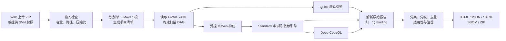

# Java 代码审计平台研究成果与扫描能力说明

> 文档版本：1.0 
> 编制日期：2026-08-18 
> 适用范围：当前 Java 17 / Maven / Web 部署版本 
> 阅读对象：管理人员、项目负责人、开发人员、测试人员和安全初学者

## 1. 文档目的

本文档说明 Java 代码审计平台已经实现了什么、各扫描组件如何工作、可以发现什么问题、扫描结果可以相信到什么程度，以及后续如何建立自己的规则体系。

它不是一份“工具广告”，也不把扫描命中数量当成安全水平。文档特别区分以下三件事：

1. **检测事实**：扫描器在源码、字节码、依赖或配置中观察到了什么；
2. **风险严重度**：如果该问题成立，可能造成多大影响；
3. **项目适用性**：在当前代码、配置和部署方式下，它是否真正可触发。

这三个问题分开回答，才是一个可用的代码审计系统，而不是一个只会“报警”的工具集合。

## 2. 一页结论

当前平台已经形成一套面向 Java 17 Maven 项目的本地多引擎代码审计能力：

| 口径 | 当前成果 |
| --- | --- |
| 逻辑扫描引擎 | **15 个** |
| 底层工具/组件家族 | **13 个** |
| 用户可理解的审计能力 | **9 组** |
| 可计数问题分类 | **12 类** |
| 资产类输出 | **1 类 SBOM**，不会把每个组件误算成问题 |
| 扫描档位 | Quick 6、Standard 14、Deep 15 |
| 输入 | 单一 Java/Maven 根项目 ZIP，或 SVN 当前/指定快照 |
| 输出 | HTML、JSON、SARIF、完整 ZIP，另含 coverage、manifest、SBOM、脱敏 raw/log |
| 部署形态 | 一个 Java 17 Spring Boot JAR + 本地工具包 + 文件数据目录 |
| 外部基础设施 | 不需数据库、Redis、MQ、Docker 或 Kubernetes |
| AI | V1 扫描和报告不依赖 AI |

这 15 个逻辑引擎不等于每次都启动 15 个完全独立的进程。PMD 和 CPD 复用同一套 PMD 发行包，Trivy Repository 和 Trivy Artifact 复用同一个 Trivy 二进制，SpotBugs 与 FindSecBugs 可复用字节码和报告处理。“15”是调度、覆盖和报告口径，不是进程数。

## 3. 小白先理解：静态代码审计到底在做什么

### 3.1 它不是“把程序跑一遍”

静态代码审计是在不实际处理业务请求的情况下，分析代码文本、语法结构、Java 字节码、Maven 依赖图和软件配置。

可以把它想象成多位分工不同的检查员：

- 有的检查员看“原始文字”，寻找密钥、危险配置或明显代码模式；
- 有的把代码转换成语法树，检查 `if`、`try`、方法调用和类结构；
- 有的看编译后的字节码，追踪空指针、异常、锁和资源流；
- 有的对照漏洞数据库，判断当前依赖版本是否落入受影响区间；
- 有的专门建立程序数据库，追踪外部输入是否最终进入 SQL、命令或文件操作。

没有一位检查员能看懂所有问题，因此需要多引擎组合。

### 3.2 扫描命中不等于已确认 Bug

例如 SpotBugs 看到 `path.getParent()` 按 Java API 契约可能返回 `null`，后续又直接使用返回值，就会报出空指针可能。如果当前系统实际传入的路径永远是 `<data>/jobs/<uuid>/...`，它就有 parent；但 SpotBugs 不一定能跨越 Spring 组装和项目目录规则证明这个业务不变量。

因此，这条命中可能属于三种情况：

| 情况 | 含义 | 应对方式 |
| --- | --- | --- |
| 真实且当前可触发 | 业务入口真的能把空值或危险数据送到该位置 | 优先修复，必要时阻断发布 |
| 真实边界缺陷，当前不可达 | 方法对合法极端参数确实会失败，但当前 Web 调用链不会这样调用 | 记为待确认/边界健壮性，安排修复 |
| 当前项目证据证明误报 | 项目不变量或主导条件保证问题不成立 | 保留审计证据，用精确、有期限的治理规则降级 |

开源工具、商业工具和 IDE Inspection 都有这个基本边界。商业产品可能有更多框架模型、调优规则和人工流程，但不会让静态分析变成百分之百的运行时事实。

### 3.3 那么扫描器的意义是什么

它的价值不是“自动代替人工下最终结论”，而是：

- 在每次发布前稳定执行人工很难穷尽的检查；
- 将数十万行代码缩小为有证据的候选问题集；
- 持续防止已知类型问题回归；
- 保留规则、工具版本、原始证据和人工结论，使审计可追溯；
- 通过历史样本逐步提高“值得人看”的比例。

## 4. 平台如何完成一次扫描

### 4.1 输入阶段

- ZIP 会检查 Zip Slip、绝对路径、符号链接、压缩炸弹、文件数和容量；
- SVN 只取一个 HEAD 或数字 revision 快照，不扫历史，不展开 externals；
- 项目必须能识别为一个 Maven 根。如果上传包含多个独立 Maven 项目，平台会要求重新打包，不猜测用户意图。

### 4.2 构建与调度阶段

Quick 引擎不要求 Maven 构建成功。Standard 和 Deep 会在服务端执行受控的 Java 17 / Maven 3.9+ 构建，固定跳过测试，不允许用户传入任意 goal、settings 或 shell 命令。

引擎按 DAG 依赖执行，受到以下并发约束：

- 全局最大并发任务数；
- 全局引擎数和每任务引擎数；
- 轻、中、重、Deep 资源权重；
- Maven、Dependency-Check、CodeQL 专用许可数；
- 超时、取消和进程树回收。

一个引擎失败不会无条件取消其他独立引擎。只要仍然存在有效证据，任务可以以 `COMPLETED_WITH_ERRORS` 生成部分报告，并明确说明未覆盖的能力。

### 4.3 归一化与报告阶段

不同工具会产生 XML、JSON、SARIF 或 Maven 日志。平台将其转换为统一 `Finding`，包括：

- 分类、P0–P3 严重度和置信度；
- 中英文标题、说明、影响和修复建议；
- 模块、项目相对路径、行号和有界代码片段；
- 引擎、版本、规则 ID、原始严重度和原始产物；
- CWE、CVE、GHSA、OSV、PURL、当前版本和修复版本；
- 真实 Source→Propagation→Sink 数据流（引擎能提供时）；
- 处置结论、适用性、理由、证据和到期时间。

报告会同时显示“原始命中数”和“去重后逻辑问题数”。这能避免三个引擎同时命中一处 SQL 注入时，被错误统计为三个独立漏洞。

## 5. 三种扫描档位

| 档位 | 逻辑引擎数 | 是否要求构建 | 定位 | 适合场景 |
| --- | ---: | --- | --- | --- |
| Quick | 6 | 否 | 源码快速广度检查 | 日常开发、上传后初筛、构建失败时保底 |
| Standard | 14 | 是 | 正式代码审计 | 发版前、定期全量审计、依赖和供应链检查 |
| Deep | 15 | 是 | 深度语义与数据流 | 核心系统、高风险代码、污点路径复核 |

### 5.1 Quick：6 个引擎

`gitleaks`、`semgrep`、`pmd`、`pmd-cpd`、`checkstyle`、`trivy-repository`。

Quick 的优点是不依赖 Maven 构建，可以很早给出源码、密钥、重复代码、规范和配置风险。它的局限是不看完整字节码和真实依赖图，不应用 Quick 的“0 问题”代替 Standard/Deep 结论。

### 5.2 Standard：Quick + 8 个引擎

`spotbugs`、`findsecbugs`、`dependency-check`、`osv-scanner`、`maven-dependency-analysis`、`maven-enforcer`、`cyclonedx`、`trivy-artifact`。

Standard 是当前推荐的默认正式审计档位。它将源码、字节码、Maven 构建、直接/传递依赖、SBOM 和制品视角结合起来。

### 5.3 Deep：Standard + CodeQL

Deep 在 Standard 完成并释放构建产物后运行 CodeQL。当前 CodeQL 使用受控 Maven 手工跟踪，经过数据库初始化、构建 trace、数据库 finalize、查询分析和 SARIF 校验。

CodeQL CLI 不进入公开介质，由部署机器本地安装，且必须确认当前使用对象符合 CodeQL Terms 或其他授权。缺失 CLI、查询包、版本不匹配或开关未开启时，Deep 会明确不可用，不会悄悄降级为 Standard。

## 6. 15 个逻辑引擎总表

| # | 引擎 ID | 工具版本 | 主要视角 | 典型问题 | 当前能力程度 | 扩展入口 |
| ---: | --- | --- | --- | --- | --- | --- |
| 1 | `gitleaks` | Gitleaks 8.30.1 | 文本/密钥模式 | Token、私钥、云凭据 | 当前快照强 | TOML 自定义 detector/allowlist |
| 2 | `semgrep` | Semgrep CE 1.170.0 | AST 代码模式 | SQL/命令拼接 | 当前规则窄而高信号 | YAML pattern/taint rule |
| 3 | `pmd` | PMD 7.26.0 | Java AST | 空判断、异常、资源、API 误用 | 中强 | XML ruleset/自定义 Java 规则 |
| 4 | `pmd-cpd` | PMD CPD 7.26.0 | Token 重复 | 复制粘贴代码 | 强，但需调阈值 | minimum tokens/路径排除 |
| 5 | `checkstyle` | Checkstyle 12.3.1 | 语法树/文本规范 | 导入、换行、括号、空白 | 确定性强，只属规范 | XML module/自定义 Check |
| 6 | `trivy-repository` | Trivy 0.73.0 | 仓库文件 | IaC/容器配置、密钥、许可资产 | 较强 | Trivy checks/Rego、平台策略 |
| 7 | `spotbugs` | SpotBugs 4.9.3 | Java 字节码/控制流 | 空指针、并发、异常、资源 | 较强 | confidence level、include/exclude filter、Detector |
| 8 | `findsecbugs` | FindSecBugs 1.14.0 | SpotBugs 安全插件 | 注入、XSS、弱加密、危险 API | Java Web 专项较强 | filter、扩展检测插件 |
| 9 | `dependency-check` | OWASP Dependency-Check 12.2.2 | 组件识别 + NVD | CVE、受影响版本 | 广度强 | NVD 数据、suppression、hint |
| 10 | `osv-scanner` | OSV-Scanner 2.3.8 | 生态坐标 + OSV | CVE/GHSA/OSV | Maven 直接依赖匹配强 | OSV 数据/输入策略 |
| 11 | `maven-dependency-analysis` | Maven Dependency Plugin 3.9.0 | 编译使用关系 | 未声明使用、已声明未使用 | 工程治理强 | 固定 goal 参数/精确例外 |
| 12 | `maven-enforcer` | Maven Enforcer 3.6.2 | Maven 依赖图规则 | dependency convergence | 工程治理强 | 受控 Enforcer rules |
| 13 | `cyclonedx` | CycloneDX Maven Plugin 2.9.3 | 软件物料清单 | 组件、版本、PURL、许可资产 | 资产底账强 | SBOM 生成参数/后续 Policy |
| 14 | `trivy-artifact` | Trivy 0.73.0 | SBOM/制品 + 漏洞库 | 直接/传递组件漏洞 | 传递依赖覆盖较强 | 漏洞库、Java DB、ignore/VEX |
| 15 | `codeql` | CLI 2.26.2 + Java Queries 1.11.7 | 语义数据库/跨方法流 | 深度污点与安全查询 | 最深，仍受模型边界影响 | QL/query pack/suite |

“强”不是统计准确率承诺，而是对当前覆盖广度、证据深度和工程成熟度的定性说明。任何真实准确率都应在具体项目真值样本集上计算，不应从工具名称推测。

## 7. Quick 六个引擎详解

### 7.1 Gitleaks：密钥与凭据泄露

**小白一句话**：它像一名熟悉各种 Token 和私钥长相的检查员，在仓库文本中找“不应该被提交的秘密”。

**当前版本与输入**：Gitleaks 8.30.1，扫描当前上传或 SVN 快照的工作目录，不扫描 SVN 历史。

**原理**：锁定版本自带的 detector 通过正则、前后文、已知凭据前缀和部分熵特征判断疑似密钥。它不会实际登录云服务验证该凭据是否仍然有效。

**可以发现**：云厂商密钥、GitHub/Slack 等 Token、私钥片段、数据库凭据和其他高置信的密钥格式。

**当前配置**：平台使用 Gitleaks 版本锁定的默认高精度 detector。曾经的“任意 password/token 长字符串”宽泛正则因为会把普通长标识符当成密钥，已经移除。执行时强制 `--redact=100`，原始 JSON 中也不允许保留明文。

**准确性边界**：

- 真实密钥、测试密钥和已失效密钥外观可能相同；
- 组织自定义 Token 格式如果不在默认 detector 内，可能漏报；
- 扫到密钥后的正确动作是立即轮换/撤销，不是仅仅删除代码中的字符串。

**扩展方式**：在 [`config/rules/gitleaks/gitleaks.toml`](../../config/rules/gitleaks/gitleaks.toml) 中增加组织自定义 detector、熵值和窄 allowlist。每个新规则必须带真密钥样例、外观相似但不是密钥的反例和脱敏回归测试。不应无条件信任被扫项目自带的 `.gitleaks.toml`，否则上传者可以自己关掉检查。

### 7.2 Semgrep CE：代码模式和轻量语义规则

**小白一句话**：它不是简单搜索字符串，而是先大致理解“这是方法调用、参数还是拼接”，再匹配危险代码形状。

**当前版本与输入**：Semgrep CE 1.170.0，直接扫描 Java 源码，不要求构建。

**原理**：将代码解析成语法结构，使用 metavariable、pattern 组合、上下文限制和可选 taint 模式检查危险 API 与数据流。

**当前真实覆盖**：平台自有默认规则当前只启用两条窄而高信号的 Java 规则：

1. SQL `executeQuery/execute/executeUpdate` 参数中出现动态字符串拼接；
2. `Runtime.getRuntime().exec(...)` 的命令中出现动态字符串拼接。

因此，不应把当前 Semgrep 默认集宣称为“已覆盖所有 Spring Web 漏洞”。工具平台具有较强扩展能力，但当前内置规则有意保守。

**准确性边界**：直接危险调用易于检测；当输入经过自定义包装、跨多个方法、反射或框架黑盒时，要么漏报，要么需要更完整的 source/sanitizer/sink 模型。一条只看“拼接”的规则也不能自动证明拼接值来自用户。

**扩展方式**：在 [`config/rules/semgrep/java-audit.yaml`](../../config/rules/semgrep/java-audit.yaml) 中增加 YAML 规则。推荐次序是：

1. 先增加危险 sink 和明确禁用 API 的高信号 pattern；
2. 再为 Spring MVC/WebFlux、JDBC/JPA、文件、URL 和命令包装建 source/sanitizer/sink 模型；
3. 每条规则必须附带可命中正例、安全参数化反例、自定义封装反例和 parser fixture；
4. 深度跨方法问题优先与 CodeQL/FindSecBugs 交叉验证，不让单条宽泛正则承担所有语义。

### 7.3 PMD：Java AST 正确性和资源规则

**小白一句话**：PMD 把 Java 源码拆成有结构的语法树，检查“这个空判断是否写反了”、“异常是否被吞掉”、“资源是否可能未关闭”。

**当前版本与输入**：PMD 7.26.0，直接扫描 Java 17 源码。

**当前规则**：[`config/rules/pmd/java-audit.xml`](../../config/rules/pmd/java-audit.xml) 精选 37 条 error-prone/best-practice 规则，包括：

- 错误空判断、对象/字符串错误比较、NaN 比较和无条件分支；
- `finally` 抛异常/返回、空 catch、异常信息/栈丢失；
- 资源关闭和 try-with-resources；
- equals/hashCode、集合类型、标准字符集、Locale 等确定性 API；
- 未使用赋值、局部变量、私有字段和方法。

默认没有整类导入主观的设计、复杂度和测试风格规则，目的是先提高正确性信号。

**准确性边界**：PMD 比纯文本规则理解更多 Java 结构，但通常没有完整运行时依赖图。反射、Spring 注入、序列化、SPI 和框架回调会让“未使用”类规则产生误报。一条 PMD 设计建议不应自动等同于 Bug。

**扩展方式**：优先通过 XML ruleset 引入已存在规则并调整属性；当团队有专用框架、分层或 API 约束时，可开发自定义 Java 规则。规则入库前应统计真阳性、假阳性和未确认样本，而不是看“新增了多少命中”。

### 7.4 PMD CPD：重复代码

**小白一句话**：CPD 不判断代码是否安全，它找的是“这几段代码是不是复制粘贴出来的”。

**原理**：将 Java 代码转成 token 序列，寻找跨文件或同文件的重复序列，比普通文本 diff 更能容忍部分空白差异。

**当前配置**：至少 100 tokens 才报告，每条 Finding 保留重复行数、token 数和全部出现位置，统一映射为 `DUPLICATION/P3`。

**可以做到的程度**：非常适合发现大段复制逻辑，但重复不一定是缺陷。生成代码、DTO、协议映射、测试数据和框架模板可能合理重复。阈值过低会被 getter/模板淹没，阈值过高则会漏掉值得抽取的中等片段。

**扩展方式**：根据真实项目分布调整 `minimum-tokens`，对 generated/test/fixture/vendor 路径设置可审计排除，对核心业务源码保持较严阈值。后续可将“同一代码片段出现的位置数”作为优先级信号。

### 7.5 Checkstyle：可确定判定的代码规范

**小白一句话**：它像一个严格的排版和写法检查员，回答“是否符合团队约定”，不回答“运行时一定会不会崩溃”。

**当前版本与规则**：Checkstyle 12.3.1（当前锁定的 JDK 17 兼容线）。[`config/rules/checkstyle/java-audit.xml`](../../config/rules/checkstyle/java-audit.xml) 当前启用 11 个具体检查：文件末换行、Tab、120 字符行长、星号/未使用导入、必要大括号、空块、一行一语句、大写 `L`、修饰符顺序和运算符空白。

**当前报告语义**：所有 Checkstyle 结果归入 `CODE_STYLE/P3`，默认为 `ADVISORY`。即使一个文件有数百条格式问题，也不应在汇报中说“发现数百个漏洞”。

**扩展方式**：可在 XML 中引入更多内置 module，也可编写自定义 Check。如果要内置《阿里巴巴 Java 开发手册》相关规则，正确方式是：

1. 先建立“手册条款→Checkstyle/PMD/Semgrep 规则”映射表；
2. 核对规则实现、版本和许可，不直接复制未审核的 IDE 插件包；
3. 将强制条款、推荐条款和参考条款分组，不用一个 severity 处理所有规范；
4. 先在存量代码上建基线，只对新增违规设门禁，避免一次产生数千条噪声。

### 7.6 Trivy Repository：仓库配置、IaC、密钥与许可资产

**小白一句话**：它的视线不只在 `.java` 文件，还会看 Dockerfile、Kubernetes、Terraform 和仓库内其他配置。

**当前版本和执行策略**：Trivy 0.73.0，以 `repo` 模式启用 `misconfig,secret,license`，固定 `--offline-scan`，不在单次扫描时访问不受控在线分支。

**可以发现**：IaC/容器配置错误、仓库密钥和许可资产。当前归一化层主要将 `Misconfigurations` 转换为 `CONFIG_IAC_SECURITY`，将 `Secrets` 转换为 `SECRET_EXPOSURE`。许可数据属于资产/策略输入，只有违反明确许可策略时才应算 Finding。

**准确性边界**：仓库配置不一定就是最终生产配置；Helm/Kustomize/变量替换后的有效值可能与源文件不同。因此它发现的是“仓库中存在的配置风险证据”，不是已对运行中集群做动态核验。Trivy 和 Gitleaks 可能同时命中一个密钥，平台会保留两份证据并尽量合并逻辑问题。

**扩展方式**：Trivy checks bundle 是动态数据，不进入 Git；可通过受控更新流程引入新 checks/Rego 策略。平台层面还需定义哪些 namespace/rule 是强制项、哪些是建议项，并对测试/示例配置设路径策略。

## 8. Standard 档：构建后分析、依赖漏洞与工程治理

Standard 在 Quick 的基础上增加 8 个逻辑引擎。它会先执行受控 Maven 构建，再让需要字节码、依赖图或 SBOM 的引擎工作。Maven 构建是公共前置阶段，不重复计入 15 个扫描引擎。

### 8.1 SpotBugs：从 Java 字节码寻找潜在 Bug

**小白一句话**：SpotBugs 不只是看源码长什么样，它查看编译后的字节码，寻找大量已知的“危险指令组合”。

**当前版本与执行条件**：SpotBugs 4.9.3，要求 Maven 构建成功并产生 `target/classes`。平台默认使用 `medium` 门槛，只接收 normal/high confidence 结果，而不是把最低置信度的所有模式全部打开。

**它如何认定一个问题**：SpotBugs 内置许多 detector。例如，一个 detector 发现某个引用在一条控制流上可能为 `null`，随后又被解引用，就生成对应 Bug Pattern。它给出的是“静态路径上存在风险”，不是在真实业务请求中已经复现的异常。

**擅长发现**：

- 空指针、错误比较、返回值误用和 API 合同错误；
- 并发可见性、锁、双重检查等常见模式；
- 流/资源未关闭和部分性能问题；
- 序列化、equals/hashCode 等 Java 正确性问题。

**为什么会误报**：字节码不总能表达 Spring 注入、不变量、外部校验、反射和容器生命周期。扫描器看到“理论路径”，但项目可能通过构造器、过滤器或工厂保证该路径永远不成立。因此 SpotBugs 的 confidence 是 detector 对模式的把握，不等于业务可达性。

**正确调优方式**：

1. 先保留 normal/high confidence，不因少量误报立刻降低全局级别；
2. 核对构建、依赖 classpath 和 generated source 是否完整，避免因分析输入残缺制造噪声；
3. 对确认不适用于本项目的精确类、方法、Bug Pattern 建过滤器或治理记录；
4. 不建议直接禁用整个 NP（空指针）类别，因为同类 detector 以后仍可能发现真问题；
5. 将当前确有风险但入口不可达的问题标成 `ADVISORY`，而不是伪装成已确认缺陷。

### 8.2 FindSecBugs：SpotBugs 的 Java 安全插件

**小白一句话**：FindSecBugs 为 SpotBugs 增加面向 Java Web 和常见框架的安全 detector。

**当前版本与执行方式**：FindSecBugs 1.14.0。它作为 SpotBugs 插件与 SpotBugs 共用一次字节码分析和同一份 XML 原始报告，平台按 `SECURITY` 分类拆成独立逻辑引擎，避免重复运行。

**擅长发现**：SQL/命令/LDAP 注入、路径遍历、弱加密、Cookie/HTTP 安全设置和部分 Spring/Servlet 安全误用。对于 SQL 注入等结果，平台会归一到 `WEB_SECURITY` 和相应 CWE。

**可以做到的程度**：它对已知框架 API 和局部数据传播很有效，但无法完整理解每个项目自定义的鉴权、清洗器、ORM 包装或跨服务调用。一个 sink 命中不能自动证明攻击者能控制参数；反过来，自定义包装过深也可能漏报。

**扩展方式**：优先使用官方 detector；项目特有的 source/sink 更适合用 Semgrep taint 或 CodeQL model 扩展。只有当模式确实依赖字节码语义且会长期复用时，才考虑开发 FindSecBugs/SpotBugs 插件。

### 8.3 OWASP Dependency-Check：用 NVD 等数据识别已知组件漏洞

**小白一句话**：它不是看业务代码是否写错，而是回答“项目带进来的第三方组件版本是否出现在已知漏洞库中”。

**当前版本与数据要求**：Dependency-Check 12.2.2。生产扫描必须使用完整、已校验、未过期的 NVD 数据库；没有数据库或只有验收用的不完整 smoke 数据时，引擎明确返回 `UNAVAILABLE`，绝不能把“没查到”报告为“零漏洞”。

**原理**：扫描依赖/JAR 的坐标、清单和特征，先识别软件组件，再与 CPE/CVE 数据匹配。平台要求依赖 Finding 至少保留 PURL、当前版本、漏洞 ID、依赖路径和数据库证据。

**擅长发现**：公开 CVE、CVSS、受影响版本和部分修复版本信息。适合离线、可追溯地使用本地 NVD 数据。

**准确性边界**：

- “版本在受影响范围内”是事实，但不等于漏洞触发路径在本系统可达；
- 组件识别/CPE 映射可能歧义，尤其是坐标不规范或内嵌/重打包 JAR；
- 漏洞数据具有时效性，数据库太旧会漏报，新映射也可能改变结果。

**扩展方式**：定期原子更新 NVD 数据，记录更新时间、数据版本和哈希；为公司内部组件增加受控映射/抑制证据；不要通过删除 CVE 规则解决误报，应在适用性层记录“组件存在、触发条件不存在”。

### 8.4 OSV-Scanner：按 Maven 坐标查询 OSV 漏洞

**小白一句话**：它把 Maven 依赖的“组织、名称、版本”拿去与 OSV 数据匹配，提供另一套漏洞来源和生态语义。

**当前版本和隐私策略**：OSV-Scanner 2.3.8。当前以在线 `osv.dev` API 检查直接 Maven 清单，并启用 `--no-resolve`；不会把项目源代码上传，只会发送包坐标和版本。传递依赖由 CycloneDX 与 Trivy Artifact 补充。

**价值**：OSV 使用生态原生版本范围，常能提供 GHSA/OSV ID、受影响区间和修复版本；与 Dependency-Check 交叉使用，可以减少单一数据源的盲区。

**准确性边界**：网络/API 失败必须算扫描失败，不能算零结果；在线数据随时间变化，同一源码在不同日期可能出现新的漏洞。直接依赖清单也不代表运行时一定加载了该组件。

**扩展方式**：如果未来要求完全离线，可引入受控 OSV 数据镜像；如果要增加完整传递依赖，优先消费 CycloneDX SBOM，而不是允许扫描器执行不受控构建逻辑。

### 8.5 Maven Dependency Analysis：声明与实际使用关系

**小白一句话**：它检查“代码用了但 pom 没直接声明”和“pom 声明了但静态看来没用”的依赖。

**当前版本与命令**：固定调用 `maven-dependency-plugin:3.9.0:analyze`，服务端控制 Maven、仓库和参数，用户不能注入 goal、settings 或任意命令。

**能发现什么**：

- used-but-undeclared：代码直接使用传递依赖，构建稳定性差；
- unused-but-declared：可能存在冗余依赖、攻击面和包体浪费。

**准确性边界**：Spring 自动装配、SPI、反射、注解处理器、JDBC driver 和运行时插件经常“源码未直接引用但确实需要”，因此 unused-declared 是典型的待人工确认项。used-undeclared 通常比 unused-declared 更具行动性。

**扩展方式**：按项目维护精确 ignore 清单并写明原因；可把 used-undeclared 设为较高优先级，把 unused-declared 默认作为 advisory；禁止通过全局关闭插件掩盖少数框架例外。

### 8.6 Maven Enforcer：依赖收敛和构建治理

**小白一句话**：它像 Maven 项目的“入场规则”，当前重点检查同一依赖是否被不同版本同时拉入。

**当前版本和规则**：固定调用 `maven-enforcer-plugin:3.6.2:enforce`，V1 内置 `dependencyConvergence`。已识别的规则失败转换为 `BUILD_GOVERNANCE` Finding；未知非零退出视为工具/进程故障。

**为什么重要**：依赖树中同一库存在多个版本时，Maven 最终选中的版本可能与开发者预期不同，引发 `NoSuchMethodError`、兼容性问题或安全修复被旧版本覆盖。

**准确性边界**：依赖不收敛是工程事实，但不一定已产生运行故障；修复时要分析 dependencyManagement、exclusion 和实际 classpath，不能简单升级任意一条边。

**扩展方式**：后续可受控增加 Maven/JDK 版本、禁止快照、重复类等 Enforcer 规则。每个组织策略应独立命名、可版本化，并区分“构建必须失败”和“报告提醒”。

### 8.7 CycloneDX Maven Plugin：生成软件物料清单

**小白一句话**：它为本次构建列一张“软件配料表”，记录用了哪些组件及版本。

**当前版本与产物**：CycloneDX Maven Plugin 2.9.3，生成 CycloneDX 1.6 JSON，并发布为报告包中的 `sbom/bom.json`。

**它不是普通 Finding 引擎**：一个 SBOM 有数百个组件是正常现象，不能把“组件数”当成“问题数”。只有某个组件被漏洞库命中、违反许可策略或违反组织策略时，才产生 Finding。

**价值和边界**：SBOM 为漏洞关联、资产盘点、交付审计和后续持续监控提供稳定输入；它描述构建解析到的组件，不自动证明所有组件都在生产运行，也不覆盖未进入 Maven 图的外部服务和基础设施。

**扩展方式**：可增加组织、许可证和 hash 属性，签名并留存 SBOM；未来可对接内部资产库或持续漏洞重评，但 V1 本身不依赖数据库服务。

### 8.8 Trivy Artifact：用 SBOM 和本地数据库检查传递依赖

**小白一句话**：CycloneDX 先生成完整配料表，Trivy 再拿配料表去查漏洞。

**当前版本和数据要求**：Trivy 0.73.0。该引擎消费受控 `sbom/bom.json`，要求 Trivy 通用漏洞库和 Java 漏洞库都已安装、通过完整性校验且未过期；少一套就明确不可用。

**价值**：无需再次执行项目构建即可检查 SBOM 中的直接和传递 Maven 组件；与 OSV、Dependency-Check 形成三源交叉证据。

**准确性边界**：三种工具命中同一 CVE 不代表三个不同问题。平台按 PURL、漏洞 ID、模块和依赖路径保守去重，报告一个逻辑问题并保留各工具证据。数据库更新时间、组件版本范围和触发条件仍需展示。

**扩展方式**：通过原子流程更新两套 DB；可扩展 severity/vendor status 解释和 VEX 适用性信息，但不能因为一份 VEX 声明就删除原始扫描证据。

## 9. Deep 档：CodeQL 跨方法语义与污点路径

### 9.1 CodeQL：把代码转成可查询数据库

**小白一句话**：CodeQL 不是用一串文本规则搜代码，它把源码、类型、调用和数据流转成数据库，再用查询回答“外部输入能否沿某条路径到达危险操作”。

**当前版本与查询集**：CodeQL CLI 2.26.2，Java query pack 1.11.7，使用官方 `java-code-scanning.qls`。CLI 按 GitHub CodeQL 条款在本机受控安装，不随本项目发行包再分发；启用前必须确认扫描目标和使用方式符合条款。

**当前生产流程**：

1. 创建临时 CodeQL 数据库；
2. 在服务器 JDK 17 和 Maven 下跟踪受控构建；
3. finalize 数据库；
4. 运行固定 query suite 生成 SARIF；
5. 验证结果和 code flow；
6. 成功后删除临时数据库，失败时也不允许把数据库归档进报告。

**擅长发现**：跨方法 SQL/命令/路径/反序列化等注入链、危险 API、复杂控制流和安全质量问题。报告可展示 Source、Propagation、Sink 代码路径，比“某一行看起来可疑”更容易复核。

**准确性边界**：

- query pack 需要知道框架的 source、sink 和 sanitizer；自定义框架没有 model 时会漏报；
- 动态反射、运行时生成代码和外部服务语义可能不可见；
- 构建不完整会降低覆盖率；
- SARIF 没有明确节点语义时，平台不会为了好看而伪造 Source/Sink。

**扩展方式**：优先通过 CodeQL model pack 建模自有 Web 参数、包装方法、清洗器和危险 API；再开发组织查询。每条自定义查询应有真实可利用正例、已清洗反例、跨方法测试和性能基线。

## 10. 九类代码审计能力如何组合

单个工具都不是“终极扫描器”。平台的价值在于让不同观察角度互相补充，并把结果放进同一个语义模型。

| 审计能力 | 主力引擎 | 补充引擎 | 当前可以回答 | 不能单独证明 |
|---|---|---|---|---|
| Java 潜在 Bug | SpotBugs、PMD | CodeQL | 是否存在已知错误模式或可疑路径 | 线上一定触发 |
| Web 漏洞/污点 | CodeQL、FindSecBugs | Semgrep | 是否有危险 API、数据流或注入证据 | 攻击者一定可利用 |
| 代码规范 | Checkstyle、PMD | Semgrep | 是否违反可机器判定的团队规则 | 代码业务设计一定差 |
| 依赖漏洞 | Dependency-Check、OSV、Trivy Artifact | CycloneDX | 哪个 PURL/版本命中哪个漏洞 | 漏洞功能一定被调用 |
| 密钥泄露 | Gitleaks、Trivy Repository | 自定义 Semgrep | 仓库是否含疑似凭据 | 凭据当前仍有效 |
| 重复/可维护性 | CPD、PMD | SpotBugs | 是否有重复块和确定性维护风险 | 一定需要重构 |
| Maven 工程治理 | Dependency Analysis、Enforcer | Maven 构建 | 是否依赖未声明、未使用或不收敛 | 最佳修复方案是什么 |
| SBOM/许可/供应链 | CycloneDX、Trivy Repository | 三个漏洞引擎 | 本次构建含哪些组件和许可资产 | 所有组件均在运行时加载 |
| 配置/IaC | Trivy Repository | Semgrep 自定义规则 | 仓库配置是否违反已知安全检查 | 线上生效配置必然相同 |

覆盖的正确理解是：平台已经覆盖 Java/Maven Web 项目主要的静态审计面，但“覆盖一个类别”不等于“该类别所有漏洞 100% 可检出”。静态分析需要与单元/集成测试、运行时配置审计、渗透测试和人工架构审查互补。

## 11. 为什么扫描结果需要一层规则治理

### 11.1 四个问题必须分开回答

每条结果至少包含四个维度：

| 维度 | 回答的问题 | 示例 |
|---|---|---|
| 检测事实 | 工具看到了什么 | `log4j-core@2.14.1` 命中 CVE-2021-44228 |
| 技术严重性 | 如果成立，潜在影响多大 | CVSS 高、可能远程代码执行 |
| 项目适用性 | 当前系统是否满足触发条件 | JndiLookup 未使用、入口不可达 |
| 处理结论 | 现在要不要改、何时改 | 条件性风险，升级依赖但不宣称已被利用 |

扫描工具最擅长第一项；规则映射可以辅助第二项；第三、第四项往往需要项目上下文和人工复核。把四项压成一个“严重/不严重”标签，是大量误解的来源。

### 11.2 平台当前统一语义

平台把各工具不同的等级映射为统一 P0/P1/P2/P3，映射版本为 `java-audit-severity-v2`。原则包括：

- 不自动产生 P0；P0 只用于已确认且需要立即处置的事件；
- 工具的 Critical/Blocker、密钥和高危依赖漏洞通常先进入 P1 待确认；
- 中等级风险进入 P2，低风险和代码规范通常进入 P3；
- 每条映射保留原始等级、映射理由和规则版本，便于以后重算。

同时使用两个项目结论轴：

- `ACTIONABLE`：当前证据足以要求修改；
- `CONDITIONAL`：组件/模式存在，但还需验证触发条件；
- `ADVISORY`：改进建议、低优先级或当前项目不变量已降低风险。

适用性进一步记录 `UNKNOWN`、`AFFECTED_VERSION`、`TRIGGER_PRESENT`、`TRIGGER_NOT_FOUND`、`NOT_AFFECTED`、`CONFIRMED_DEFECT`、`FALSE_POSITIVE`。这样，报告不会为了“降噪”删除事实，也不会把每个事实说成已确认漏洞。

### 11.3 保守去重

平台只在证据足够一致时合并结果：

- 依赖漏洞：相同 PURL、漏洞 ID、模块/依赖路径兼容；
- 源码问题：类别/规则族兼容，并且源位置或 Source/Sink 锚点一致；
- 合并后仍保留全部引擎证据、原始产物和版本。

因此 Dependency-Check、OSV 和 Trivy 同时命中 Log4j 时，用户看到的是一个逻辑漏洞和三套证据，而不是三个独立漏洞。平台不会仅凭“标题相似”跨模块强行合并。

### 11.4 48 条高优先级结果的真实复核经验

本项目曾对一次扫描中的 48 条 P1/P2 证据逐条复核：

- 15 条依赖漏洞证据：组件受影响版本事实成立；去重后为 14 个漏洞-组件组合；其中 7 个未找到触发条件，归为 `CONDITIONAL`，另 7 个有项目证据判定当前不适用，归为 `ADVISORY`；均不能据此宣称已可利用；
- 33 条 SpotBugs 空指针证据：25 条被当前项目构造/校验不变量排除，属于精确误报和 `ADVISORY`；8 条是边界健壮性缺陷，但正常 Web 接线下暂不可达，归为 `CONDITIONAL`；
- 治理和去重后形成 47 个逻辑问题：`ACTIONABLE=0`、`CONDITIONAL=15`、`ADVISORY=32`；
- 另有 547 条 P3 规范/质量结果未逐条深度复核，保留为 `ADVISORY + UNKNOWN`，没有伪装成已确认 Bug。

这次复核说明：扫描器确实发现了可验证的模式和受影响组件，但初始优先级不应直接用作修复结论。正确优化不是“把扫描关松”，而是补全适用性、精确过滤、基线和证据。

### 11.5 项目治理记录不删除原始证据

[`config/rules/finding-governance.json`](../../config/rules/finding-governance.json) 可以按精确 fingerprint 或 PURL+漏洞 ID 记录项目结论，必须包含证据、理由和到期时间。到期后重新复核；规则升级、源码位置或依赖版本变化时，旧结论不能无限沿用。

## 12. 建立自己的规则体系：三层模型

### 12.1 第一层：检测规则

回答“扫描器要找什么”。例如 Semgrep pattern、Checkstyle module、PMD ruleset、CodeQL query/model、SpotBugs filter、Trivy Rego check。

### 12.2 第二层：组织政策

回答“找到以后本组织如何定级和处理”。例如：

- 哪些规则是发布阻断项；
- 哪些只提醒新增代码；
- 哪些路径/模块适用；
- severity 如何映射；
- 哪些问题允许临时豁免、由谁批准、何时到期。

### 12.3 第三层：项目适用性

回答“这条结果在当前项目是否成立”。它记录具体证据，不反向篡改全局 detector。例如某个 Spring Bean 由框架保证非空，应该按精确 fingerprint 治理，不应全局关闭所有空指针规则。

### 12.4 各工具的扩展入口

| 工具 | 主要扩展物 | 适合做什么 | 扩展难度 |
|---|---|---|---|
| Gitleaks | TOML 规则/allowlist | 企业凭据格式、测试路径例外 | 低 |
| Semgrep | YAML pattern/taint rule | 禁用 API、框架 source/sink、分层约束 | 中 |
| PMD | XML ruleset/自定义 Java rule | AST 正确性、团队 Java 约束 | 低至高 |
| CPD | token 阈值、路径策略 | 复制代码治理 | 低 |
| Checkstyle | XML module/自定义 Check | 编码格式和确定性规范 | 低至中 |
| Trivy Repo | checks bundle/Rego/secret config | IaC、配置、许可政策 | 中 |
| SpotBugs | include/exclude filter/Detector | 字节码 Bug 模式 | 低至高 |
| FindSecBugs | filter/自定义 detector | Java 框架安全模式 | 中至高 |
| Dependency-Check | 数据/精确 suppressions | CPE/CVE 匹配例外 | 中 |
| OSV | 数据镜像/结果政策 | 生态漏洞和修复版本 | 中 |
| Maven Analysis | ignore 清单 | 反射/SPI 依赖例外 | 低 |
| Maven Enforcer | Enforcer rule | 组织构建和依赖政策 | 中 |
| CycloneDX | 插件参数/后处理政策 | SBOM 字段、许可/资产策略 | 低至中 |
| Trivy Artifact | DB/VEX/结果政策 | SBOM 漏洞、厂商状态 | 中 |
| CodeQL | model pack/query pack | 跨方法数据流和组织安全模型 | 高 |

### 12.5 一条规则正确上线的流程

1. **明确目的**：写清要防止的真实缺陷，不以“命中越多越好”为目标；
2. **确认归属**：选择最适合的引擎，不用 Checkstyle 模拟污点分析；
3. **许可与来源审查**：记录规则来源、版本、许可证和上游链接；
4. **准备样本**：至少有一个应命中正例、一个不应命中的安全反例和一个边界例；
5. **Golden 契约**：同时验证 clean、findings、partial、malformed、process failure；
6. **历史试跑**：在若干真实项目上抽样复核，计算真阳性率和主要噪声来源；
7. **分阶段启用**：先观察/Advisory，再对新增问题告警，最后才考虑门禁；
8. **版本化发布**：规则、映射、基线和变更说明一起进入 Git 审查；
9. **持续复盘**：跟踪确认率、豁免数、到期治理和扫描时长，低质量规则下线或收窄。

推荐至少记录三个指标：

- `确认率 = 确认需要处理的问题 / 已复核问题`；
- `误报率 = 明确不成立的问题 / 已复核问题`；
- `未知率 = 尚无足够证据的问题 / 已复核问题`。

不要把“未确认”全部算成误报，也不要把“受影响版本”全部算成已可利用漏洞。

## 13. 阿里巴巴 Java 开发规范如何内置

可以内置，但不应简单地“安装一个 IDEA 插件然后导出所有规则”。IDE 插件、服务端 CLI 和平台报告是三种不同运行环境，规则实现、许可和版本兼容都要重新核对。

推荐做一个独立、可选的 `java-alibaba-baseline` 规则包：

| 手册条款类型 | 推荐承载引擎 | 默认处置 |
|---|---|---|
| 命名、导入、空白、大括号、行长 | Checkstyle | P3/Advisory |
| equals、集合、异常、日期、并发 API | PMD/SpotBugs | P2/P3，按规则验证 |
| 禁用危险 API、框架用法 | Semgrep | P2，先观察 |
| 复杂跨方法安全要求 | CodeQL | P1/P2，需代码路径 |
| Maven 依赖和构建约束 | Enforcer | 组织策略决定是否阻断 |
| 无法机器可靠判断的设计原则 | 人工评审清单 | 不伪造成静态规则 |

落地步骤：

1. 对手册版本建立条款编号和原文摘要；
2. 标注“强制/推荐/参考”和是否可机器判定；
3. 映射到已有规则，避免重复造轮子；
4. 缺失项再开发自定义规则；
5. 为存量代码建立 baseline，默认只阻断新增的高信号强制条款；
6. 报告同时展示“阿里条款编号”和底层引擎规则 ID，方便解释；
7. 每次手册或引擎升级都重新跑正反例和真实项目回归。

## 14. 推荐的生产配置基线

| 方面 | 推荐默认值 | 原因 |
|---|---|---|
| 日常扫描 | Quick | 无需构建，反馈快，适合上传后快速发现明显风险 |
| 正式审计 | Standard | 加入字节码、依赖树、SBOM 和三源依赖漏洞检查 |
| 高风险/发布审计 | Deep | 在 Standard 上增加跨方法 CodeQL 数据流 |
| SpotBugs | `medium`，normal/high confidence | 保留有效 Bug 覆盖并控制低置信噪声 |
| Checkstyle | 全部 P3/Advisory，存量建 baseline | 代码规范不应冒充漏洞 |
| CPD | 100 tokens 起，排除生成代码需留痕 | 避免小片段重复噪声 |
| 依赖漏洞 | 显示原始 CVSS + 统一优先级 + 适用性 | 版本事实与可利用性分开 |
| 漏洞库 | 完整、校验、原子更新、过期即不可用 | 防止“缺库=零漏洞” |
| 密钥 | 原始报告 100% 脱敏，精确 allowlist | 防止报告再次泄密 |
| 自定义规则 | 先观察、后新增门禁、再全量门禁 | 用真实确认率控制噪声 |
| 抑制/豁免 | 精确范围、证据、责任人、到期日 | 防止永久静默风险 |
| 报告 | 候选/逻辑问题/治理结论分开统计 | 领导和开发看到一致口径 |

## 15. 当前实现与验证达到的程度

当前项目不是只把若干 CLI 名字列在文档里，而是已实现统一适配、调度、报告和 Web/API 接入：

- ZIP 上传和 SVN 地址两种源码入口；
- JDK 17、Maven 项目，支持单模块和 reactor 多模块；
- Quick/Standard/Deep 三档及按工具健康状态计算可用性；
- 有界队列、公平 DAG 调度、全局/每任务/每工具许可、取消、超时和优雅停机；
- 每个适配器使用参数数组而非 shell 拼接，固定工具版本和入口完整性；
- HTML、JSON、SARIF、manifest、SBOM、脱敏 raw/log 和不可变下载归档；
- 统一分类、等级、指纹、代码片段、证据、保守去重和规则治理；
- Web 页面可上传 ZIP、选择档位、查看进度并下载最终报告；
- macOS ARM64 与 GitHub-hosted Ubuntu 22.04 x86_64 均已完成原生发布介质 E2E；完整 NVD 生产数据库、详尽接口压力与恢复验证在 macOS ARM64 完成；
- 适配器的 clean/findings/partial/malformed/failure 契约及 Web/API 主路径已有自动化测试。

测试通过只能证明“当前受测契约和样本符合预期”，不等于所有真实项目都不会出现新解析边界。每次工具、规则和漏洞库升级仍需回归。

## 16. 当前边界和不应对外夸大的内容

1. **这是静态审计平台，不是运行时防护系统**：不替代 DAST、渗透测试、WAF、生产配置核查和人工威胁建模。
2. **V1 主要面向 Java 17 + Maven**：Gradle、其他 JDK 和多语言不在当前承诺范围。
3. **可信代码前提**：Standard/Deep 会执行 Maven 生命周期和插件。当前为宿主机工具包模式，没有把不可信上传放入强隔离沙箱；扫描任意外部恶意项目时需先引入容器/沙箱、网络和文件系统限制。
4. **数据库有时效性**：NVD、Trivy、OSV 和 checks bundle 必须更新、校验和展示版本；扫描结果对应的是当时数据快照。
5. **规则不是越多越好**：当前 Semgrep/Checkstyle/PMD 默认集有意偏高信号。扩展覆盖必须同时承担误报、性能和维护成本。
6. **CodeQL 有使用条款**：本项目开源不自动等于任意分发/任意目标均许可，应按实际使用场景核对 GitHub CodeQL Terms。
7. **许可数据不是漏洞**：SBOM/许可资产需叠加明确组织政策后才形成违规 Finding。
8. **“没有发现”不是“绝对安全”**：只能表达在当前源码、构建、规则、数据和工具成功覆盖范围内未发现。

## 17. 下一阶段优化路线

### 第一阶段：把准确性闭环做成日常机制

- 在报告页面增加确认、误报、条件性、责任人、到期日的轻量反馈；
- 建立真实项目小型 benchmark，保存已确认真/假样本；
- 按引擎、规则族统计确认率、未知率和扫描耗时；
- 对 547 条 P3 抽样复核，先收敛高频噪声，再扩大规范规则。

### 第二阶段：建设组织规则包

- 发布 `java-web-high-confidence` Semgrep/CodeQL model pack；
- 建立 `java-alibaba-baseline` 映射和正反例；
- 为 Spring/SPI/反射常见场景完善 PMD/Maven Analysis 精确例外；
- 建立 Trivy IaC 组织策略和 Maven Enforcer 组织策略。

### 第三阶段：提高交付与安全隔离

- 在目标生产服务器上按 Ubuntu 22.04 x86_64 介质复验全引擎、完整漏洞库、并发和恢复，并归档现场证据；
- 为不可信源码增加容器/沙箱、只读工具包、临时 Maven 仓库、网络出口控制；
- 对规则包、工具包和数据包建立发行签名与顶层不可变 manifest；
- 在需要时增加差量扫描和“只阻断新增问题”能力。

## 18. 常见术语

| 术语 | 小白解释 |
|---|---|
| AST | 把源码拆成“类、方法、判断、调用”等结构后的语法树 |
| 字节码 | Java 源码编译后的 `.class` 指令，SpotBugs 主要分析它 |
| 污点分析 | 追踪外部输入是否经过传播到达危险操作 |
| Source/Sink/Sanitizer | 输入来源/危险终点/安全清洗步骤 |
| Finding | 扫描器提交的一条问题证据，不自动等于已确认 Bug |
| PURL | 标准化的软件包坐标，例如 Maven group/artifact/version |
| CVE/CVSS | 漏洞编号/通用严重性评分 |
| SBOM | 软件物料清单，即本次构建使用的组件配料表 |
| SARIF | 多种静态分析工具通用的 JSON 报告格式 |
| Golden fixture | 固定输入和固定期望输出，用于防止解析/规则升级悄悄改变语义 |
| Baseline | 已知存量问题快照，用于把治理重点放到新增问题 |
| False Positive | 检测模式命中，但经证据确认在当前项目不成立 |

## 19. 项目内事实来源

本报告以当前仓库中的可执行配置、manifest、测试和验收记录为事实来源，重要入口包括：

- 三档配置：[`config/profiles`](../../config/profiles/)
- 规则与治理：[`config/rules`](../../config/rules/)
- 工具与数据清单：[`tools/manifest`](../../tools/manifest/)
- API 契约：[`docs/v1/api-contract.md`](../v1/api-contract.md)
- 规则治理实施记录：[`docs/v1/rule-governance-implementation-report-2026-08-13.md`](../v1/rule-governance-implementation-report-2026-08-13.md)
- 高优先级问题复核：[`docs/v1/actionable-findings-triage-2026-08-13.md`](../v1/actionable-findings-triage-2026-08-13.md)
- V1 验收证据：[`docs/v1/acceptance-evidence.md`](../v1/acceptance-evidence.md)
- 当前 Web 使用说明：[`web-ui/README.md`](../../web-ui/README.md)

## 20. 结论

当前平台已形成 **15 个逻辑扫描引擎、13 个工具家族、9 类代码审计能力、12 类统一问题模型和 1 类 SBOM 资产**。它已经覆盖 Java/Maven Web 项目中最常见的源码 Bug、安全污点、密钥、依赖漏洞、配置/IaC、代码规范、重复代码、构建治理和供应链资产场景。

研究成果最重要的结论不是“接入工具越多越安全”，而是建立了一条可重复、可解释的工程链路：**固定工具与数据 → 受控执行 → 统一证据 → 保守去重 → 严重性和适用性分离 → 可到期治理 → 可下载报告**。后续优化应围绕真实确认率、组织规则包、漏洞数据新鲜度和不可信代码隔离展开，而不是简单把更多默认规则一次性全部打开。
