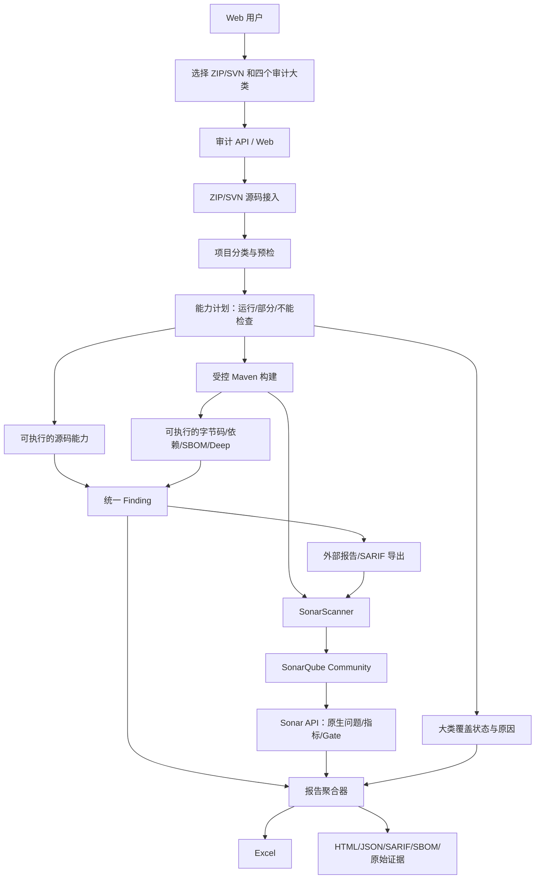
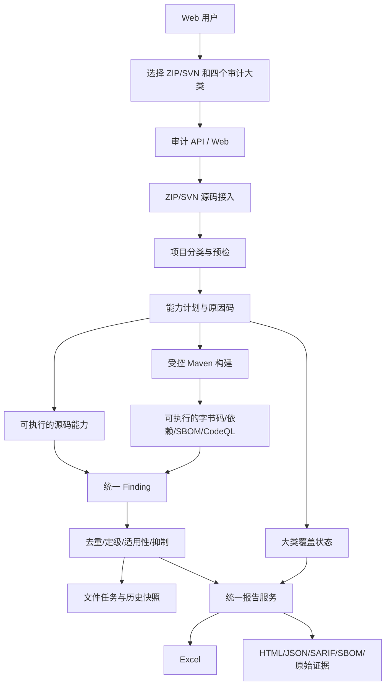

# SonarQube Community 与现有 15 引擎收敛决策及两种落地方案

日期：2026-08-20  
状态：讨论基线，尚未据此删除生产引擎  
适用范围：Java 17、Maven、ZIP/SVN 源码接入、SonarQube Community Build

# 第一部分：SonarQube 与 15 引擎的能力重合和收敛

## 1. 文档目的

本文第一部分回答四个问题：

1. SonarQube Community 与现有 15 个逻辑扫描引擎分别重合在哪里；
2. 哪些引擎可以考虑移除，哪些只能精简规则，哪些不能移除；
3. 外部扫描结果进入 SonarQube 后，哪些信息仍必须由统一审计报告保留；
4. 如果后续采用“SonarQube + 外部扫描器 + Excel 审计报告”，现有引擎应如何收敛。

本文只形成能力和产品决策，不在本次提交中修改扫描档位、适配器、规则或 API。

## 2. 先统一三个口径

### 2.1 “能够导入”不等于“SonarQube 自己能够检测”

SonarQube Community 可以导入 SpotBugs、FindSecBugs、PMD、Checkstyle 等报告，也可以导入 Generic External Issues 和 SARIF。导入后，问题能够出现在 SonarQube 项目中并参与 Quality Gate，但实际检测仍由外部工具完成。

因此，不能因为 SonarQube 页面能够展示 SpotBugs 问题，就认为 SpotBugs 已经可以删除。

### 2.2 “检查类别相同”不等于“检测实现相同”

例如 SonarJava 和 SpotBugs 都能报告空指针，但两者分析对象不同：

- SonarJava 主要使用源码语法树、类型和语义模型；
- SpotBugs 分析 Maven 构建后产生的 JVM 字节码；
- 同一问题被两者命中可以提高证据可信度；
- 只有一个工具命中也不必然表示误报或漏报，可能是分析层次不同。

### 2.3 SonarQube 的问题模型不能完整承载所有审计数据

有明确文件和行号的 Bug、规范和代码漏洞很适合进入 SonarQube。以下内容即使能够映射成摘要问题，也不能只保存在 SonarQube：

- PURL、直接/传递依赖和完整依赖路径；
- SBOM 组件关系；
- CVE 的多个数据源、修复版本和适用性证据；
- Source、Propagation、Sink 的完整污点路径；
- 漏洞库版本、规则包版本、工具版本和原始报告哈希；
- 扫描器失败、超时、不可用、部分成功和未覆盖原因；
- 原始日志、SBOM 和审计归档。

这些信息必须继续进入平台统一 Finding、Excel 报告和原始证据归档。

## 3. 结论摘要

现有 15 个引擎不应因为接入 SonarQube 而整体替换，但也不代表 15 个都必须进入默认扫描。建议分为五类处理：

| 决策 | 引擎 | 数量 | 结论 |
| --- | --- | ---: | --- |
| 验证后可下线 | PMD CPD | 1 | SonarQube 已提供重复代码块、重复行和重复率；完成同源验证后可取消独立 CPD Finding |
| 保留但收缩规则 | PMD、Checkstyle、Semgrep、Trivy Repository | 4 | 关闭与 Sonar 重复的通用规则，保留组织规范、安全、框架和 IaC 增量 |
| 保留为互补证据 | Gitleaks、SpotBugs、FindSecBugs、CodeQL | 4 | 与 Sonar 有类别交集，但在规则定制、字节码、安全或污点深度上不可替代 |
| 默认必须保留 | Dependency-Check、OSV-Scanner、CycloneDX、Trivy Artifact | 4 | Community Build 不具备对应的完整依赖漏洞和 SBOM 能力 |
| 退出默认、按需启用 | Maven Dependency Analysis、Maven Enforcer | 2 | 依赖冲突、声明使用和构建约束不属于首版四大类；仅在组织有工程治理需求时启用 |

按照该建议，近期目标不是从 15 个引擎一次性削减到很少，而是：

```text
SonarQube Community
  + 12 个默认外部逻辑引擎（CPD 验证下线，Maven 两项退出默认后）
  + 2 个可选工程健康引擎
  + 精简后的规则包
  + 统一 Finding、Excel 和原始证据归档
```

总共仍可安装 14 个外部逻辑引擎，默认四类的候选池只包含其中 12 个；实际每次运行还要受所选大类、项目形态和服务器深度策略约束。逻辑能力数量不代表独立进程数量；SpotBugs/FindSecBugs、SBOM/Trivy 等仍可复用构建或产物。

## 4. 逐引擎重合与处置矩阵

| # | 当前引擎 | 主要能力 | SonarQube Community 原生重合 | 重合程度 | 推荐处置 | 主要原因 |
| ---: | --- | --- | --- | --- | --- | --- |
| 1 | Gitleaks | Token、私钥、云凭据和高熵 Secret | 内置 Secret 检测 | 中 | 保留 | Gitleaks 支持自定义规则、allowlist 和 Git 历史；Community 不支持公司自定义 Secret Pattern |
| 2 | Semgrep | Java/Spring 安全规则、危险 API、组织自定义规则 | 部分源码安全和质量规则 | 中 | 保留并收缩 | 保留 Spring、MyBatis、文件上传、命令执行和内部 API 规则；关闭通用规范重复项 |
| 3 | PMD | AST Bug、复杂度、资源、设计和规范 | Java 可靠性、可维护性规则 | 高 | 保留并收缩 | Sonar 作为通用质量主源；PMD 只保留独有规则和组织扩展 |
| 4 | PMD CPD | 复制粘贴代码块 | 重复块、重复行、重复率和新代码重复率 | 很高 | 验证后下线 | 当前最明确的重复能力；应统一计数口径，避免同一复制问题双份 Finding |
| 5 | Checkstyle | 格式、命名、Import、注释、团队规范 | 部分编码规范和可维护性规则 | 高 | 保留并收缩 | 阿里 Java 规范和公司格式规则仍需要独立规则包；纯格式默认降为 Advisory |
| 6 | Trivy Repository | Secret、Docker/Kubernetes/Terraform 和仓库配置 | 内置 Secret、部分 IaC 语言规则 | 中 | 保留并收缩 | Trivy 继续作为 IaC 和云原生安全主源；普通规范不重复启用 |
| 7 | SpotBugs | 字节码正确性、空指针、并发、资源问题 | Java 可靠性和部分 Bug | 高 | 保留 | 字节码分析层次不可被源码规则完全替代；可作为 SonarJava 交叉证据 |
| 8 | FindSecBugs | Java Web、框架和危险 API 安全 detector | 部分安全规则和 Hotspot | 中 | 保留 | Community 缺少完整 Injection Vulnerabilities Detection 和 Advanced SAST |
| 9 | Dependency-Check | NVD/CPE 依赖漏洞 | 无完整 SCA | 低 | 必须保留 | 提供 CVE、CVSS、CPE 和本地 NVD 证据；Sonar 只能承载摘要问题 |
| 10 | OSV-Scanner | OSV/GHSA/CVE、生态坐标和修复版本 | 无完整 SCA | 低 | 必须保留 | 补充 Maven 生态漏洞和修复版本；与 NVD 形成不同数据源证据 |
| 11 | Maven Dependency Analysis | 使用未声明、声明未使用依赖 | 无 | 无 | 退出默认、按需启用 | 属于工程健康而非代码漏洞；Spring、SPI 和反射场景还可能产生噪声 |
| 12 | Maven Enforcer | 依赖收敛、禁用依赖、版本约束 | 无 | 无 | 退出默认、按需启用 | 只有组织已经定义 JDK、禁用组件或依赖收敛政策时才有明确业务依据 |
| 13 | CycloneDX | 生成组件、版本、关系和许可证 SBOM | 无完整 SBOM 模型 | 无 | 必须保留 | 是供应链资产底账和 Trivy Artifact 的输入，不应按 Finding 计数 |
| 14 | Trivy Artifact | 基于 SBOM/制品的依赖漏洞 | 无完整 SCA | 低 | 必须保留 | 提供独立漏洞库交叉验证和 Java DB；完整组件证据保留在 Excel/归档 |
| 15 | CodeQL | 跨方法数据流、Source 到 Sink、高级安全查询 | 部分代码安全规则 | 中 | 保留 | Community 无法替代高级污点和路径证据；继续作为 Deep 档位 |

## 5. 按能力域确定主引擎和补充引擎

接入 SonarQube 后，应明确每个能力域的“主来源”，避免多个工具都把相同问题当作独立主问题。

| 能力域 | 主来源 | 补充/交叉证据 | SonarQube 中的呈现 |
| --- | --- | --- | --- |
| Java 通用可靠性 | SonarJava | SpotBugs、PMD | Sonar 原生问题；外部独有问题导入，重复命中合并证据 |
| 通用可维护性 | SonarJava | 精简后的 PMD | Sonar 原生为主，PMD 只导入独有规则 |
| 代码规范 | Checkstyle 组织规则包 | SonarJava、精简后的 PMD | 通用规则由 Sonar；阿里/公司规则作为外部问题 |
| 重复代码 | SonarQube | CPD 仅在迁移期对照 | 最终只保留 Sonar 重复指标，不再生成 CPD 独立问题 |
| Java Web 安全 | CodeQL、FindSecBugs、Semgrep | SonarJava 安全规则 | SARIF/外部问题导入；Excel 保留完整路径和适用性 |
| Secret | Gitleaks | Sonar Secret、Trivy Repository | Gitleaks 为主；同文件同凭据类型保守去重，明文统一脱敏 |
| IaC/配置安全 | Trivy Repository | Semgrep、Sonar IaC | Trivy 为主；代码位置明确的问题导入 Sonar |
| 依赖漏洞 | Dependency-Check、OSV、Trivy Artifact | 三数据源互证 | Sonar 只显示组件漏洞摘要；Excel 保留 PURL、路径和数据库证据 |
| 工程健康（可选） | Maven Dependency Analysis、Enforcer | 无 | 默认不运行；启用时映射到 `pom.xml`，不冒充安全漏洞 |
| SBOM 组件清单 | CycloneDX | Trivy Artifact | 作为依赖漏洞的后台输入和证据，不按普通 Issue 计数；进入 Excel、manifest 和归档 |

## 6. 可以去掉什么

### 6.1 PMD CPD：唯一明确的下线候选

SonarQube Community 已经提供：

- 重复代码块数量；
- 重复代码行数量；
- 重复行密度；
- 新代码重复率；
- 可用于 Quality Gate 的重复率条件。

CPD 和 Sonar 的计数单位不同：CPD 倾向于 clone group，Sonar 使用重复块、行和密度。因此不能直接比较“25 条 CPD Finding”和“63 个 Sonar 重复块”，但两者表达的是同一类治理事实。

建议下线步骤：

1. 在相同源码、相同排除路径下同时执行 Sonar 与 CPD；
2. 确认当前 benchmark 中有维护价值的复制片段均能被 Sonar 展示；
3. Excel 改用 Sonar 重复块、重复行和重复率，不再把每个 CPD clone group 当作漏洞；
4. 保留 CPD 原始能力一个过渡版本；
5. 完成报告、档位、测试和文档口径调整后再删除适配器。

只有满足以下条件才允许正式下线：

- 没有经过人工确认的高价值 CPD 独有 Finding 丢失；
- Sonar 重复指标已经进入 Excel 和 Quality Gate；
- ZIP、SVN、单模块和多模块样本都通过对比；
- API、报告和验收不再硬编码 Quick 6、Standard 14、Deep 15 的旧数量；
- 原始 CPD 报告不再是任何合规交付的强制证据。

### 6.2 Checkstyle：只在不需要组织规范时才可能进一步下线

如果未来明确不需要阿里 Java 规范、公司命名、Import 顺序、行长和格式门禁，可以再评估移除 Checkstyle。但当前需求包含“建立自己的规则”和“可能内置阿里 Java 规范”，因此本阶段不能去掉。

正确做法是将其收缩为独立规则包：

```text
java-company-baseline
java-alibaba-baseline（可选）
```

纯格式结果默认进入 `CODE_STYLE / ADVISORY`，不与漏洞数量相加。

## 7. 默认保留与按需能力

### 7.1 依赖漏洞三引擎不能由 SonarQube Community 替代

Dependency-Check、OSV 和 Trivy Artifact 虽然都可能命中同一个 CVE，但其数据源和证据不同：

- Dependency-Check：NVD/CPE/CVSS 证据；
- OSV：生态包坐标、OSV/GHSA 和修复版本；
- Trivy Artifact：基于 SBOM 和 Trivy Java/通用漏洞库的独立匹配。

正确方向是统一组件、PURL、漏洞 ID 和依赖路径后去重，而不是删除到只剩一个数据源。

SonarQube 中只导入摘要，例如：

```text
HIGH：log4j-core 2.14.1 存在 CVE-2021-44228
位置：pom.xml
```

Excel 和原始归档继续保留完整依赖路径、修复版本、数据源、数据库时间和适用性结论。

### 7.2 CycloneDX 不能去掉

CycloneDX 输出的是本次构建的软件物料清单，不是普通问题列表。它承担：

- 直接和传递依赖资产底账；
- 组件版本和 PURL；
- 许可证和组件关系；
- Trivy Artifact 等供应链扫描的标准输入；
- Excel 的 SBOM 工作表和审计归档。

SonarQube Community 没有等价的完整 SBOM 资产模型。

### 7.3 Maven Dependency Analysis 和 Enforcer 退出默认扫描

两者负责构建治理而非源码规则：

- 已使用未声明依赖；
- 已声明未使用依赖；
- 依赖版本收敛；
- 禁用组件和构建版本约束。

这些能力不是当前“上传代码、完成四类审计、下载报告”的必需项：

- 依赖冲突主要是运行稳定性和工程质量问题，不等于已知漏洞；
- 声明未使用依赖在 Spring、SPI、反射和插件机制中可能出现误报；
- 构建约束必须先有组织自己的 JDK、禁用组件和版本政策，否则缺少判断依据。

因此两者保留为未来可选的“工程健康检查”，不随四个默认大类执行，也不进入默认风险总数。只有管理员配置了组织规则后才启用，并在 Excel 中单独展示。

### 7.4 CodeQL 不能由 Community Build 替代

SonarQube Community 能提供部分安全规则，但当前官方能力边界不包含完整 Advanced SAST 和 Injection Vulnerabilities Detection。CodeQL 的主要增量是：

- 跨方法数据流；
- Source、Propagation、Sink；
- SQL/命令/路径等注入类路径；
- 可扩展查询和框架模型；
- SARIF 路径证据。

CodeQL 继续作为 Deep 能力。Sonar 中展示摘要，Excel 和原始 SARIF 保留完整路径。

### 7.5 SpotBugs、FindSecBugs 和 Gitleaks 不能因“界面已能显示”而删除

- SpotBugs 提供字节码视角；
- FindSecBugs 提供 Java Web/框架安全 detector；
- Gitleaks 提供可定制 Secret 规则和可选 Git 历史扫描；
- SonarQube 只是其中部分结果的统一展示和治理入口。

## 8. 需要精简哪些规则

### 8.1 PMD

建议关闭与 Sonar 重复的通用命名、基础复杂度和普通代码味道规则，保留：

- Sonar 没有或项目实测有增量的正确性规则；
- 资源和异常处理增量；
- 组织自定义规则；
- 经独立正反例验证的规则。

### 8.2 Checkstyle

建议保留：

- 阿里 Java 规范中可机器判定的规则；
- 公司命名、Import、禁用 API 和文件组织规范；
- 必须统一的格式规则。

行长、换行和花括号等结果默认不进入高风险统计。

### 8.3 Semgrep

建议关闭通用代码味道和格式规则，保留：

- Spring MVC、Spring Security；
- JDBC、MyBatis 和 SQL 构造；
- 文件上传、路径和命令执行；
- 反序列化、SSRF 和危险外部调用；
- 公司内部危险 API 和禁止调用；
- 上传零散 Java 源码时不依赖构建的安全规则。

### 8.4 Trivy Repository

建议明确其主职责为：

- Docker、Kubernetes、Terraform 等 IaC 安全；
- 仓库 Secret 补充；
- 云原生配置问题。

不与 Sonar 的普通代码质量规则竞争主来源。

## 9. SonarQube 导入与统一报告策略

### 9.1 适合进入 SonarQube 的问题

- 有源码文件和行号的 Bug；
- 代码规范和可维护性问题；
- Secret 的脱敏位置；
- Semgrep、FindSecBugs、CodeQL 的代码漏洞；
- 能合理映射到 `pom.xml` 的第三方依赖漏洞摘要；可选工程健康能力启用后，其结果必须与漏洞分开。

官方直接支持的 Java 外部报告包括 SpotBugs、FindSecBugs、PMD 和 Checkstyle。其他结果优先使用 SARIF 2.1.0，其次转换为 Sonar Generic External Issues。

### 9.2 不按普通 Sonar Issue 处理的数据

- CycloneDX SBOM；
- JaCoCo 覆盖率原始报告；
- 工具和漏洞数据库版本；
- 失败、超时、不可用和跳过状态；
- manifest、日志和原始报告；
- 完整依赖树和污点路径附件。

### 9.3 外部规则治理仍由平台负责

SonarQube 可以展示和处理外部问题，但外部规则不会进入 Sonar Quality Profile；在 Sonar 中标记 False Positive，也不会自动同步回外部扫描器。

因此仍需保留平台侧：

- 引擎规则包版本；
- 规则启停和严重性映射；
- suppression、理由和过期时间；
- 跨引擎去重；
- ACTIONABLE、CONDITIONAL、ADVISORY、FALSE_POSITIVE；
- Excel 和归档的统一统计口径。

## 10. 建议的迁移顺序

### 阶段一：接入但不删除

1. 保持 15 引擎执行不变；
2. 将适合的问题导入 SonarQube；
3. Excel 同时读取统一 Finding 和 Sonar 指标；
4. 建立同源码、同规则族、同位置的重合统计。

### 阶段二：规则收缩

1. SonarJava 成为通用可靠性和可维护性主来源；
2. PMD、Checkstyle、Semgrep、Trivy Repository 关闭重复规则；
3. 观察真实项目和独立 benchmark 中是否损失有效问题；
4. 更新 Quality Gate 和 Excel 分类。

### 阶段三：下线 CPD

1. 完成重复代码同源验证；
2. Excel 改用 Sonar 重复率和重复块数据；
3. 修改 Quick/Standard/Deep 引擎数量口径；
4. 删除 CPD adapter、工具包入口和对应测试；
5. 保留迁移前后对比证据。

### 阶段四：持续治理

1. 用独立真值 Benchmark 验证规则升级；
2. 按确认率和使用价值继续收缩低信号规则；
3. 不以“问题数量减少”作为唯一优化目标；
4. 不因两个工具重合就删除具有独立分析层次的引擎。

## 11. 目标能力组合

建议的目标组合如下：

| 层次 | 组件 | 职责 |
| --- | --- | --- |
| 日常质量中心 | SonarQube Community | SonarJava、复杂度、重复率、代码页面、趋势、Quality Gate |
| 源码与字节码补充 | PMD、Checkstyle、SpotBugs | 组织规范、AST 增量、字节码交叉证据 |
| 代码安全 | Semgrep、FindSecBugs、CodeQL | 快速安全模式、Java detector、深度污点路径 |
| Secret/IaC | Gitleaks、Trivy Repository | 凭据、Token、容器和基础设施配置 |
| 依赖漏洞 | Dependency-Check、OSV、Trivy Artifact | NVD、OSV、Trivy 多数据源证据与修复版本 |
| 工程健康（可选） | Dependency Analysis、Enforcer | 默认关闭；按组织需要检查依赖声明、收敛和构建政策 |
| 依赖组件清单 | CycloneDX | 为漏洞识别提供 SBOM、组件、版本、关系和许可证底账，不产生问题等级 |
| 正式交付 | 统一 Finding、Excel、原始归档 | 去重、定级、适用性、覆盖说明和完整证据 |

## 12. 最终决策

当前建议可以概括为：

1. **可以去掉**：PMD CPD，但必须经过同源项目、零散源码、单模块和多模块样本验证后再下线；
2. **不能直接去掉但应精简**：PMD、Checkstyle、Semgrep、Trivy Repository；
3. **默认不能去掉**：Gitleaks、SpotBugs、FindSecBugs、Dependency-Check、OSV、CycloneDX、Trivy Artifact、CodeQL；
4. **退出默认、按需启用**：Maven Dependency Analysis、Maven Enforcer；
5. **SonarQube 的定位**：日常代码质量、统一在线查看、趋势和 Quality Gate；
6. **现有平台的保留价值**：外部引擎执行、漏洞数据、统一 Finding、跨工具去重、适用性治理、Excel 和证据归档。

因此，SonarQube Community 与现有平台不是二选一。正确的收敛方向是减少重复规则和重复统计，同时保留不同分析层次、安全数据源和正式审计证据。

## 13. 参考资料

项目内证据：

- [自研 15 引擎扫描器与 SonarQube 同源对比及 Codex 独立复核](scanner-vs-sonarqube-comparison-2026-08-19.md)
- [V1 代码审计能力矩阵](../v1/capability-matrix.md)
- [Java 代码审计平台研究成果汇报摘要](executive-summary.md)
- [SonarQube 与平台能力矩阵](sonarqube-vs-audit-platform-capability-matrix.csv)

SonarSource 官方资料：

- [Community Build 功能对比](https://docs.sonarsource.com/sonarqube-community-build/feature-comparison-table)
- [Community Build 外部问题说明](https://docs.sonarsource.com/sonarqube-community-build/analyzing-source-code/importing-external-issues/about-external-issues)
- [Generic External Issues](https://docs.sonarsource.com/sonarqube-community-build/analyzing-source-code/importing-external-issues/generic-issue-import-format)
- [SARIF 报告导入](https://docs.sonarsource.com/sonarqube-community-build/analyzing-source-code/importing-external-issues/importing-issues-from-sarif-reports)
- [Java 分析和字节码要求](https://docs.sonarsource.com/sonarqube-community-build/analyzing-source-code/languages/java)

# 第二部分：两种开发、架构和部署方案

## 14. 第二部分解决的问题

在完成能力重合分析后，还需要决定平台最终采用哪种产品架构：

1. **方案 A：自研扫描执行与报告层 + SonarQube Community**；
2. **方案 B：纯自研扫描器平台**。

两种方案都需要满足相同的用户入口和交付目标：

```text
输入：一个 ZIP 或一个 SVN 地址 + 用户选择的审计大类
处理：识别项目形态、计算可检查能力、构建、扫描、归一化、去重和治理
输出：各大类检查状态、不能检查的原因、完整 Excel、HTML/JSON/SARIF、SBOM 和原始证据 ZIP
```

两种方案的差别不在是否使用外部扫描器，而在于谁负责通用代码质量、在线问题管理、趋势和 Quality Gate。

## 15. 两种方案应使用同一评价口径

两种方案可以由不同仓库、不同代码和不同部署体系实现，但应使用同一组输入分类、结果字段和验收指标。这样最终比较的是两套产品的真实能力，而不是两个无法对齐口径的演示结果。

### 15.1 页面只展示四个审计大类

用户不需要理解 SpotBugs、Semgrep、CodeQL 或 Trivy 的区别。页面建议使用四个可多选的卡片：

| 大类代码 | 页面名称 | 用户容易理解的说明 | 典型问题 |
| --- | --- | --- | --- |
| `RELIABILITY` | 缺陷与稳定性 | 查找可能导致程序出错、崩溃或行为异常的问题 | 空指针、资源泄漏、错误并发、错误返回值、异常处理缺陷 |
| `SECURITY` | 安全与敏感信息 | 查找攻击者可能利用的代码漏洞和泄露风险 | SQL/命令注入、路径穿越、弱加密、硬编码密码、Token 泄露、危险配置 |
| `QUALITY` | 质量与规范 | 查找影响可读性、可维护性和团队规范的问题 | 复杂代码、重复代码、命名和格式、无效代码、依赖使用不合理 |
| `DEPENDENCY_VULNERABILITY` | 第三方依赖漏洞 | 查找项目使用的第三方组件是否存在已知安全漏洞 | CVE、GHSA、OSV、受影响版本、修复版本和依赖路径 |

页面另外提供“全部审计”快捷入口，它只是一次选中四个大类，不是第五个大类。默认建议选中全部；允许用户取消部分大类，但不允许提交空选择。

页面原型可以简化为：

```text
选择代码： [上传 ZIP] 或 [填写 SVN 地址]

选择检查类型（可多选）：
  ☑ 缺陷与稳定性     ☑ 安全与敏感信息
  ☑ 质量与规范       ☑ 第三方依赖漏洞
  [全部审计]

                    [开始检查]
```

### 15.2 四个大类与现有 15 个引擎的内部映射

四个大类不是四个新扫描器，而是面向用户的“审计目标”。后台将大类继续拆成能力点和规则族，再选择实际引擎：

```text
用户大类
  → 能力点/规则族
  → 候选引擎
  → 当前项目可执行的引擎和规则
  → Finding 重新归入用户大类
```

建议映射如下。一个引擎可以服务多个大类；例如 PMD 同时包含缺陷规则和质量规则，执行时合并规则集，只启动一次 PMD：

| 现有逻辑引擎 | 缺陷与稳定性 | 安全与敏感信息 | 质量与规范 | 第三方依赖漏洞 | 主要前置条件或默认定位 |
| --- | :---: | :---: | :---: | :---: | --- |
| Semgrep | ✓ | ✓ | 可选 |  | Java 源码 |
| Gitleaks |  | ✓ |  |  | 源文件或仓库快照 |
| PMD | ✓ | 可选 | ✓ |  | Java 源码 |
| PMD CPD |  |  | ✓ |  | 足够的源码；方案 A 验证后可由 Sonar 重复率替代 |
| Checkstyle |  |  | ✓ |  | Java 源码和规则配置 |
| Trivy Repository |  | ✓ | 可选 |  | 仓库文件、配置和规则数据；不负责 Maven 组件 CVE 主扫描 |
| SpotBugs | ✓ | 可选 | ✓ |  | Maven 构建成功并产生字节码 |
| FindSecBugs |  | ✓ |  |  | Maven 构建成功、字节码和 SpotBugs 插件 |
| Maven Dependency Analysis |  |  |  |  | 退出默认四类；仅作为可选工程健康检查 |
| Maven Enforcer |  |  |  |  | 退出默认四类；仅在管理员提供组织构建政策后启用 |
| Dependency-Check |  |  |  | ✓ | 构建产物和完整可用的 NVD 数据库 |
| OSV-Scanner |  |  |  | ✓ | 可识别的依赖清单；在线或本地数据能力可用 |
| CycloneDX |  |  |  | 后台支撑 | 生成 SBOM 组件清单，不产生 Finding 和问题等级 |
| Trivy Artifact |  |  |  | ✓ | SBOM、Trivy 通用库和 Java 漏洞库可用 |
| CodeQL | ✓ | ✓ | 可选 |  | 完整项目、受控 CodeQL 安装和查询包 |

“第三方依赖漏洞”不能在技术实现上只认 CVE 编号。页面使用一个简单名称，后台同时归并 CVE、GHSA 和 OSV Advisory，否则可能漏掉尚未分配 CVE 的生态漏洞。该大类内部流程为：

```text
CycloneDX 生成 SBOM 和依赖关系
  → Dependency-Check 使用 NVD/CVE 数据
  → OSV-Scanner 使用 OSV/GHSA/CVE 和修复版本
  → Trivy Artifact 使用 Trivy 数据库交叉验证
  → 按“组件 PURL + 当前版本 + 漏洞身份”归并为一个问题组
```

SBOM 回答“项目用了哪些组件”，漏洞扫描器回答“这些组件是否存在已知漏洞”。SBOM 自身不是问题，不设置严重性，也不计入问题总数，但应进入 Excel 组件清单和最终归档。

依赖冲突、声明未使用、依赖收敛和构建约束不属于该大类。Maven Dependency Analysis 和 Maven Enforcer 默认不运行；以后需要时作为独立的“工程健康检查”高级能力启用。

表中的“可选”表示该引擎存在少量相关规则，但不是该大类的主要执行者。规则治理层根据规则族决定是否启用，不能因为某个引擎被列入大类，就把它的全部规则都打开。

在方案 A 中，这张表还会加入 SonarJava：SonarJava 主要服务“缺陷与稳定性”和“质量与规范”，部分安全规则服务“安全与敏感信息”；依赖漏洞、SBOM 和 Secret 仍由专项引擎负责。

大类状态必须按“能力点”计算，不能按“成功引擎数/总引擎数”计算。后台应给能力点定义角色：

| 能力角色 | 含义 | 对大类状态的影响 |
| --- | --- | --- |
| `PRIMARY` | 该大类的主要能力 | 适用却没有任何实现成功时，大类不能标已完成 |
| `CONDITIONAL` | 只有满足前置条件时才要求 | 例如字节码安全仅在能够构建时纳入 |
| `ALTERNATIVE` | 多个引擎可替代地完成同一能力 | 任一合格实现成功即可，不能要求所有替代引擎都成功 |
| `ENRICHMENT` | 提供更深路径或第二证据 | 缺失时记录覆盖差异，但默认不把主要能力判为失败 |

例如 Semgrep 和 CodeQL 都可能发现注入问题，但二者并不完全等价。可以把 Semgrep 作为源码安全主能力，把 CodeQL 数据流作为增强能力；当管理员未启用 CodeQL 时，报告明确写“未执行深度数据流增强”，但不能把已经完成的源码安全扫描说成完全失败。

### 15.3 用户选择和服务器策略是两个不同维度

用户只选择“想检查什么”，不选择“使用哪个工具”。服务端保留自己的执行策略，例如是否允许 CodeQL、单任务资源上限、漏洞库是否允许联网更新等。

```text
最终执行计划 = 用户选择的大类
             ∩ 当前产品允许的引擎/规则
             ∩ 当前项目满足的前置条件
             ∩ 当前机器健康且可用的工具和数据
```

当前的 `QUICK/STANDARD/DEEP` 可以继续作为服务器内部的“扫描深度上限”，但不再冒充用户大类：

- 审计大类回答“检查什么”；
- `QUICK/STANDARD/DEEP` 回答“最多使用多重的工具检查”；
- 页面首版只展示审计大类，服务器默认策略由管理员配置；
- 后续确需控制耗时，可以增加“普通/深度”高级选项，但不能让用户直接勾选 15 个引擎。

例如，用户选择“安全与敏感信息”：

- 上传几个 Java 文件时，可以运行 Semgrep、Gitleaks 和部分 Trivy Repository；FindSecBugs 因没有字节码不能运行；
- 上传完整 Maven 项目且构建成功时，可以继续运行 FindSecBugs 和受控 CodeQL；
- CodeQL 没有安装时，其他安全引擎仍然执行；如果当前服务器把 CodeQL 定义为增强能力，则大类可保持“已完成”并注明未做深度增强；只有在 `DEEP` 策略明确把它列为本次必需能力时才返回“部分完成”；
- 所有安全引擎都不可用时，返回“无法检查”，绝不能返回“检查完成且零漏洞”。

### 15.4 后台先生成能力计划，再执行扫描

源码接入后，由 `CapabilityPlanner`（名称可由两套方案各自决定）为每个大类和引擎生成计划：

| 计划结论 | 含义 | 示例 |
| --- | --- | --- |
| `RUNNABLE` | 当前输入和环境满足要求，应加入执行 DAG | 源码存在，Semgrep 可用 |
| `NOT_APPLICABLE` | 当前输入不具备该能力所需材料 | 只有 Java 文件，无法做字节码分析 |
| `BLOCKED` | 本来适用，但前置步骤失败 | Maven 构建失败，SpotBugs 被阻断 |
| `UNAVAILABLE` | 工具、许可、规则包或数据缺失/过期 | NVD 数据库未初始化，Dependency-Check 不可用 |
| `DISABLED_BY_POLICY` | 服务器策略明确禁用该能力 | 管理员关闭 CodeQL |
| `NOT_SELECTED` | 用户没有选择关联的大类 | 用户只选择安全检查，没有选择质量规范 |

执行结束后，页面和报告按大类聚合成五种用户状态：

| 用户状态 | 判断 |
| --- | --- |
| 已完成 | 当前输入适用且服务器策略要求的主要/条件能力均成功；替代能力至少一个成功；增强能力缺失只作说明 |
| 部分完成 | 至少一个主要能力成功，但另一个适用且本次策略要求的主要/条件能力被阻断、不可用或失败 |
| 无法检查 | 没有任何适用的主要能力能够执行，必须展示具体原因和补救方法 |
| 检查失败 | 能力原本可执行，但执行过程异常，不能解释为零问题 |
| 未选择 | 用户未选择该大类，不参与总问题数和覆盖率分母 |

“部分完成”和“无法检查”必须列出缺失能力，例如“缺少 Maven 字节码”“NVD 数据库未初始化”“CodeQL 被管理员禁用”，不能只显示一个模糊的黄色图标。

典型输入下的预期行为如下，最终结果仍以实际工具和数据健康状态为准：

| 输入情况 | 缺陷与稳定性 | 安全与敏感信息 | 质量与规范 | 第三方依赖漏洞 |
| --- | --- | --- | --- | --- |
| 完整 Maven 且构建成功 | 源码 + 字节码能力 | 源码 + Secret + 字节码，Deep 可增强 | 源码规范 + 重复代码 | SBOM + NVD/OSV/Trivy 多源漏洞比对 |
| Maven 构建失败 | 源码能力完成，字节码能力被阻断 | 源码和 Secret 可运行，FindSecBugs 等被阻断 | 源码规范可运行，字节码质量能力被阻断 | 能解析 `pom.xml` 或锁文件的能力可运行，依赖解析失败的能力明确被阻断 |
| 只有 Java 源文件 | 运行源码缺陷规则 | 运行源码安全和 Secret 规则 | 运行源码质量和规范规则 | 没有依赖清单时通常无法做 SCA/SBOM，返回无法检查及原因 |
| 漏洞数据库缺失或过期 | 不受影响 | 代码安全仍可运行 | 不受影响 | SBOM 可能成功，但漏洞比对部分完成或无法检查 |

因此，“无法检查”是某个大类或能力的正式业务结果，不一定等于整个任务发生系统故障。

### 15.5 输入形态必须分类

| 项目形态 | 判断 | 可承诺能力 |
| --- | --- | --- |
| `FULL_MAVEN` | 有唯一根 `pom.xml` 且 Maven 构建成功 | 源码、字节码、依赖、SBOM，以及方案支持时的 SonarJava、JaCoCo 和 CodeQL |
| `PARTIAL_MAVEN` | 有 Maven 工程但构建失败或类路径不完整 | 源码和部分依赖扫描；字节码、覆盖率和深度结果明确降级 |
| `SOURCE_ONLY` | 一个或若干 Java 文件，无可构建工程 | PMD、Checkstyle、Semgrep、Gitleaks、Trivy Repository 等源码能力 |
| `INVALID` | 多个根工程、输入越界或没有可扫描文件 | 在预检阶段拒绝，不产生虚假的零问题报告 |

报告必须区分“执行成功且零问题”和“未执行/不可用/失败”。

### 15.6 建议保持一致的 Finding 数据契约

每个扫描器的原始格式先转换成统一 Finding，至少保存：

- 引擎、规则、规则版本和原始严重性；
- 审计大类、统一五级严重性、定级理由和严重性策略版本；
- 可信度、确认状态、适用性和治理结论；
- 文件、行列、代码片段和指纹；
- CWE、CVE、GHSA、OSV、PURL 和依赖路径；
- Source、Propagation、Sink 和完整数据流；
- 修复版本、修复建议、适用性证据和参考链接；
- 原始产物、工具版本、漏洞库版本和产物哈希；
- 执行状态、耗时、失败原因和覆盖范围。

Finding 还应保存 `auditScope` 和 `capabilityId`。同一条问题即使被多个引擎发现，只在统一报告中保留一个问题组，同时保存各引擎证据；大类统计按最终问题组计算，不能把引擎命中数简单相加。

方案 A 和方案 B 可以分别实现自己的数据模型，不要求共享同一个 Java 类库；但对外报告应尽量遵守相同字段定义。SonarQube、Excel 和 HTML 不应各自随意改变严重性、数量和漏洞身份，否则两套方案无法公平对比。

### 15.7 完整报告不能依赖某一个页面

正式交付包统一为：

```text
audit-report.zip
├── report.xlsx
├── report.html
├── report.json
├── report.sarif
├── manifest.json
├── coverage/scope-status.json
├── governance/policy-snapshot.json
├── sbom/bom.json
├── raw/<engine>/*
└── logs/engine-status.json
```

Excel 和 HTML 的首页必须先按四个大类展示：是否选择、检查状态、实际运行能力、无法执行能力、问题总数和五级严重性分布；然后再下钻到规则、问题和引擎证据。`ADVISORY` 提示数与 `CRITICAL/HIGH/MEDIUM/LOW` 风险问题数分栏展示，避免代码格式建议放大风险总数。

即使 SonarQube 或某个外部工具不可用，只要仍有能力成功执行，平台也应输出标明缺失能力的部分报告，而不是丢失全部结果。只有当选中的所有大类都无法执行时，任务才应以“无法完成审计”结束。

### 15.8 API 契约建议

ZIP 和 SVN 接口都增加稳定的 `auditScopes` 字段，客户端不传引擎 ID：

```json
{
  "source": {
    "type": "SVN",
    "repositoryUrl": "https://svn.example.org/project/trunk",
    "revision": "HEAD"
  },
  "auditScopes": [
    "RELIABILITY",
    "SECURITY",
    "QUALITY",
    "DEPENDENCY_VULNERABILITY"
  ]
}
```

页面可先调用 `GET /api/v1/audit-scopes` 获取四个大类的代码、名称、说明和服务器级健康提示。该提示只能说明工具/数据是否已安装，项目级是否能检查仍需等源码接入和 Maven 预检后判断。

ZIP 使用 `multipart/form-data`，其中 `file` 保存压缩包，`auditScopes` 保存相同的代码数组或逗号分隔值。页面上的“全部审计”应在提交前展开为四个明确值，不建议把 `ALL` 持久化，否则以后新增大类会改变历史任务的真实含义。

任务查询至少返回：

```json
{
  "scanId": "...",
  "scopePolicyVersion": "2026.08.1",
  "severityPolicyVersion": "2026.08.1",
  "requestedScopes": ["SECURITY", "DEPENDENCY_VULNERABILITY"],
  "scopeResults": [
    {
      "scope": "SECURITY",
      "status": "PARTIAL",
      "findingCount": 12,
      "severityCounts": {
        "CRITICAL": 0,
        "HIGH": 2,
        "MEDIUM": 5,
        "LOW": 1,
        "ADVISORY": 4
      },
      "executedCapabilities": ["SECRET_SCAN", "SOURCE_SAST"],
      "missingCapabilities": [
        {
          "capability": "BYTECODE_SECURITY",
          "reasonCode": "MAVEN_BUILD_FAILED",
          "message": "Maven 构建失败，无法执行 FindSecBugs"
        }
      ]
    }
  ]
}
```

接口还应遵守四条规则：

1. 用户未选择的大类不得偷偷进入报告总数；
2. 同一引擎服务多个大类时只执行一次，命令使用所选规则的并集；
3. 一条问题只设置一个 `primaryScope`，可以附带 `relatedScopes`，总数不重复计算；
4. 如果工具无法按规则集关闭非选中大类，归一化层必须过滤非选中 Finding，并在原始证据中保留真实执行范围。

每个任务必须固化 `scopePolicyVersion`、`severityPolicyVersion`、实际大类到能力/规则/引擎映射和服务器执行策略。以后规则发生变化，历史报告仍能解释当时为什么运行、没有运行或如何定级。

### 15.9 两套方案统一使用五个问题等级

方案 A 和方案 B 的内部代码可以不同，但页面、API、Excel 和 Benchmark 都使用同样的五级含义：

| 等级代码 | 页面名称 | 统一含义 |
| --- | --- | --- |
| `CRITICAL` | 严重 | 很可能造成系统失陷、大范围数据泄露、核心数据损坏或核心业务持续中断 |
| `HIGH` | 高危 | 能造成明确的安全影响、生产故障或重要数据影响，应优先处理 |
| `MEDIUM` | 中危 | 需要一定条件才能触发，或影响范围有限，需要进入整改计划 |
| `LOW` | 低危 | 风险较小但问题成立，建议在常规维护中修复 |
| `ADVISORY` | 提示 | 规范、可维护性或最佳实践建议，不代表代码一定会发生故障或漏洞 |

五级严重性回答“如果问题成立，后果有多严重”，不能同时承担准确率、是否适用和是否执行成功的含义。

#### 15.9.1 严重性、可信度、确认状态和覆盖状态必须分开

| 维度 | 回答的问题 | 示例 |
| --- | --- | --- |
| `severity` | 如果问题成立，影响有多大 | `HIGH` |
| `confidence` | 扫描结果有多大把握是真的 | `MEDIUM` |
| `verificationStatus` | 人工如何处理了它 | `TO_REVIEW/CONFIRMED/FALSE_POSITIVE/ACCEPTED_RISK` |
| `applicability` | 当前项目是否实际使用了受影响路径或组件 | `AFFECTED/POSSIBLY_AFFECTED/NOT_AFFECTED/UNKNOWN` |
| `scopeStatus` | 该大类是否完成检查 | `COMPLETED/PARTIAL/UNAVAILABLE/FAILED/NOT_SELECTED` |

一条结果可以是“高危 + 中可信度 + 待确认”，表示后果可能很严重，但证据还不足以直接认定。不能为了降低误报把它偷偷改成低危，也不能因为等级高就隐瞒可信度不足。

可信度统一为：

| 可信度 | 含义 |
| --- | --- |
| `CONFIRMED` | 已人工确认，或存在足以确定问题的直接证据 |
| `HIGH` | 文件、位置、数据流、版本或触发条件比较明确 |
| `MEDIUM` | 很可能存在，但需要结合业务上下文确认 |
| `LOW` | 启发式命中，误报概率较高 |

#### 15.9.2 四个大类分别如何定级

| 大类 | 严重/高危的主要依据 | 中危 | 低危/提示 | 默认限制 |
| --- | --- | --- | --- | --- |
| 缺陷与稳定性 | 明确的数据损坏、全局死锁、核心路径必现崩溃、严重资源耗尽 | 特定条件下的空指针、资源泄漏、并发和异常处理错误 | 防御不足、低概率错误路径和设计建议 | `CRITICAL` 极少自动产生，通常要求高可信度或人工确认 |
| 安全与敏感信息 | 可到达的远程命令/SQL 注入、认证绕过、危险反序列化、生产私钥或高权限凭据 | 需要登录、特定配置或有限权限才能利用的漏洞，弱加密和有限信息泄露 | 防御纵深不足、安全热点、测试示例 Secret | 可以使用全五级，但必须同时展示可达性和可信度 |
| 质量与规范 | 默认不产生严重或高危 | 极高复杂度、大段重复和明显影响维护的核心代码 | 一般复杂度、无效代码、命名、格式、Import 和注释 | 自动等级默认最高为 `MEDIUM`，大多数规范是 `LOW/ADVISORY` |
| 第三方依赖漏洞 | 主要依据 Advisory/CVSS、受影响版本和依赖范围 | CVSS 中危或影响条件受限的组件漏洞 | CVSS 低危；SBOM 本身没有等级 | 不因“暂未发现调用”就擅自降级；适用性单独记录 |

Secret 需要按类型区分：明确私钥、云访问密钥和生产 Token 通常为高危；疑似普通密码可为中危；测试样例和明显占位符为低危或提示。平台默认不主动登录第三方系统验证密钥是否有效，只有证据确认仍有效且权限极高时才考虑提升为严重。

#### 15.9.3 第三方依赖漏洞使用 CVSS，但不只认 CVE

| CVSS 基础分 | 统一等级 |
| ---: | --- |
| 9.0～10.0 | `CRITICAL` |
| 7.0～8.9 | `HIGH` |
| 4.0～6.9 | `MEDIUM` |
| 0.1～3.9 | `LOW` |

如果 Advisory 没有 CVSS，优先使用权威数据源给出的严重性；如果仍然没有等级，暂按 `MEDIUM + LOW confidence + provisional=true` 展示并要求治理，不能误写为“提示”或静默放过。

依赖漏洞还必须展示：当前版本、修复版本、直接/传递依赖、生产/测试范围、依赖路径、数据源和适用性。SBOM 只是这些判断的组件底账，不产生 Finding，不进入五级问题总数。

#### 15.9.4 扫描器原始等级不能直接复制

| 工具 | 原始等级主要代表什么 | 平台处理方式 |
| --- | --- | --- |
| SonarJava | Sonar 规则严重性、软件质量属性和问题类型 | 按 Sonar Rule Key 映射到四大类和五级，保留 Sonar 原始字段 |
| SpotBugs | Bug Pattern 优先级和置信信息 | 按具体 Rule ID、影响和证据重新映射 |
| PMD | 规则优先级 | 区分真实缺陷、可维护性和纯规范，不能把 P1 机械当高危 |
| Checkstyle | 规则配置的 error/warning/info | 大多数映射为 `LOW/ADVISORY` |
| Semgrep | 规则作者声明的严重性 | 结合 Source/Sink、框架和输入可控性校准 |
| CodeQL | 规则严重性、安全严重性和精度 | 以查询元数据为起点，保留真实路径和精度 |
| Gitleaks | 疑似 Secret 类型和匹配 | 按凭据类型、路径、示例/生产上下文和可信度映射 |
| Dependency-Check/OSV/Trivy | Advisory、CVSS 和数据源等级 | 归并漏洞身份后按统一 CVSS/Advisory 政策定级 |

两套方案都应维护版本化严重性目录，例如：

```yaml
engine: spotbugs
ruleId: NP_NULL_ON_SOME_PATH
auditScope: RELIABILITY
severity: MEDIUM
defaultConfidence: MEDIUM
reason: 特定执行路径可能发生空指针
severityPolicyVersion: 2026.08.1
```

规则未进入映射目录时使用保守的临时策略：缺陷/安全规则暂定 `MEDIUM + LOW confidence`，质量规则暂定 `ADVISORY`，依赖漏洞优先使用上游等级；同时标记 `provisional=true`，不得据此自动阻断发布。

#### 15.9.5 跨引擎重复命中不简单取最高等级

同一问题被多个引擎命中时：

1. 先按规则族、文件位置、数据流或“PURL + 版本 + 漏洞身份”判断是否真是同一个问题；
2. 最终严重性由统一规则目录、CVSS 和项目上下文决定，不能谁报得最高就听谁；
3. 各引擎原始严重性全部保留在证据中；
4. 独立引擎给出一致证据时可以提高可信度，但不自动抬高严重性；
5. 无法证明相同的问题继续分开，避免错误合并。

#### 15.9.6 默认门禁建议

| 结果 | 默认处理 |
| --- | --- |
| 严重 + `CONFIRMED/HIGH` 可信度 | 阻断，需要修复或审批接受风险 |
| 高危 + `CONFIRMED/HIGH`，且属于缺陷、安全或依赖漏洞 | 默认阻断 |
| 中危 | 进入整改计划，首版不自动阻断 |
| 低危 | 常规修复，不阻断 |
| 提示 | 只统计建议，不进入风险问题总数和默认门禁 |
| 某个已选择大类无法检查 | 触发独立的覆盖门禁，不能按“零问题”通过 |
| 质量与规范 | 首版按新增数量、比例或总体阈值治理，不因单条规范问题阻断 |

门禁策略可以由两套产品分别实现，但含义必须保持一致，并把 `severityPolicyVersion`、可信度要求和阈值写入任务快照及最终报告。

方案 A 中要区分两个 Gate：Sonar Quality Gate 负责 Sonar 自己的质量指标和问题规则；统一 Audit Gate 负责四大类、五级严重性、可信度和覆盖状态。最终报告同时保存两者，但发布是否通过由产品明确配置，不能把 Sonar Gate 直接冒充完整代码审计结论。

## 16. 方案 A：自研扫描执行与报告层 + SonarQube Community

### 16.1 方案定位

该方案不把现有平台改造成 SonarQube 插件集合，而是明确分工：

| 层次 | 负责人 | 主要职责 |
| --- | --- | --- |
| 源码接入和任务执行 | 自研 Java 服务 | ZIP/SVN、审计大类、能力计划、Maven 构建、外部进程、并发、超时和取消 |
| 专项审计 | 12 个默认 + 2 个可选外部逻辑引擎 | 字节码、安全、Secret、依赖漏洞、SBOM、可选工程健康和 CodeQL |
| 通用质量中心 | SonarQube Community | SonarJava、复杂度、重复率、代码页面、问题状态、趋势和 Quality Gate |
| 正式交付 | 自研报告层 | 统一 Finding、去重、适用性、Excel、HTML/JSON/SARIF 和原始证据 |
| 数据持久化 | 文件存储 + PostgreSQL | 自研任务仍使用文件；PostgreSQL 仅服务 SonarQube |

SonarQube 不是扫描任务的唯一事实源。外部问题导入 Sonar 后只是在线投影，Excel 仍以统一 Finding 为准，避免从 Sonar API 读回后重复计数。

### 16.2 逻辑架构



### 16.3 单次任务流程

1. 接收 ZIP/SVN 和用户选择的一个或多个审计大类，生成 `scanId` 和不可变源码哈希；
2. 安全解压或固定 Revision 检出；
3. 识别 `FULL_MAVEN`、`PARTIAL_MAVEN` 或 `SOURCE_ONLY`；
4. 结合审计大类、项目形态、工具健康和数据状态生成初始能力计划；
5. 根据能力计划创建执行 DAG，未选择的能力不启动进程；
6. Maven 构建成功后并行执行可用的字节码、依赖和 SBOM 工具；构建失败则标记关联能力被阻断；
7. 所有外部结果归一化、脱敏和初步去重；
8. 生成 Sonar 外部报告或 SARIF；
9. 对可进行 SonarJava 分析且用户选择了相关大类的项目运行一次 SonarScanner；
10. 等待 Sonar Compute Engine 完成，读取 Sonar 原生问题、复杂度、重复率、覆盖率和 Quality Gate；
11. 将 Sonar 原生问题转换成统一 Finding，与外部 Finding 保守去重；
12. 按四个大类汇总“已完成/部分完成/无法检查/失败/未选择”，生成 Excel 和完整审计归档；
13. 按保留策略清理工作目录、临时 Sonar 项目和过期报告。

### 16.4 Sonar 项目映射

| 输入 | `projectKey` 策略 | 生命周期 |
| --- | --- | --- |
| ZIP 临时扫描 | `audit-adhoc-<scanId>` | 每次独立，报告生成后保留 7～30 天再清理 |
| SVN 持久项目 | `audit-svn-<repository-url-hash>` | 同仓库复用，保存 Revision 和长期趋势 |
| SVN 一次性扫描 | `audit-svn-adhoc-<scanId>` | 不污染持久项目，按临时项目清理 |

同一 Sonar 项目不得并发提交两个最终分析；同仓库的新任务应排队或取消旧的排队任务。

### 16.5 Java 工程模块建议

如果方案 A 独立立项，可以在新的代码仓库中按以下边界建设；也可以选择性复用现有平台中成熟的源码接入、Scanner Adapter、Finding 或报告模块，但复用不是方案 A 成立的前提：

```text
source-intake
project-classifier
audit-scope
capability-planner
scan-orchestrator
local-process-runner
scanner-adapters
finding-core
rule-governance
sonarqube-integration
excel-report-service
report-service
file-storage
audit-api
```

`sonarqube-integration` 建议包含：

- `SonarProjectService`：创建、查询和删除项目；
- `SonarTokenService`：最小权限项目 Token 生命周期；
- `SonarScannerRunner`：安全参数数组和超时执行；
- `SonarExternalIssueExporter`：Generic External Issues；
- `SonarSarifExporter`：SARIF 路径和严重性转换；
- `SonarComputeTaskPoller`：异步任务状态和超时；
- `SonarIssueClient`：只拉取 Sonar 原生问题，过滤外部问题镜像；
- `SonarMeasureClient`：覆盖率、复杂度、重复率和规模；
- `SonarQualityGateClient`：Gate 结果和条件；
- `SonarRetentionService`：临时项目过期清理。

`audit-scope` 和 `capability-planner` 建议包含：

- 四个大类的稳定代码、显示名称和说明；
- 大类到能力点、规则族和候选引擎的版本化映射；
- 项目形态、构建状态、工具健康和数据库状态判断；
- `RUNNABLE/NOT_APPLICABLE/BLOCKED/UNAVAILABLE/DISABLED_BY_POLICY` 原因码；
- 同一引擎被多个大类选中时的规则并集和单次执行；
- 大类覆盖率、部分完成和无法检查的汇总。

`rule-governance` 建议负责：

- `engine + ruleId` 到四大类、规则族和五级严重性的版本化映射；
- 原始等级、统一等级、定级理由、可信度和适用性的保存；
- 未映射规则的保守临时策略和治理告警；
- 跨引擎证据合并时只提高可信度、不机械提高严重性；
- 五级门禁、项目例外、误报、接受风险和到期抑制。

`excel-report-service` 建议包含：

- 报告数据聚合和统一统计；
- 封面、概览、图表和风险矩阵；
- 代码漏洞、依赖漏洞、Secret、质量、覆盖率和 SBOM 工作表；
- 五级严重性、可信度、确认状态、适用性以及风险问题/提示分栏；
- 审计大类选择、覆盖状态、未执行能力和补救建议工作表；
- 引擎状态、未覆盖项、误报和抑制工作表；
- Apache POI `SXSSF` 大数据量流式输出；
- Secret 脱敏、超链接安全和 Excel 公式注入防护。

### 16.6 最小部署单元

正式环境最少需要三个逻辑服务：

| 服务 | 端口示例 | 持久化 | 是否对用户开放 |
| --- | ---: | --- | --- |
| 自研审计 Java 服务 | 8080 | 任务、报告、缓存和工具数据目录 | 是 |
| SonarQube Community | 9000 | 配置、索引和日志目录 | 建议仅内网或经审计服务跳转 |
| PostgreSQL | 5432 | SonarQube 数据库 | 否，只允许 SonarQube 访问 |

JDK、Maven、扫描器 CLI、NVD/Trivy 数据库和 CodeQL 查询包是工具或数据，不是常驻服务。

推荐部署方式：

```text
Linux x86_64
├── audit-service.jar                  # 宿主机 JDK 17/systemd
├── tools/                             # 固定版本工具包
├── data/jobs|reports|cache|databases  # 本地持久化
└── Docker Compose
    ├── sonarqube
    └── postgresql
```

不使用 Docker 时，三个组件也可以全部由 systemd 管理，逻辑服务数量不变。

可选服务：

- Nginx：HTTPS、统一域名和上传大小限制；
- Jenkins：后续持续集成；
- 独立 Scanner Worker：面向不可信代码或需要横向扩容时；
- 对象存储：多节点或大规模长期报告归档时。

### 16.7 并发模型

不需要为每个任务启动一套 SonarQube。所有任务共享一个 SonarQube 和 PostgreSQL，每个任务只启动需要的扫描器子进程。

初始建议限流：

| 资源 | 初始建议 |
| --- | ---: |
| 同时运行任务 | 2～4 |
| 单任务并行引擎 | 3～5 |
| Maven | 2 |
| Dependency-Check | 1 |
| CodeQL | 1 |
| 同时提交 SonarScanner | 2 |
| 同一 Sonar `projectKey` | 1 |

实际值必须通过目标 Linux 的 CPU、内存、磁盘和 Sonar Compute Engine 队列压测后调整。

### 16.8 方案 A 优点

- 直接复用成熟的 Java 规则、代码页面、问题生命周期和趋势；
- 直接具备复杂度、重复率、覆盖率和 Quality Gate；
- SpotBugs、FindSecBugs、PMD、Checkstyle 具有官方外部报告入口；
- SARIF/Generic Issue 可以统一展示外部漏洞；
- 后续接 Jenkins、Git 和持续质量治理成本更低；
- 自研精力集中在 Sonar Community 缺失的漏洞、SBOM、报告和输入服务。

### 16.9 方案 A 缺点

- 正式部署从一个 JAR 变成至少三个服务；
- SonarQube 正式环境需要 PostgreSQL和额外运维；
- Community 仍无正式多分支和 PR 分析；
- 外部规则不进入 Sonar Quality Profile；
- 在 Sonar 中标记外部问题为误报不会自动同步回外部工具；
- 依赖漏洞、SBOM 和完整污点路径仍需自研报告；
- Sonar 升级会带来 Scanner、API、规则和报告兼容性测试成本；
- 上传零散 Java 源码时，SonarJava 因缺少字节码不能作为稳定主能力。

## 17. 方案 B：纯自研扫描器平台

### 17.1 方案定位

纯自研不是自己编写所有静态分析算法，而是继续维护现有 15 个开源逻辑引擎，由自研平台承担审计大类选择、能力计划、编排、治理、在线查询、报告和门禁逻辑，不部署 SonarQube。默认四类的候选池包含其中 13 个，Maven Dependency Analysis 和 Maven Enforcer 仅按需启用；实际任务再根据项目和深度策略缩小执行集合。用户看到的是四个审计大类，15 个引擎属于后台实现细节。

```text
一个 Java 服务 JAR
  + 本地 tools
  + 本地漏洞/规则数据
  + 文件任务存储
  + HTML/JSON/SARIF/SBOM/Excel/ZIP
```

### 17.2 逻辑架构



### 17.3 部署单元

最小正式部署仍可保持：

| 部署项 | 类型 | 是否常驻服务 |
| --- | --- | ---: |
| `audit-service.jar` | Java 17 服务 | 是 |
| `tools/` | 外部 CLI/JAR 工具包 | 否 |
| `data/` | 任务、报告、缓存和漏洞数据库 | 否 |

即一个常驻服务，不强制 PostgreSQL、Redis、消息队列或 Kubernetes。

对于可信内部代码，可以继续使用本地子进程执行；如果允许不可信外部用户上传项目，Maven 插件和测试可能执行任意代码，两种方案都必须增加容器、受限账户或独立 Worker 隔离。

### 17.4 方案 B 优点

- 部署最简单，保持一个 JAR + 工具包；
- 不需要 PostgreSQL 和 SonarQube 运维；
- ZIP、SVN、一次性扫描和零散 Java 源码天然是一等入口；
- 四个审计大类、能力可用性和不能检查原因完全由自研 API 控制；
- 报告模型、规则治理、脱敏、保留策略和 API 完全可控；
- 适合离线、内网、单机和自用场景；
- 依赖漏洞、SBOM、工具状态和原始证据无需迁就 Sonar Issue 模型；
- 现有代码、测试、工具包和生产验证可以最大程度复用。

### 17.5 方案 B 缺点

- 需要自己建设代码页面、问题评论、责任人、状态和历史趋势；
- 需要自己实现 Quality Profile、Quality Gate 和新增代码基线；
- 通用 Java 规则丰富度和维护速度难以直接追平 SonarJava；
- 重复率、认知复杂度、测试代码规则等需要继续补齐；
- 与 Jenkins/Git 的日常开发体验需要自研；
- 长期维护扫描器版本、规则包、归一化和 Web 体验的成本更高；
- 如果继续追求 Sonar 的所有能力，最终容易重复建设成熟平台。

## 18. 两种方案对比

| 对比维度 | 方案 A：自研 + SonarQube | 方案 B：纯自研 |
| --- | --- | --- |
| 建设方式 | 可新建独立的 SonarQube 增强审计平台仓库 | 继续建设当前 `java-code-audit-platform` 仓库 |
| 是否必须共用代码 | 不需要；只在确有收益时复用成熟模块 | 不需要依赖方案 A 的任何模块 |
| 页面检查类型 | 四个审计大类，后台映射 SonarJava 和专项引擎 | 相同四个大类，后台映射现有 15 引擎 |
| 问题等级 | 统一严重/高危/中危/低危/提示，并单列可信度 | 相同五级含义和独立可信度 |
| 无法检查的反馈 | 自研能力计划综合 Sonar 和外部工具状态 | 自研能力计划综合项目、工具和数据状态 |
| 最小常驻服务 | 3 个：审计服务、SonarQube、PostgreSQL | 1 个：审计服务 |
| 外部扫描器 | 安装 14 个：12 个默认、2 个可选工程健康；另有 SonarJava | 安装 15 个：13 个默认、2 个可选工程健康 |
| 数据库 | SonarQube 必须使用正式数据库；自研侧仍可文件存储 | 不需要数据库 |
| ZIP/SVN 一次性扫描 | 需要为 ZIP 管理临时 Sonar 项目 | 原生适配，流程最短 |
| 零散 Java 源码 | SonarJava 受字节码限制，依赖外部源码工具 | 直接使用 Quick/source-only 工具 |
| 通用 Java 质量 | SonarJava 规则和生态更成熟 | 依赖 PMD/SpotBugs/Checkstyle 和自定义规则 |
| 重复和复杂度 | Sonar 原生提供成熟指标 | CPD + 自研指标和展示 |
| 漏洞、SCA、SBOM | 仍依赖自研外部引擎和报告 | 已由现有引擎完整承接 |
| 在线问题管理 | Sonar 成熟 | 需要继续自研 |
| Quality Gate | Sonar 成熟 | 需要自研政策和门禁 |
| 外部规则治理 | Sonar 中只能展示；启停仍在外部 | 全部在自研治理层统一控制 |
| Excel/正式审计报告 | 仍需自研 | 完全由自研报告层生成 |
| Jenkins 集成 | Sonar 插件、Webhook 和 Gate 较成熟 | 调用自研 API、轮询/回调和自研 Gate |
| Community PR/分支 | 仅主分支，仍有限制 | 可按产品需求自己实现，但开发成本高 |
| 运维复杂度 | 中高 | 低 |
| 升级风险 | Sonar、数据库、Scanner、API 和外部工具共同升级 | 主要是自研服务和外部工具 |
| 离线/单机适应性 | 较弱 | 强 |
| 首次改造成本 | 较高，需要 Sonar 集成和双来源去重 | 较低，主要新增 Excel |
| 长期质量平台成本 | 较低，复用 Sonar 成熟能力 | 较高，持续自研通用平台功能 |
| 对当前成果复用 | 可选择复用，复用程度不作为方案前提 | 最高 |

## 19. 对当前真实需求的判断

当前最明确的第一阶段需求是：

```text
上传 ZIP 或提供 SVN
  → 选择缺陷、安全、质量、第三方依赖漏洞中的一个或多个大类
  → 执行 Java/Maven 审计
  → 查看哪些能检查、哪些不能检查及原因
  → 下载一份完整 Excel/ZIP 报告
```

就这个单次扫描目标而言，纯自研方案更接近现有成果，部署简单，改造成本最低。SonarQube 的主要增量是通用 Java 质量、在线治理、趋势和未来 Jenkins 流水线，而不是依赖漏洞或 Excel。

不能据此预设两种方案必须共用一套代码。方案 A 可以作为新的 SonarQube 增强审计产品独立立项；方案 B 继续使用当前仓库。是否复用 Scanner Adapter、Finding 模型或 Excel 组件，应由实际复用收益决定，而不是把两种部署强行绑在一起。

## 20. 两套方案可以独立建设

### 20.1 方案 A：独立的 SonarQube 增强审计平台

方案 A 可以新建独立仓库，例如 `sonarqube-audit-platform`。它以 SonarQube 为质量中心，自研部分只补齐输入、专项漏洞扫描、统一报告和交付能力。

建议的仓库边界：

```text
sonarqube-audit-platform/
├── audit-api/                  # ZIP/SVN 接口、任务查询和报告下载
├── source-intake/              # 安全解压、SVN 快照和项目分类
├── audit-scope/                # 四个审计大类及规则族映射
├── capability-planner/         # 项目、工具和数据可用性计算
├── scan-orchestrator/          # Maven、SonarScanner 和专项工具编排
├── external-scanner-adapters/  # SCA、Secret、SBOM、CodeQL 等专项适配器
├── sonar-integration/          # 项目、Token、分析、API、Gate 和清理
├── finding-contract/           # 方案 A 自己的统一结果模型
├── rule-governance/            # 四大类、五级定级、可信度和门禁
├── excel-report-service/       # Excel 和正式归档
└── distribution/               # 安装包、配置和部署脚本
```

它可以选择性迁移当前仓库中已经验证过的 Adapter 或报告逻辑，也可以重新实现。关键是方案 A 自己能够独立编译、测试、发布和升级，不依赖方案 B 正在运行。

方案 A 的最小部署仍是：

```text
服务 1：sonarqube-audit-service.jar
服务 2：SonarQube Community
服务 3：PostgreSQL
附属介质：Scanner CLI、专项工具、漏洞数据库、规则和查询包
```

三个服务可以使用 Docker Compose，也可以由 systemd 分别运行。SonarQube 和 PostgreSQL 是共享常驻服务，不是每次扫描各启动一个实例。

### 20.2 方案 B：当前纯自研扫描器平台

方案 B 继续在当前 `java-code-audit-platform` 仓库独立建设，不要求引入任何 SonarQube 代码或接口：

```text
java-code-audit-platform/
├── source-intake
├── audit-scope
├── capability-planner
├── scan-orchestrator
├── scanner-adapters
├── finding-core
├── rule-governance
├── excel-report-service
├── report-service
├── file-storage
├── audit-api
└── distribution
```

方案 B 的最小部署保持：

```text
服务 1：audit-service.jar
附属介质：tools、规则、NVD/Trivy 数据库、CodeQL 查询包和文件数据目录
```

它独立承担任务、引擎状态、规则治理、统计、Excel、HTML/JSON/SARIF、SBOM、原始证据和后续自研 Gate，不需要 SonarQube 或 PostgreSQL。

### 20.3 可以共享标准，但不强制共享代码

为了让两套方案能够公平比较，建议共同维护以下“标准资产”：

| 标准资产 | 作用 | 是否要求共享实现 |
| --- | --- | --- |
| 真值 Benchmark | 比较召回率、准确率和误报率 | 否，使用同一输入和人工真值即可 |
| Finding 字段规范 | 对齐规则、位置、严重性、证据和身份 | 否，各自实现 |
| 四大类和五级严重性映射 | 防止同一问题在两套报告中类别或等级相反 | 否，各自加载或编码，但含义必须一致 |
| Excel 列和统计口径 | 让领导或用户可直接横向看报告 | 否，可以有不同模板实现 |
| 规则取舍台账 | 记录重合、独有、关闭和误报原因 | 否，台账本身可以独立维护 |
| 验收场景 | ZIP、SVN、构建失败、并发和故障恢复 | 否，两边分别执行 |
| 审计大类定义 | 对齐用户看到的四个大类和状态含义 | 否，两边可分别实现能力映射 |

未来只有在两个产品长期并行且复制维护成本明显上升时，才考虑把稳定的数据契约或报告模板抽成公共库；当前不应为了代码复用提前制造耦合。

## 21. 两套方案各自的开发计划

### 21.1 方案 A 开发计划

#### A1：独立可行性原型

1. 单独部署 SonarQube Community 和 PostgreSQL；
2. 固化四个审计大类、能力点和 Sonar/专项引擎映射；
3. 固化五级严重性、可信度和 Sonar/专项引擎的映射规则；
4. 用同一份完整 Maven、构建失败和零散 Java 样例验证 SonarJava 边界；
5. 验证 ZIP 临时项目、SVN 持久项目和项目清理；
6. 验证 Generic External Issues、SARIF、SpotBugs、FindSecBugs、PMD 和 Checkstyle 导入；
7. 验证 Sonar 原生问题、外部问题、指标和 Gate 能否按大类、五级和可信度稳定导出为 Excel；
8. 形成“保留、导入、只放 Excel、删除”的最终引擎清单。

#### A2：最小可用产品

1. 建立独立仓库和发布流程；
2. 实现四大类多选页面、`auditScopes` API 和能力计划；
3. 实现 ZIP/SVN、任务 API、Maven 构建和 SonarScanner；
4. 接入依赖漏洞、Secret、SBOM 和可选 CodeQL；Maven 工程健康保持默认关闭；
5. 实现方案 A 自己的 Finding、五级定级、可信度、去重、脱敏和按大类汇总的 Excel；
6. 实现临时 Sonar 项目、Token 和保留期管理；
7. 提供一键部署、健康检查和备份恢复文档。

#### A3：生产化与持续集成

1. 完成并发、超时、取消、重启和 Sonar 故障测试；
2. 完成 PostgreSQL 备份、Sonar 升级和 API 兼容测试；
3. 通过 Jenkins 对 Git/SVN 构建结果调用审计服务；
4. 将 Quality Gate、Excel/ZIP 归档和发布阻断接入流水线；
5. 逐步建设长期项目趋势，而一次性 ZIP 继续使用临时项目。

### 21.2 方案 B 开发计划

#### B1：正式报告闭环

1. 固化四个审计大类以及 15 引擎到能力点和规则族的映射；
2. 固化五级严重性、可信度、确认状态和适用性映射；
3. 增加四大类多选页面、`auditScopes` API 和能力计划；
4. 在当前仓库新增或完善 Excel 报告；
5. 固化概览、风险、代码位置、依赖路径、引擎状态和未覆盖原因；
6. 验证完整 Maven、构建失败、零散 Java、ZIP 和 SVN；
7. 保持一个 JAR + tools + data 的发布和启动方式。

#### B2：准确率和规则治理

1. 以独立真值 Benchmark 计算每个引擎和规则族的准确率、召回率和误报率；
2. 建立规则档位、项目级白名单、基线、到期抑制和理由审计；
3. 对重合规则只保留证据更完整、真实准确率更高的一侧；
4. 补齐认知复杂度、测试代码、空指针、资源泄漏等已验证的规则缺口；
5. 通过版本化回归集防止规则调整后漏报或数量失控。

#### B3：生产化与后续 Jenkins

1. 完成 Linux x86_64 介质、完整漏洞库和离线更新流程；
2. 完成并发、限流、低磁盘、取消、重启、归档和保留测试；
3. 提供自研 Gate API，例如按新增高危、可信度和引擎失败决定是否通过；
4. Jenkins 通过 REST API 提交 ZIP/SVN 或工作区产物，轮询结果并归档 Excel/ZIP；
5. 如确有需要，再建设趋势、责任人和问题生命周期，不把它们作为首版前提。

### 21.3 两套方案的共同对比验收

两套方案应各自完成后，再使用同一批输入进行盲测，而不是用一套方案的结果当另一套方案的真值：

| 验收维度 | 主要指标 |
| --- | --- |
| 检测能力 | 已知真问题召回率、确认问题准确率、误报率、独有问题数 |
| 覆盖边界 | 完整 Maven、构建失败、源码片段、单模块和多模块 |
| 类型选择 | 四类单选、任意组合、全部选择、未选择隔离和不能检查原因 |
| 等级治理 | 四类五级含义、原始到统一映射、可信度、适用性、去重和门禁一致性 |
| 报告能力 | Excel 完整度、证据链、去重、未执行原因和可复核性 |
| 性能 | 总耗时、CPU、内存、磁盘、并发吞吐和排队时长 |
| 稳定性 | 工具失败、网络失败、数据库不可用、取消和重启恢复 |
| 部署运维 | 安装步骤、服务数量、数据更新、升级、备份和故障定位 |
| 研发接入 | ZIP/SVN 易用性、Jenkins 接入、Gate 和历史趋势 |
| 长期成本 | 规则升级、工具兼容、平台研发和人员学习成本 |

最终对比报告应同时包含数量和人工复核结论。单纯比较“谁报得多”没有意义，报得多可能只是误报更多。

## 22. 选择条件，而不是预设结论

### 更适合选择方案 A 的情况

- 目标是长期代码质量平台，而不只是一次性审计报告；
- 很快要和 Jenkins、Git 或 SVN 持续构建深度结合；
- 重视在线问题状态、代码浏览、趋势、复杂度、重复率和 Quality Gate；
- 能接受 SonarQube、PostgreSQL 和审计服务三个常驻服务；
- 愿意承担 Sonar 升级、数据库备份和 API 兼容运维。

### 更适合选择方案 B 的情况

- 当前第一目标是“上传 ZIP/SVN，完成扫描，下载 Excel/ZIP”；
- 希望保持一个 Java 服务、文件存储和较简单的部署；
- 重视专项安全、SCA、SBOM、Secret、原始证据和离线运行；
- 希望完全控制规则治理、报告格式和 API；
- 暂时不需要复制 Sonar 的全部在线质量管理能力。

### 当前阶段的客观判断

按当前已经明确的 ZIP/SVN 和正式报告需求，方案 B 的短期交付成本更低，并且可以直接延续已有成果；按未来 Jenkins、持续质量治理和长期趋势需求，方案 A 的平台能力更成熟。这两个判断可以同时成立，不代表必须把它们做成一套代码。

如果要在投入完整开发前做决策，建议先建设两个相互独立的小型原型：

1. 方案 A 原型：SonarQube + 必要专项扫描器 + Excel；
2. 方案 B 原型：当前 15 引擎 + Excel；
3. 两个原型都实现四个审计大类、统一五级严重性、独立可信度和不能检查原因；
4. 使用同一份独立真值数据和同一批真实项目进行盲测；
5. 再根据准确率、报告、部署、性能和长期维护成本决定建设哪一个，或者将二者作为不同定位的产品分别保留。

无论最终选择哪套方案，都不应把 SonarQube 的结果当作绝对真值，也不应以当前自研扫描器的结果反向证明自己准确。判断依据必须是独立真值 Benchmark、人工复核和真实生产样本。

已经确认的共同产品契约是：用户只选择“缺陷与稳定性、安全与敏感信息、质量与规范、第三方依赖漏洞”四个大类；问题统一显示“严重、高危、中危、低危、提示”五个等级；可信度、人工确认、适用性和是否完成检查分别表达。两套方案可以使用不同代码实现，但不得改变这些对外含义。
