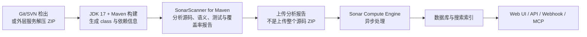
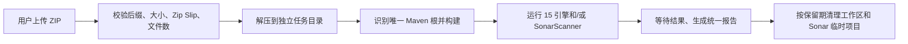
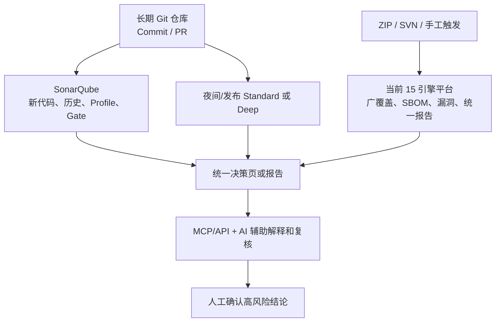

# SonarQube 全面功能调研与 15 引擎扫描平台选型报告

> 调研日期：2026-08-19 
> 面向对象：技术负责人、研发负责人、安全负责人，以及第一次了解代码扫描的人 
> 决策问题：SonarQube 能不能替代当前 Java 17/Maven/Web 版 15 引擎扫描平台？ZIP、Git、SVN、增量、报告、规则、MCP 和 AI 应该怎样落地？ 
> 本机实测：SonarQube Community Build `26.8.0.126808`、SonarJava `8.37.0.45887`、官方 MCP Server `1.23.0.3101` 
> 同源对比提交：`34ad1c686106d92ee5c9d979d1f6b294deb0bfbb`

## 1. 三十秒结论

先直接回答最关心的几个问题。

| 问题 | 简短答案 |
| --- | --- |
| SonarQube 支持直接上传 ZIP 吗？ | **不原生支持。**Scanner 分析的是已经在本地检出或解压的工作区。可以由我们的 Web 服务接收 ZIP、校验、解压、构建后再调用 Sonar，但那是我们提供的能力，不是 SonarQube 自带的上传接口。 |
| SonarQube 支持 Git 第一次全量、以后增量吗？ | **支持长期仓库和“新代码”治理，但不能简单理解成以后只扫 Git diff。**Java 的 PR 分析会跳过或优化部分未变化文件并使用缓存；主分支仍要维持完整、正确的项目状态。Community Build 官方只支持主分支，不支持 PR 分析；真正的分支/PR门禁需要 SonarQube Server。 |
| SVN 能结合吗？ | **能。**先由 SVN 客户端、Jenkins 或我们的 SVNKit 拉取一个工作副本，再运行 Scanner。Sonar 可读取 SVN blame 等信息，但 SVN 没有 Git Pull Request 的原生模型。 |
| 有官方 MCP 吗？ | **有，而且本机真实连通了。**官方 `sonarqube-mcp-server` 可查询项目、问题、规则、门禁等；它是 AI 与 Sonar API 之间的桥，不是替代 Scanner 的完整仓库扫描器。 |
| 有 AI 功能吗？ | 有 MCP、AI Code Assurance、AI CodeFix、Vortex 等不同层次能力，但受版本、版次和授权限制。AI 适合解释、分组、复核和建议修复；确定性发现问题仍由分析器完成。 |
| 能替代当前 15 引擎吗？ | **Community Build 不能。付费版也不建议未经 Benchmark 就全量替代。**Sonar 很适合长期 Git 代码质量、新代码门禁和团队治理；当前平台在 ZIP/SVN 一次性审计、依赖漏洞、SBOM、Maven 治理、字节码和 CodeQL 深层安全方面仍有明显独立价值。 |
| 最推荐什么？ | **混合方案。**SonarQube 作为长期代码质量平台；现有 15 引擎平台作为广覆盖审计与统一报告平台。PR/提交走 Sonar，夜间/发布/人工触发走 Standard 或 Deep；两边结果进入统一决策页。 |

这不是折中式的“两个都要”。它们解决的主要问题本来就不同：

- SonarQube 更像“长期健康档案 + 每次提交的体检门禁”；
- 当前平台更像“把一个代码包带来，做一次覆盖面尽量广的审计，并交付完整证据包”。

## 2. 本报告如何区分事实与判断

为避免把产品宣传、扫描结果和个人判断混在一起，后文使用三种证据标签：

- **官方文档**：SonarSource 当前文档或官方 GitHub 仓库明确说明；
- **本机实测**：在本项目、当前固定版本上真实运行得到；
- **选型判断**：根据官方能力、本机数据和当前使用场景作出的工程判断。

版本会变化。本报告中的规则数量、MCP 工具数量和商业能力都带有日期与版本，升级前应重新跑清单脚本，而不是永远把这里的数字当常量。

## 3. 先用一个生活化比喻理解 SonarQube

把研发过程想象成学校：

- **Scanner** 是阅卷员。它必须拿到实际代码、编译信息和配置，在构建机上完成分析；
- **SonarQube Server** 是教务系统。它保存每次成绩、展示趋势、分配问题、执行“新代码不能新增严重问题”这样的校规；
- **Quality Profile** 是本次考试使用哪套题、每题阈值是多少；
- **Quality Gate** 是多少分算通过；
- **New Code** 是本学期新学的内容，只要求新内容先达标，历史欠账逐步消化；
- **MCP** 是一个受控的 AI 教务员接口，让 AI 能查成绩、找问题、解释规则，必要时更新问题状态。

所以 SonarQube 不是“把 ZIP 发给服务器，服务器自动懂一切”的黑盒。标准流程是 Scanner 在代码所在的构建环境中工作，再把分析报告提交给 Server。

## 4. SonarQube 到底是什么，不是什么

### 4.1 它擅长什么

SonarQube 的核心长处是：

1. 在同一个项目上长期积累分析历史；
2. 把问题统一展示、分配给开发者并记录状态；
3. 用 Quality Profile 管规则，用 Quality Gate 管是否通过；
4. 用 New Code 把注意力放到本次新增或修改的代码；
5. 与 GitHub、GitLab、Azure DevOps、Bitbucket 和 CI 流程结合；
6. 用 IDE、Web API、Webhook 和 MCP 把结果接入研发工作流。

### 4.2 它不天然提供什么

SonarQube 本身不是以下系统的完整替代：

- 不可信 ZIP 上传网关；
- SVN/Git 下载服务；
- Maven 构建沙箱；
- 任意 CLI 扫描器的统一调度器；
- Community Build 下的完整 SCA/SBOM 平台；
- Community Build 下的完整 PDF/ZIP 审计报告生成器；
- 依赖收敛、Maven 未声明依赖等构建治理工具；
- 动态渗透测试、运行时安全测试或业务逻辑审计。

## 5. 一次 Sonar 分析实际发生了什么

对于 Java 多文件项目，官方文档要求提供编译后的 `.class`。这也是为什么正确命令通常是在 Maven 根目录执行 Scanner for Maven，而不是把源码目录随便交给一个文本规则程序。[官方 Java 分析文档](https://docs.sonarsource.com/sonarqube-community-build/analyzing-source-code/languages/java)

一个容易混淆的点：Scanner 会把分析所需信息和生成的分析报告交给 Server，但 SonarQube 的标准产品接口并不是“上传任意 ZIP，Server 为你完成源码接入、构建和隔离”。[官方 Analysis overview](https://docs.sonarsource.com/sonarqube-community-build/analyzing-source-code/analysis-overview)

## 6. ZIP、Git、SVN 三种输入应该怎样接

### 6.1 ZIP：可以做，但要由外层服务负责

推荐流程：

需要明确项目身份：

- 如果 ZIP 只是一次性审计，继续由当前平台扫描并生成报告最自然；
- 如果 ZIP 代表一个长期维护项目，用户必须提供稳定的 `projectKey`、分支/版本和生命周期策略，才适合把历史写入 Sonar；
- 不建议每上传一个匿名 ZIP 就永久创建一个 Sonar 项目，否则数据库会被一次性项目、错误基线和重复历史污染。

因此答案不是“Sonar 完全不能扫描 ZIP”，而是“Sonar 没有原生 ZIP intake；我们能把 ZIP 转换成它能分析的工作区”。

### 6.2 Git：最适合发挥 Sonar 的长期治理价值

标准做法是在 CI 中：

1. 完整检出代码和必要历史；
2. 执行测试、编译并生成 JaCoCo XML；
3. 运行 `sonar:sonar`；
4. 等待 Quality Gate；
5. 在 PR 页面或流水线中决定是否允许合并。

官方建议不要只做浅克隆，因为 blame、共同祖先和新代码判断需要 SCM 历史。浅克隆可能导致缺少作者、日期和问题自动分配信息。[官方 Checked-out code](https://docs.sonarsource.com/sonarqube-community-build/analyzing-source-code/scanners/scanner-environment/verifying-code-checkout-step)

重要的版本边界：

- Community Build：官方能力矩阵写明只支持主分支分析，不提供 Pull Request 分析；
- SonarQube Server：支持分支与 Pull Request，并能把门禁结果反馈到 DevOps 平台；
- 因此，如果“每个 PR 只关注新增问题、失败就阻止合并”是必选项，Community Build 不是完整方案。

[官方版本能力矩阵](https://docs.sonarsource.com/sonarqube-community-build/feature-comparison-table.md)

### 6.3 SVN：能分析工作副本，但没有 Git PR 那套体验

Sonar SCM 集成支持 Git 和 SVN，可自动检测 `.svn`，也可显式设置 `sonar.scm.provider=svn`。它主要提供：

- 每行作者与最后修改时间；
- 问题自动归属；
- 基于时间的新代码口径；
- 在页面中显示 blame 信息。

实际接入仍需要先检出工作副本。可以选择：

- Jenkins 的 SVN 插件检出后运行 Maven Scanner；
- 服务器安装 `svn` 命令检出后运行 Scanner；
- 复用当前平台的 SVNKit 安全快照能力，再运行 Scanner。

当前平台已经支持匿名/用户名密码、固定 revision、限额、凭据清零和不展开 externals，这一层不应删除。Sonar 不负责替代这套安全的源码接入。

[官方 SCM integration](https://docs.sonarsource.com/sonarqube/latest/analyzing-source-code/scm-integration/)

## 7. “第一次全量，以后增量”到底是什么意思

这里至少有三个不同概念，不能混为一谈。

### 7.1 New Code：改变展示和门禁口径

New Code 是“哪些代码算这次新增”的定义，例如：

- 与上一版本相比；
- 与某个天数以前相比；
- 与参考分支相比。

它的主要价值是让团队先做到“新代码不再制造新问题”，而不是承诺所有分析器都只处理新增行。旧问题仍保留在 Overall Code 中，新代码问题决定本次门禁。

### 7.2 Skip unchanged files：PR 时跳过或优化部分未变化文件

官方文档明确：该机制用于 Pull Request 分析。对 Java 等需要跨文件语义的语言，分析器可能跳过部分未变化文件，也可能只做优化；不能一律理解为只分析 diff 文件。[官方增量分析说明](https://docs.sonarsource.com/sonarqube-community-build/analyzing-source-code/incremental-analysis/introduction)

### 7.3 Analysis cache：复用上次分析元数据

Server 会保存分支最近一次分析缓存。PR 可下载目标分支缓存；分析器判断规则、构建设置、跨文件依赖等条件是否允许复用。

官方当前列表中，Java 的分析缓存主要用于缩短 PR 分析；用于缩短普通分支分析的语言列表不是 Java。因此不应承诺“Java 主分支第一次全量，以后只扫描提交差异”。

### 7.4 为什么即使做增量也需要完整、可构建的工作区

假设只改了一行方法调用，是否安全可能取决于：

- 被调用方法的签名；
- Spring 注解和依赖版本；
- 另一文件中的父类或接口；
- 编译后的类型和 classpath；
- Quality Profile 是否刚更新。

所以增量是一种正确性约束下的优化，不是简单的 `git diff | scanner`。

## 8. Community Build、付费 Server 与 Advanced Security

下面只列和本项目选型最相关的差异。完整机器可读矩阵见 [sonarqube-edition-feature-matrix.csv](sonarqube-edition-feature-matrix.csv)。

| 能力 | Community Build | SonarQube Server/更高版次 | 对我们的影响 |
| --- | --- | --- | --- |
| 主分支 | 支持 | 支持 | Community 可先做长期主分支 PoC |
| 非主分支/PR | 不支持 | 支持 | 真正按 PR 门禁要付费 Server |
| 自定义 Profile/Gate | 支持 | 支持 | 社区版已经能做规则和门禁治理 |
| 注入漏洞检测 | 官方矩阵未对 Community 承诺 | Server 支持，Enterprise 可扩展配置 | 不能用 Community 直接替代 CodeQL/FindSecBugs |
| SCA、Advanced SAST | 不支持 | Enterprise + Advanced Security | 可作为依赖/深层安全的付费替代候选，但需 Benchmark |
| PDF/监管/跨项目管理报告 | 不支持 | Enterprise 起 | Community 仍需自己基于 API 导出 |
| AI CodeFix | 不支持 | 当前文档主要面向 Enterprise/DCE | 它解决“怎么修”，不自动证明“报得准” |
| 高可用 | 不提供 DCE 形态 | Data Center Edition | 当前个人/小团队不必一开始上 DCE |

商业版按实例最大代码行数等因素订阅，官方要求询价。报告不编造一个很快会过时的具体价格；正确流程是先计算实际 LOC 和所需功能，再向 SonarSource 获取书面报价。[官方定价页](https://www.sonarsource.com/plans-and-pricing/sonarqube/)

## 9. Java 扫描原理：为什么它能报 Bug，也为什么仍会误报

SonarJava 不是只用正则搜索文本。它会使用多层信息：

1. **语法树**：知道这是 `if`、方法、record 构造器还是测试断言；
2. **类型与符号**：知道变量类型、方法解析和注解；
3. **控制流**：分析条件、循环、返回和异常路径；
4. **符号执行/数据流**：在一部分路径上追踪值的状态；
5. **编译信息**：使用 class 和依赖补充语义；
6. **规则引擎**：把上述事实与某条规则的触发条件匹配。

它仍可能误报，因为静态分析无法知道所有运行时事实：反射、Spring 动态代理、配置中心、外部调用、运行时生成代码、业务约束和“这个对象绝不会被外部替换”都可能超出模型。

本项目已经出现了典型例子：Sonar 把 Java record 紧凑构造器中的参数重新赋值判为无效赋值，但 Java 会在构造器结尾把调整后的参数写入字段。这说明“规则写得很专业”也不等于“每个上下文都判断正确”。开源版和商业版都会有误报；差别主要来自分析深度、规则和框架模型，不存在绝对零误报的静态扫描器。

## 10. 当前 SonarJava 到底有多少规则

本机固定版本盘点结果：

| 项目 | 数量 |
| --- | ---: |
| 已安装 Java 规则 | 738 |
| `Sonar way` 激活 | 571 |
| 未激活 | 167 |
| CODE_SMELL | 487 |
| BUG | 185 |
| VULNERABILITY | 66 |
| READY / DEPRECATED | 725 / 13 |
| MAIN / ALL / TEST scope | 560 / 123 / 55 |
| 可调参数规则 | 64 |
| 规则模板 | 5 |
| 本项目实际触发规则种类 | 40 |
| 本项目问题数 | 275 |

完整逐规则清单见 [sonarqube-java-rule-inventory-26.8.0.126808.csv](sonarqube-java-rule-inventory-26.8.0.126808.csv)，其中包含：是否激活、是否在本项目触发、问题数、类型、严重性、scope、质量影响、标签、是否可调参数、是否为模板。

这组数字说明两件事：

- 当前项目只命中 40 种，不代表 Sonar 只有 40 种规则；
- 规则库有 738 条，也不代表应该全部启用，更不代表 738 条都能替代其他 15 个专用引擎。

## 11. 正确的规则治理方法

### 11.1 四层结构

推荐把治理分为四层：

| 层 | 负责什么 | 例子 |
| --- | --- | --- |
| 规则层 | 什么情况算命中 | `java:S3776` 计算认知复杂度 |
| Profile 层 | 项目启用哪些规则、参数是多少 | 把复杂度阈值从 15 调到团队认可值 |
| Gate 层 | 哪些问题会阻断提交 | 新代码不能新增 Blocker/Critical，重复率不得超过阈值 |
| Issue 治理层 | 某一条具体问题怎样处理 | Open、Accepted、False Positive、Fixed，并记录原因 |

这能解释一个常见疑问：SpotBugs/Sonar 发现的问题有可能误报，为什么扫描器还有意义？因为扫描器负责高召回地找到“值得检查的候选”，Profile/Gate/Issue 治理负责把团队能行动的部分筛出来。准确性不是靠把所有规则关掉，而是靠真值 Benchmark、上下文、参数和可复核的抑制共同提高。

### 11.2 推荐从 Sonar way 复制，而不是直接改默认内置 Profile

正确步骤：

1. 复制 `Sonar way` 为组织自己的 Java Profile；
2. 首先保持大多数规则不变，跑 2～4 个代表性项目；
3. 按规则统计 TP、FP、CONDITIONAL 和修复成本；
4. 只对有证据的规则调参数、降级或停用；
5. 每次规则包升级都重跑 Benchmark；
6. Profile 变更要有版本、负责人、原因和生效日期。

不要直接启用全部 738 条。未激活规则中包含已弃用规则、场景特殊规则和可能带来大量噪音的规则。

### 11.3 白名单/误报可以怎样处理

从窄到宽依次选择：

1. **单条问题标记 False Positive**：最精确，保留审计记录；
2. **标记 Accepted**：问题真实存在，但团队当前接受风险或暂不修改；
3. **规则 + 路径排除**：例如某条测试规则只排除生成代码目录；
4. **文件/目录范围排除**：排除 vendored、generated、fixture 等非产品代码；
5. **规则参数调整**：例如复杂度、文件大小阈值；
6. **停用整个规则**：最后才使用；
7. **`//NOSONAR`**：会隐藏该行的所有问题，缺少精细度，应极少使用。

白名单必须记录：规则、路径或指纹、原因、负责人、建立日期、到期日期、复核结果。永久性大目录排除是最危险的做法，因为后续真实漏洞也会一起被隐藏。

[官方问题管理](https://docs.sonarsource.com/sonarqube-server/user-guide/issues/managing) · [官方高级排除](https://docs.sonarsource.com/sonarqube-server/project-administration/adjusting-analysis/setting-analysis-scope/advanced-exclusions)

### 11.4 Quality Gate 应该怎样设置

推荐对新代码严格、对存量逐步治理：

- 新代码不得新增明确的高严重性可靠性和安全问题；
- 新增 Security Hotspot 必须完成 Review；
- 新代码覆盖率设置团队可实现的目标；
- 新代码重复率设上限；
- 存量问题单独做趋势，不在第一天把所有旧债务都阻断。

本机第一次比较时，项目页面曾显示 Gate `OK`，但条件为空；后来配置了“新问题数必须为 0”，当前相同分析证据显示 Gate `ERROR`，实际新问题为 33。这个变化说明 Gate 是组织政策，不是准确率证明：配置为空时“通过”不等于没有问题，配置太严时“失败”也不等于 33 条都是生产 Bug。

## 12. 规则扩展的四种方式

### 12.1 调整已有规则参数

成本最低，优先级最高。例如调整认知复杂度阈值、允许列表或文件大小限制。只有本身声明参数的规则才能调整；本机 738 条中有 64 条带参数。

### 12.2 用 Profile 启停规则

适合吸收 Sonar 中当前未启用但对团队有价值的规则。每次启用必须先在真值集和代表项目上计算噪音，不能因为规则名字听起来重要就直接阻断流水线。

### 12.3 导入外部问题

Sonar 可导入 SARIF 或 Generic Issue 格式，把 Semgrep、PMD、Checkstyle 等外部结果展示在同一页面。这很适合“统一看板”，但要知道：

- 外部规则不由 Sonar Quality Profile 真正管理；
- 在 Sonar 页面标记外部问题，不会自动修改外部扫描器规则；
- 下一次导入的稳定性依赖外部 fingerprint；
- 当前平台的原始报告、去重和白名单仍需保留。

[官方 SARIF 导入](https://docs.sonarsource.com/sonarqube-community-build/analyzing-source-code/importing-external-issues/importing-issues-from-sarif-reports) · [Generic issue format](https://docs.sonarsource.com/sonarqube-community-build/analyzing-source-code/importing-external-issues/generic-issue-import-format)

### 12.4 编写 SonarJava 自定义规则插件

这是最强、维护成本也最高的方式：使用公开 `org.sonar.plugins.java.api` 编写规则，打成插件 JAR，放入 Server 后重启。需要负责：

- SonarQube/SonarJava 版本兼容；
- 单元测试与正反例；
- 性能和线程安全；
- 规则元数据、严重性和修复建议；
- 升级时 API 变化。

如果一条规则用 Semgrep YAML 就能稳定表达，没有必要为了“都在 Sonar 里”重写成 Java 插件。只有需要 Sonar AST、类型系统或符号执行能力时才值得这样做。

[官方 Adding coding rules](https://docs.sonarsource.com/sonarqube-community-build/extension-guide/adding-coding-rules) · [SonarJava CUSTOM_RULES_101](https://github.com/SonarSource/sonar-java/blob/master/docs/CUSTOM_RULES_101.md)

## 13. 报告、API、Webhook 和可下载文件

### 13.1 Community Build 能看到什么

Community Build 的主要交付界面是 Web UI：

- 项目总览和 Quality Gate；
- Issues 列表、过滤、负责人和状态；
- Security Hotspots；
- Measures、重复率、覆盖率和历史趋势；
- 规则与 Quality Profile；
- 分析任务状态和日志。

它也提供 Web API，可以查询项目、问题、规则、指标、分析记录和门禁状态。当前文档说明 Web API V2 正在逐步替换旧接口，集成方应监控弃用提示并用 Bearer token，不应把页面内部请求当稳定 API。[官方 Web API](https://docs.sonarsource.com/sonarqube-community-build/extension-guide/web-api)

### 13.2 Community Build 不等于“一键下载完整审计包”

Community Build 没有当前平台这种固定的 HTML/JSON/SARIF/原始证据 ZIP。企业版提供项目 PDF、监管报告、Portfolio 和安全报告等管理能力，但它们仍不完全等价于当前平台的全引擎原始证据包。[官方版本能力矩阵](https://docs.sonarsource.com/sonarqube-community-build/feature-comparison-table.md)

如果继续使用 Community，建议由当前平台或独立导出服务：

1. 等待 Compute Engine 任务成功；
2. 调用 Issues、Measures、Quality Gate、Rules API；
3. 固定分页拉全，不只取前 100/500 条；
4. 记录 Sonar 版本、插件版本、Profile、Gate 和分析时间；
5. 生成本地 HTML/JSON；
6. 与 15 引擎结果按稳定指纹并排展示；
7. 对 token、源码和原始响应做脱敏。

### 13.3 Webhook 适合做什么

Webhook 可在后台分析完成后通知外部系统，适合替代高频轮询：

- 更新当前扫描任务状态；
- 触发统一报告生成；
- 把 Gate 结果通知流水线或消息系统；
- 记录分析完成时间和 dashboard URL。

生产接入应启用 HMAC 验证、限制接收端来源并实现幂等。Webhook 只表示事件发生，接收端仍应通过 API 读取最终权威数据。[官方 Webhooks](https://docs.sonarsource.com/sonarqube-server/2025.5/project-administration/webhooks)

## 14. 官方 MCP：有什么、怎么部署、实测到什么程度

### 14.1 官方确实提供 MCP

官方仓库是 [SonarSource/sonarqube-mcp-server](https://github.com/SonarSource/sonarqube-mcp-server)。本次固定并验证：

| 项目 | 本机证据 |
| --- | --- |
| 发布版本 | `1.23.0.3101` |
| Release tag commit | `182277d1d006bc29346a2cb306240ed9d2f428fa` |
| 下载 JAR SHA-256 | `d11484c0f37ee2416235d280e05f6dc74b06f7686cc58b6e3acb9a2f5d84a8c7` |
| 研究时 master commit | `b9c734cc9949b0d17c49c88db6eb8a195070d218` |
| 连接目标 | 本机 Community Build `26.8.0.126808` |
| 传输 | stdio |
| 模式 | read-only |
| 选择的 toolsets | issues、projects、quality-gates、rules、measures |
| 客户端实际看到的工具 | 10 个 |
| 真实调用 | `search_my_sonarqube_projects` 返回 `java-code-audit-platform`，`isError=false` |

机器可读实测摘要见 [sonarqube-mcp-local-validation-2026-08-19.json](sonarqube-mcp-local-validation-2026-08-19.json)。

官方 README 在该发布系列中列出约 48 个工具，但很多工具是条件性的：取决于版次、订阅 entitlement、Cloud/Server、IDE bridge、Vortex、是否启用对应 toolset。不能把“文档一共列了 48 个”宣传成“Community 默认可用 48 个”。

### 14.2 MCP 能做什么

按工具集大致包括：

- 查询与管理问题；
- 查询项目、规则、质量门禁、指标和重复代码；
- 查询 Security Hotspot；
- 查询依赖风险、覆盖率、Portfolio 等有权限的能力；
- 与 SonarQube for IDE bridge 协作分析文件；
- 在具备 entitlement 时使用 Vortex/Agentic Readiness 类能力。

它最适合这样的交互：

> “列出这个项目新代码中的高严重性问题，按规则和模块分组，解释前三条，并给出需要人工确认的条件。”

它不适合替代这样的流程：

> “接收任意 ZIP，完成 Maven 构建、15 引擎扫描、漏洞库检查和可下载审计包。”

### 14.3 MCP 如何部署

官方支持两类介质：

- 官方容器 `sonarsource/sonarqube-mcp`；
- 发布 JAR/源码构建。

传输模式：

| 模式 | 适用场景 | 安全建议 |
| --- | --- | --- |
| stdio | 本机 Codex、Claude Code、VS Code、Cursor 等客户端启动子进程 | 推荐个人开发；token 放环境变量，MCP 不监听网络端口 |
| Streamable HTTPS | 多用户远程 MCP 服务 | 必须 TLS；每个请求使用用户自己的 Bearer token；限制 toolsets 和 read-only |

官方明确要求连接 SonarQube Server 时使用 **USER token**，项目分析 token 或全局分析 token不能完整工作。多用户场景不能让所有人共用管理员 token。

### 14.4 推荐的 MCP 安全基线

个人使用也建议：

1. 默认 `SONARQUBE_READ_ONLY=true`；
2. 只启用 `projects,issues,quality-gates,rules,measures` 等必要 toolsets；
3. 单独创建低权限 Sonar 账号和 USER token；
4. token 只放环境变量/系统密钥管理，不进配置仓库和命令历史；
5. 多用户只开放 HTTPS，不开放明文 HTTP；
6. 写操作单独启用并记录审计日志；
7. 评估 telemetry，按组织要求设置 `TELEMETRY_DISABLED=true`；
8. 若挂载源码工作区，明确 AI/MCP 可读取哪些文件。

## 15. AI 相关能力应该怎样理解

Sonar 的 AI 相关能力不是一个东西。

### 15.1 AI Code Assurance

它主要做“AI 生成代码项目的质量保证标识和更严格门禁”。它不是一个新扫描器，也不会因为打了 AI 标签就自动产生更准确的漏洞判断。[官方 AI Code Assurance gate](https://docs.sonarsource.com/sonarqube-server/quality-standards-administration/ai-code-assurance/quality-gates-for-ai-code)

### 15.2 AI CodeFix

AI CodeFix 根据 Sonar 已发现的问题生成修复建议。官方当前文档说明它面向 Enterprise/Data Center 等受支持版次和规则，并会把受影响代码及问题描述发给配置的 LLM 服务。它解决的是“如何修”，不是“扫描器是不是报对了”。[官方启用 AI CodeFix](https://docs.sonarsource.com/sonarqube-server/2026.1/instance-administration/ai-features/enable-ai-codefix)

采用前应确认：

- 哪些代码/问题文本会离开内网；
- 使用 OpenAI、Azure OpenAI 还是组织批准的模型；
- 数据保留和合规条款；
- 内部仓库、密钥和客户代码是否允许发送；
- 建议必须经过测试和人工审查，不能自动提交到主分支。

### 15.3 MCP + Codex/其他 AI

这是当前最适合我们的 AI 介入方式：

1. 扫描器输出确定性事实；
2. MCP/API 提供规则、代码位置和历史；
3. AI 解释“为什么报”；
4. AI 结合上下文给出 TRUE_POSITIVE、FALSE_POSITIVE、CONDITIONAL 候选判断；
5. 人工确认高风险结论；
6. 治理结果写回 Sonar 或当前平台。

AI 不应该直接改变底层原始结果，也不应该因为一句自然语言解释就永久关闭整条规则。每个 AI 判断应保留：使用模型、输入证据、时间、置信度、人工确认人和到期复核时间。

## 16. 部署、资源、数据库和并发

### 16.1 生产不是一个无状态 JAR

当前 15 引擎平台的设计是一个 Java 17 JAR + 本地 tools + 文件存储，不需要数据库。SonarQube 不同：它是长期状态服务，保存用户、项目、问题、规则、历史和索引。

Community Build 生产环境应使用受支持的外部数据库；内置 H2 适合测试，不适合生产。官方当前支持 PostgreSQL 等数据库，具体版本应随安装版本重新核对。[官方安装数据库](https://docs.sonarsource.com/sonarqube-community-build/server-installation/installing-the-database)

### 16.2 JDK 版本边界

本项目业务和扫描构建固定使用 JDK 17。当前 SonarQube Community ZIP 运行时要求更高版本的 Java（当前文档为 JDK 21/25 范围），二者可以共存：

- Maven 构建与当前平台继续使用 JDK 17；
- SonarQube Server 单独使用其要求的 JDK；
- 使用官方 SonarQube 容器时，Server runtime 随镜像提供，可减少宿主 JDK 冲突。

不要为了安装 Sonar 强行把被扫描项目升级到 JDK 21。Scanner 与 Server runtime 是两个概念。

### 16.3 小规模起步资源

官方主机要求给小规模安装的起点约为 2 CPU、4GB RAM、30GB 磁盘，并要求保留可用空间；Linux 还需配置 Elasticsearch 相关的 `vm.max_map_count`、文件描述符和线程限制。[官方主机要求](https://docs.sonarsource.com/sonarqube-community-build/server-installation/server-host-requirements) · [官方 Linux 预配置](https://docs.sonarsource.com/sonarqube-community-build/server-installation/pre-installation/linux)

这只是起点。真正容量取决于：

- 项目数量和代码行数；
- 每天分析次数；
- 分支/PR数量；
- 保留历史；
- 安装插件和安全能力；
- 数据库与 Elasticsearch 性能。

### 16.4 并发发生在哪里

并发要分两段：

1. **Scanner/构建段**：在 CI 或当前平台工作节点执行 Maven、测试和扫描，CPU/内存主要消耗在这里；
2. **Compute Engine 段**：Server 接收报告后异步处理，队列与数据库/索引成为瓶颈。

Community 小规模可以单实例运行。Enterprise 可增加 Compute Engine workers；更大规模和高可用才评估 Data Center Edition。不能只给 Server 加 CPU，却让几十个 Maven 构建同时在同一台机器争夺内存。

如果把 Sonar 接入当前 Web 平台，应继续沿用有界队列和资源权重：

- Maven 构建共享 `maven` permit；
- SonarScanner 设全局并发上限；
- 每个 Sonar projectKey 同时只允许一个需要稳定基线的主分析；
- 对 CE 队列长度、任务耗时和数据库磁盘告警；
- 上传接口遇到资源不足返回 429，而不是无限排队。

## 17. 安全、隐私和许可证边界

### 17.1 Advanced Security 的数据出站

SonarQube Server 的 Advanced Security/SCA 文档说明，自托管实例的依赖分析会与 Sonar 云服务交互；通常发送 manifests/lockfiles 等依赖信息而不是完整源码，但内部包名、依赖坐标仍可能属于敏感资产。引入前必须让安全/合规人员确认网络、数据处理和供应商条款。[官方 Advanced Security](https://docs.sonarsource.com/sonarqube-server/advanced-security) · [依赖分析说明](https://docs.sonarsource.com/sonarqube-server/advanced-security/analyzing-projects-for-dependencies)

### 17.2 “Community 是开源的”需要说完整

SonarQube 核心仓库有 LGPL-3.0 许可证文件，但当前 SonarJava 和部分捆绑分析器使用 SSALv1。也就是说，“可以免费自建 Community”不等于“所有分析器都可随意复制、改名、打包进自己的竞争性扫描产品”。

- [SonarQube 核心 LICENSE](https://github.com/SonarSource/sonarqube/blob/master/LICENSE.txt)
- [SonarJava 仓库和许可证说明](https://github.com/SonarSource/sonar-java)
- [SSAL](https://www.sonarsource.com/license/ssal/)

当前项目本身是一个开源代码扫描平台，尤其要谨慎：

- 不把 SonarJava 或 MCP 二进制直接打进当前发行包；
- 把官方 SonarQube 作为独立服务部署，通过官方 Scanner/API/MCP 集成；
- 不复制 Sonar 私有/受限规则实现到自己的规则库；
- 需要分发或提供类似商业服务前做正式法律审查。

本报告只做工程风险提示，不构成法律意见。

## 18. 当前 15 引擎分别覆盖什么

| 序号 | 引擎 | 主要检查 | Sonar Community 能否直接替代 |
| ---: | --- | --- | --- |
| 1 | Gitleaks | 密钥、token、凭据模式 | 部分重合，不能直接替代 |
| 2 | Semgrep | 自定义源码模式和安全规则 | 部分重合，不能承接任意 YAML |
| 3 | PMD | Java 正确性和可维护性 | 大范围重合，可 Benchmark 后缩减 |
| 4 | PMD CPD | 重复代码 | 强重合，最优先评估停用 |
| 5 | Checkstyle | 团队格式与代码规范 | 部分重合，团队硬规范仍应保留 |
| 6 | Trivy Repository | IaC、配置、密钥 | 部分重合，覆盖不等价 |
| 7 | SpotBugs | Java 字节码 Bug 模式 | 部分重合，字节码层不可直接等价 |
| 8 | FindSecBugs | 字节码安全规则 | 部分重合，Community 不足以替代 |
| 9 | Dependency-Check | NVD 依赖漏洞 | Community 无正式 SCA，不能替代 |
| 10 | OSV-Scanner | OSV 依赖漏洞 | Community 无正式 SCA，不能替代 |
| 11 | Maven Dependency Analysis | 未声明/未使用依赖 | 无等价能力 |
| 12 | Maven Enforcer | 依赖收敛和 Maven 政策 | 无等价能力 |
| 13 | CycloneDX | SBOM | Community 无等价正式交付物 |
| 14 | Trivy Artifact | 制品/SBOM 漏洞 | Community 无正式 SCA，不能替代 |
| 15 | CodeQL | 深层数据流与安全查询 | Community 无等价承诺 |

逐项判定、版本和付费能力对照见 [sonarqube-vs-audit-platform-capability-matrix.csv](sonarqube-vs-audit-platform-capability-matrix.csv)。

## 19. 同一份代码真实对比出了什么

两套系统使用同一 commit 和同一不可变 ZIP：

| 指标 | 当前 15 引擎平台 | SonarQube Community |
| --- | ---: | ---: |
| 执行引擎 | 15/15 成功 | SonarJava 等捆绑分析器成功 |
| 原始命中 | 667 | 275 issues |
| 归一化唯一问题 | 595 | 275 |
| 主要构成 | 456 规范、67 正确性、25 重复、14 依赖漏洞等 | 257 Code Smell、18 BUG |
| 同文件、同行、同语义保守交集 | 17 条 | 17 条 |
| SBOM | 63 组件、4 个漏洞组件 | Community 本次无 SCA/SBOM |
| 依赖漏洞 | 14 条，经适用性治理 | 0，但本次日志显示 dependency analysis skipped |
| 测试覆盖率 | 当前平台不以 Sonar 指标展示 | 0%，因为公平比较固定 `-DskipTests` 且未导入 JaCoCo |

只有 17 条严格交集，并不表示其余都是漏报。主要是观察层次不同：Checkstyle 看格式、SpotBugs 看字节码、SCA 看组件版本、Sonar 看源码语义/复杂度/测试写法。

本次 Codex 复核还发现：

- Sonar 的 18 条 BUG 并非 18 个已确认生产缺陷；大部分是加固建议或上下文误报；
- 当前平台唯一 Gitleaks ACTIONABLE `admin:admin` 也是本地初始化场景误报；
- 依赖漏洞的版本命中真实，但能否利用取决于配置、调用路径和部署条件；
- 两个系统都没有自动发现所有系统级边界，例如源码片段读取超大文件导致 JVM 内存风险。

完整同源分析见 [scanner-vs-sonarqube-comparison-2026-08-19.md](scanner-vs-sonarqube-comparison-2026-08-19.md)。

## 20. 为什么不能直接用 Sonar 报告总数判断谁更准

如果扫描器 A 报 595 条，扫描器 B 报 275 条，不能推出 A 更强或 B 更准。必须有独立真值：

- 已知存在问题的正例；
- 长得很像但确认安全的负例；
- 开源漏洞修复前/后 commit；
- 人工双人复核的真实代码片段；
- 每条样本的触发条件、期望文件、行、CWE、适用版本和来源。

然后计算：

- TP：确实存在，也扫出来；
- FP：并不存在，但报了；
- FN：确实存在，却没报；
- Precision：报出来的有多少是真的；
- Recall：真的问题有多少被找到。

Sonar、15 引擎和 AI 都只能接受同一份独立真值集评测。不能用 Sonar 当真值来调自研规则，也不能用自研扫描器当真值来证明 Sonar 漏报。

## 21. 三种选型方案

### 方案 A：完全用 Community Build 替代当前平台

不推荐。

优点：UI、历史、Profile、Gate 和主分支治理成熟。 
缺点：无原生 ZIP intake、无 PR、无 Community SCA/SBOM、无 Maven 治理、无统一审计 ZIP，也不能证明覆盖 SpotBugs/CodeQL 等专用范围。

### 方案 B：购买 SonarQube Server/Enterprise/Advanced Security 并尽量替代

可以作为中长期评估方案，但不能只看销售功能表就删除现有引擎。

优点：Git 分支/PR、注入检测、Advanced SAST/SCA、管理报告和 AI 能力更完整。 
缺点：费用、LOC 许可、数据出站、SSAL/集成边界和迁移成本；Maven Enforcer/Dependency Analysis、任意 ZIP/SVN intake、CodeQL 查询包仍未必等价。

正确做法是先用独立 Benchmark 并行 4～8 周，逐引擎给出“完全替代、部分替代、保留”证据。

### 方案 C：混合方案

推荐。

建议职责：

- Sonar：长期 Git 项目、New Code、趋势、日常开发门禁、IDE 和团队 Issue 流程；
- 当前平台：ZIP/SVN、发布审计、依赖/SBOM/Maven/CodeQL、原始证据和可下载报告；
- AI：解释、相似问题聚类、上下文适用性分析、修复建议；
- Benchmark：决定规则和引擎是否真的可以退休。

## 22. 推荐的落地阶段

### 阶段 0：保持当前结果可复现

- 固定 Sonar、SonarJava、Profile 和 Gate 版本；
- 保存规则清单、插件清单和分析证据；
- 继续固定 15 引擎版本、规则包和漏洞库时间；
- 不把两个系统的总数直接相加。

### 阶段 1：Community 主分支 PoC

- 使用 PostgreSQL，而不是生产 H2；
- 选择 2～4 个代表性 Git 项目；
- CI 完整检出、JDK17 Maven 构建、测试、JaCoCo、Sonar；
- 复制 Sonar way 建组织 Profile；
- Gate 只约束新代码；
- 启用只读 MCP，验证查询和解释，不先开放写操作。

### 阶段 2：接入当前 Web 平台

- 新增可选 `sonarqube` 外部引擎，不把 Sonar 二进制打进当前发行包；
- ZIP/SVN 继续由当前 intake 负责；
- 用稳定 projectKey 策略区分长期项目和一次性任务；
- 等待 CE 完成后通过 API 拉取全量分页结果；
- 把 Sonar 问题映射到统一 Finding，但保留 Sonar rule key、issue key、analysis id 和 dashboard URL；
- 统一报告中明确区分 Sonar 原生、外部导入和 15 引擎命中。

### 阶段 3：Benchmark 和规则瘦身

优先评估：

1. PMD CPD 与 Sonar duplication 是否可以只保留一套；
2. PMD 可维护性规则与 SonarJava 的逐规则重合；
3. Checkstyle 只保留确定性的团队硬规范；
4. Gitleaks、SCA、Maven 治理、SpotBugs、FindSecBugs、CodeQL 暂不退出；
5. 对正则性能、认知复杂度、测试代码质量等 Sonar 优势规则，决定在 Sonar 中治理还是移植到当前平台。

### 阶段 4：决定是否购买付费版

只有下面至少一项成为硬需求时，再进入商务评估：

- Git PR 分析和合并门禁；
- 多分支长期历史；
- Advanced SAST/SCA；
- Enterprise PDF/监管/Portfolio 报告；
- AI CodeFix；
- 多 CE worker、审计日志或更高治理能力。

用实际 LOC、项目数、并发、数据出站要求向官方询价，并把 PoC 指标写入验收条款。

## 23. PoC 验收指标

不要只验收“页面打开了”。建议至少验收：

| 维度 | 验收方法 |
| --- | --- |
| 可重复性 | 同 commit、同 Profile 连跑两次，结果差异必须可解释 |
| Java 正确性 | 10 模块 Maven reactor 构建成功，class 和依赖解析无缺失警告 |
| SCM | Git blame、作者、新代码基线正确；SVN revision 可追溯 |
| 增量 | 记录首次、普通主分支、PR 的耗时和缓存日志，不用口头“增量”代替数据 |
| 准确率 | 用独立真值集计算每个规则族 TP/FP/FN，不以 Sonar 为真值 |
| Gate | 新代码门禁能真实失败/恢复，不受存量 275 条直接淹没 |
| API | 问题分页完整、CE 异步状态、Gate、Measures、规则元数据均可查询 |
| MCP | USER token、只读、最小 toolsets；查询真实项目成功；越权写入被拒绝 |
| 报告 | 可生成领导摘要与开发明细，能追溯 Sonar 版本/Profile/analysis id |
| 并发 | 在目标项目数下测 CI 构建、CE 队列、数据库和磁盘，不出现无限排队 |
| 安全 | token 不落日志；Webhook HMAC；代码/依赖数据出站得到批准 |
| 许可 | 官方组件独立部署，不进入当前扫描器发行介质；法律边界书面确认 |

## 24. 已知边界与反事实判断

### 24.1 当前结论什么时候可能改变

如果未来真实使用场景从“个人上传 ZIP/SVN 做一次性审计”变成：

- 全部代码都在长期 Git 仓库；
- 每次变更都走 PR；
- 可以购买 SonarQube Server/Enterprise/Advanced Security；
- 统一报告 ZIP、Maven 治理和自定义 CodeQL 不再重要；

那么 SonarQube 可以从“辅助质量平台”上升为“主平台”，当前 15 引擎缩成发布时的补充扫描。

反过来，如果主要场景继续是一次性 ZIP/SVN、离线审计、需要完整原始证据和不希望引入数据库，那么当前平台仍应是主入口，Sonar 只适合作为可选长期项目对照。

### 24.2 本报告没有证明什么

- 没有证明 Sonar 的 738 条规则全部准确；
- 没有证明当前 15 引擎的 595 条全部真实；
- 没有使用付费 Enterprise/Advanced Security 真实许可证跑同源项目，因此对付费安全能力的判断来自官方文档，不是假装成本机实测；
- 没有把一次本机性能当成生产容量结论；
- 没有提供法律意见或商业报价。

## 25. 给领导的决策建议

建议批准的是“分层整合”，不是“立即替换”：

1. 当前 15 引擎平台继续作为 Java 17/Maven 的 ZIP/SVN 审计和完整报告工具；
2. 单独部署 SonarQube，先用于长期 Git 主分支质量、规则治理和历史趋势；
3. 如果 PR 门禁是硬需求，直接评估付费 SonarQube Server，Community 无法完整满足；
4. 以官方 API/MCP 集成，不把 SonarJava/MCP 二进制内嵌到当前开源扫描器；
5. 两套系统共同使用独立真值 Benchmark，4～8 周后再决定 PMD CPD、部分 PMD/Checkstyle 规则是否退出；
6. Gitleaks、SCA/SBOM、Maven 治理、SpotBugs/FindSecBugs、CodeQL 在没有证据前继续保留；
7. AI 只作为复核与解释层，不替代底层扫描和人工最终确认。

一句话汇报可以是：

> SonarQube 强在长期 Git 新代码治理，现有平台强在 ZIP/SVN 一次性全量审计和多引擎证据；Community 不能整体替代 15 引擎，最优方案是独立部署 Sonar 并混合使用，以真值 Benchmark 决定后续规则和引擎瘦身。

## 26. 机器可读附件与本机证据

| 文件 | 用途 |
| --- | --- |
| [sonarqube-vs-audit-platform-capability-matrix.csv](sonarqube-vs-audit-platform-capability-matrix.csv) | 15 引擎及平台能力逐项替代矩阵 |
| [sonarqube-edition-feature-matrix.csv](sonarqube-edition-feature-matrix.csv) | Community、Server、Enterprise/Advanced Security 能力边界 |
| [sonarqube-java-rule-inventory-26.8.0.126808.csv](sonarqube-java-rule-inventory-26.8.0.126808.csv) | 738 条 Java 规则完整盘点 |
| [sonarqube-mcp-local-validation-2026-08-19.json](sonarqube-mcp-local-validation-2026-08-19.json) | 官方 MCP 本机真实连接摘要 |
| [scanner-vs-sonarqube-comparison-2026-08-19.md](scanner-vs-sonarqube-comparison-2026-08-19.md) | 同一份代码的扫描结果、交集与 Codex 复核 |
| [sonarqube-local-deployment-and-scan-2026-08-19.md](sonarqube-local-deployment-and-scan-2026-08-19.md) | 本机 Sonar 部署和扫描复现记录 |
| `deploy/sonarqube/evidence/latest/` | 已提交的 health、CE、issues、measures、profiles、plugins、gate API 证据 |

## 27. 主要官方来源

### 分析、SCM、增量

- [Analysis overview](https://docs.sonarsource.com/sonarqube-community-build/analyzing-source-code/analysis-overview)
- [SonarScanner for Maven](https://docs.sonarsource.com/sonarqube-server/analyzing-source-code/scanners/sonarscanner-for-maven)
- [Checked-out code](https://docs.sonarsource.com/sonarqube-community-build/analyzing-source-code/scanners/scanner-environment/verifying-code-checkout-step)
- [Incremental analysis](https://docs.sonarsource.com/sonarqube-community-build/analyzing-source-code/incremental-analysis/introduction)
- [New Code](https://docs.sonarsource.com/sonarqube-community-build/user-guide/about-new-code)
- [SCM integration](https://docs.sonarsource.com/sonarqube/latest/analyzing-source-code/scm-integration/)
- [Java analysis](https://docs.sonarsource.com/sonarqube-community-build/analyzing-source-code/languages/java)

### 规则、门禁、扩展、报告

- [Feature comparison](https://docs.sonarsource.com/sonarqube-community-build/feature-comparison-table.md)
- [Rules](https://docs.sonarsource.com/sonarqube-community-build/quality-standards-administration/managing-rules/rules)
- [Creating a Quality Profile](https://docs.sonarsource.com/sonarqube-community-build/quality-standards-administration/managing-quality-profiles/creating-a-quality-profile)
- [Quality Gates](https://docs.sonarsource.com/sonarqube-community-build/quality-standards-administration/managing-quality-gates/introduction-to-quality-gates)
- [Issue management](https://docs.sonarsource.com/sonarqube-server/user-guide/issues/managing)
- [Advanced exclusions](https://docs.sonarsource.com/sonarqube-server/project-administration/adjusting-analysis/setting-analysis-scope/advanced-exclusions)
- [Custom coding rules](https://docs.sonarsource.com/sonarqube-community-build/extension-guide/adding-coding-rules)
- [Web API](https://docs.sonarsource.com/sonarqube-community-build/extension-guide/web-api)
- [Webhooks](https://docs.sonarsource.com/sonarqube-server/2025.5/project-administration/webhooks)
- [PDF reports](https://docs.sonarsource.com/sonarqube-server/10.8/user-guide/viewing-reports/pdf-reports)
- [Regulatory reports](https://docs.sonarsource.com/sonarqube-server/2025.6/user-guide/viewing-reports/regulatory-reports)

### MCP、AI、安全、部署与许可

- [Official SonarQube MCP Server](https://github.com/SonarSource/sonarqube-mcp-server)
- [AI CodeFix](https://docs.sonarsource.com/sonarqube-server/2026.1/instance-administration/ai-features/enable-ai-codefix)
- [AI Code Assurance](https://docs.sonarsource.com/sonarqube-server/quality-standards-administration/ai-code-assurance/quality-gates-for-ai-code)
- [Advanced Security](https://docs.sonarsource.com/sonarqube-server/advanced-security)
- [Database installation](https://docs.sonarsource.com/sonarqube-community-build/server-installation/installing-the-database)
- [Server host requirements](https://docs.sonarsource.com/sonarqube-community-build/server-installation/server-host-requirements)
- [Data Center performance](https://docs.sonarsource.com/sonarqube-server/server-update-and-maintenance/data-center-edition/improving-performance)
- [Plans and pricing](https://www.sonarsource.com/plans-and-pricing/sonarqube/)
- [SonarQube core license](https://github.com/SonarSource/sonarqube/blob/master/LICENSE.txt)
- [SonarJava repository](https://github.com/SonarSource/sonar-java)
- [SSAL](https://www.sonarsource.com/license/ssal/)

## 28. 研究版本固定信息

| 项目 | 固定值 |
| --- | --- |
| SonarQube | `26.8.0.126808` |
| SonarJava | `8.37.0.45887` |
| SonarQube MCP release | `1.23.0.3101` |
| MCP release JAR SHA-256 | `d11484c0f37ee2416235d280e05f6dc74b06f7686cc58b6e3acb9a2f5d84a8c7` |
| MCP master research commit | `b9c734cc9949b0d17c49c88db6eb8a195070d218` |
| SonarQube source research commit | `f823d0c99a2a754921ead280d4413a38890875e2` |
| SonarJava source research commit | `a7ccf539045383417756de5108e9cc1ead8f1553` |
| 被比较项目 commit | `34ad1c686106d92ee5c9d979d1f6b294deb0bfbb` |
| 输入 ZIP SHA-256 | `78035783583f3919e02eea3e2db8d5bbc8198584fe824c2fda92396f00b8f76d` |

这些固定值的作用是让半年后能够回答：“当时到底研究的是哪个 Sonar、哪套规则、哪份代码”，而不是只留下一个无法复现的网页截图。
