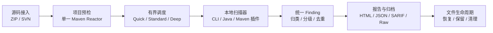

# Java Code Audit Platform V1 文档基线

> 状态：**Frozen for V1** 
> 冻结日期：2026-08-12 
> 适用范围：Java 17、Maven、ZIP/SVN 输入、macOS ARM64 本机运行、Ubuntu 22.04 x86_64 部署

## 十五秒结论

V1 是一个不依赖数据库、IDE 或容器的本地多引擎代码审计工具：启动一个 Java 17 Spring Boot JAR，接收 ZIP 或 SVN 当前快照，在同一台机器上调度外部扫描器，最后生成一份带统计、代码证据、覆盖状态和原始报告的 HTML/JSON/SARIF 审计包。

它适合个人在可信网络中扫描自己掌控的 Java 17 Maven 开源项目；它不是面向任意公网用户的恶意代码沙箱，也不替代业务逻辑审查、动态渗透测试和人工安全结论。

## 全局模型

一条最小可观察链路是：上传一个含已知问题的小型 Maven ZIP，平台识别唯一根项目，执行 Semgrep，把原始 JSON 转换成统一 Finding，在报告首页显示唯一问题数，并允许下载 HTML、JSON、SARIF 和原始证据。该纵向链路是后续并行接入其他扫描器之前的架构门槛。

## 文档权威顺序

1. 本目录中的冻结文档；
2. `docs/adr/` 中状态为 Accepted 的决策记录；
3. 根目录 README、SECURITY 和 CONTRIBUTING；
4. 代码与配置中的当前实现；
5. `docs/code-audit-capabilities.md` 等早期调研资料。

发现冲突时以上级文档为准。实现与冻结文档不一致属于缺陷，不能用当前代码反向修改需求。

## 阅读顺序

### 产品与能力

- [产品范围](product-scope.md)：V1 做什么、明确不做什么。
- [决策登记册](decision-register.md)：用户已经确认的全部关键决策。
- [能力矩阵](capability-matrix.md)：9组审计能力、12类问题和扫描器覆盖。

### 架构与契约

- [总体架构](architecture.md)：单 JAR 模块化单体与本地进程模型。
- [跨平台与工具包](tool-pack.md)：macOS/Linux 介质、可复现工具组装、CodeQL 和动态数据。
- [扫描生命周期](scan-lifecycle.md)：从接入源码到最终清理的状态变化。
- [并发与资源](concurrency.md)：队列、权重、限流、公平性和资源保护。
- [扫描器适配协议](scanner-adapter.md)：探测、命令准备、执行和归一化接口。
- [Finding 模型](finding-model.md)：严重性、分类、证据、指纹和抑制。
- [报告规范](report-schema.md)：统计口径、详情、下载包和失败表达。
- [API 契约](api-contract.md)：ZIP/SVN、进度、取消、删除和报告接口。
- [文件存储](storage-layout.md)：无数据库状态、原子写入、恢复和保留。
- [安全边界](security-boundary.md)：可信代码前提及仍需执行的输入防护。

### 交付与验证

- [开发计划](development-plan.md)：串行骨架、纵向切片、两轮并行和发布。
- [Worktree 策略](worktree-strategy.md)：分支职责、创建时机、合并和冲突控制。
- [测试策略](testing-strategy.md)：单元、契约、真实工具、并发、安全和跨平台测试。
- [验收标准](acceptance-criteria.md)：V1 Definition of Done。

## 变更控制

下列变化必须先获得用户确认，并新增或修改 ADR：

- 新增数据库、容器、消息队列或独立 Runner 服务；
- 改变 Java 17/Maven、macOS ARM64 或 Linux x86_64 平台边界；
- 改变问题总数、严重级别、12类问题或 SBOM 统计口径；
- 把服务暴露给任意公网不可信上传者；
- 将认证、历史基线、完全离线或 AI 纳入 V1；
- 删除已经承诺的扫描器或硬性验收项。

工具小版本、内部类名、库选择和非破坏性实现细节不需要重新确认，但必须通过既定测试并同步文档。
