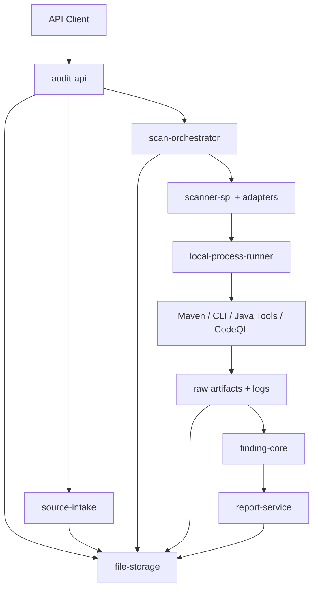
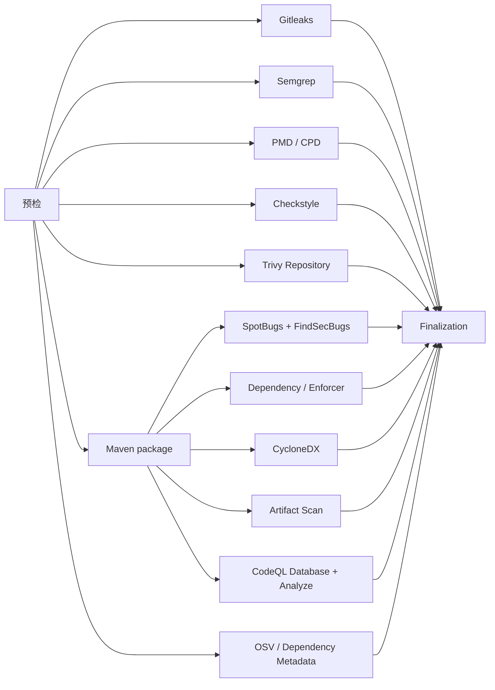

# V1 总体架构

## 1. 架构结论

V1 采用**单 JAR 模块化单体 + 本地工具进程 + 文件持久化**。Web API、任务编排、扫描适配、Finding、报告和清理运行在一个 Spring Boot 进程中；扫描器按任务启动，结束后退出。



## 2. 模块边界

| 模块 | 职责 | 不负责 |
| --- | --- | --- |
| `audit-api` | REST、参数校验、错误映射、任务查询和下载 | 扫描规则、直接拼命令、报告统计 |
| `source-intake` | ZIP/SVN、凭据生命周期、安全解压、项目根探测 | Maven 构建、Finding 解析 |
| `scan-orchestrator` | 状态机、DAG、队列、并发、取消、恢复 | 工具专属命令和报告字段 |
| `scanner-spi` | 适配器公共协议和执行描述 | 具体工具实现 |
| `scanner-adapters` | 每个工具的探测、命令、输出校验、Parser | 全局调度、HTTP、文件保留 |
| `local-process-runner` | 子进程、日志、超时、进程树、环境变量和退出码 | 理解扫描结果语义 |
| `finding-core` | Finding、分类、严重性、指纹、去重、抑制 | 执行外部工具 |
| `file-storage` | 目录、原子写入、锁、恢复、保留和清理 | 业务统计和扫描规则 |
| `report-service` | 汇总、代码片段、HTML/JSON/SARIF和下载包 | 重新执行扫描器 |

这些是 Maven 模块和代码所有权边界，不是独立部署服务。最终只生成一个可执行 JAR。

## 3. 核心接口

### 3.1 执行后端

```java
public interface ExecutionBackend {
    ExecutionResult execute(ExecutionSpec spec, CancellationToken cancellationToken);
}
```

V1 只有 `LocalProcessExecutionBackend`。接口保留的原因是把“工具语义”与“进程执行”分开，不表示 V1 需要容器后端。

### 3.2 扫描器适配器

```java
public interface ScannerAdapter {
    String engineId();
    Applicability probe(ProjectContext project, ToolContext tools);
    ExecutionSpec prepare(ProjectContext project, ScanContext scan);
    NormalizationResult normalize(RawArtifactSet artifacts, NormalizationContext context);
}
```

一个适配器必须完成四件事：判断能否运行、准备无 Shell 的命令、声明预期输出、把原始结果转换为统一模型。详细契约见[扫描器适配协议](scanner-adapter.md)。

### 3.3 配置是扫描计划唯一来源

`config/profiles/*.yaml` 定义档位、引擎、依赖和可选条件。Java 代码负责解析和验证，不再重复硬编码 Quick/Standard/Deep 列表。这样可以避免现有骨架中 Java Planner 与 YAML 不一致。

配置启动时必须验证：

- 引擎 ID 唯一且存在适配器；
- DAG 无环；
- Deep 明确依赖 Standard；
- 资源权重和超时合法；
- 必需工具缺失时给出档位可用性，而不是静默删除引擎。

## 4. 任务与引擎状态

### 4.1 ScanJob

```text
QUEUED
  → ACQUIRING_SOURCE
  → PREFLIGHT
  → RUNNING
  → FINALIZING
  → COMPLETED | COMPLETED_WITH_ERRORS
```

任意非终态还可以进入：

```text
FAILED | CANCELLED | INTERRUPTED
```

### 4.2 EngineTask

```text
PENDING → READY → RUNNING
                  ├→ SUCCEEDED
                  ├→ PARTIAL
                  ├→ FAILED
                  ├→ TIMED_OUT
                  ├→ CANCELLED
                  └→ SKIPPED
```

任务成功与引擎成功是两层概念。`COMPLETED_WITH_ERRORS` 仍然生成报告；`FAILED` 表示源码获取、解压、项目根识别等前置条件使整个扫描无法成立。

## 5. 扫描 DAG



具体依赖由锁定工具的真实输入决定。例如 OSV 可使用 POM 或 SBOM；适配器必须在 `probe` 中记录本次采用的输入，不能在报告中虚构覆盖。

## 6. 数据流和持久化边界

```text
API request
  → sanitized request metadata
  → source snapshot
  → project manifest
  → scan plan
  → raw tool artifacts
  → normalized findings
  → deduplicated findings
  → reports and archive
  → retention cleanup
```

每个箭头都先写临时文件，再原子替换最终文件。任务状态不能先于对应证据落盘，否则重启恢复会看到不存在的产物。

## 7. 设计选择与代价

| 选择 | 收益 | 代价 | 何时改用替代方案 |
| --- | --- | --- | --- |
| 单 JAR 模块化单体 | 部署、调试和恢复简单 | 不能水平扩展，不隔离控制面与执行面 | 多用户、多节点或公网不可信输入时拆 Runner |
| 文件持久化 | 无数据库依赖、可直接检查和打包 | 单实例、查询能力有限 | 需要多实例协调或大规模历史查询时引入数据库 |
| 本地子进程 | 无容器镜像开销，接近原生工具行为 | Maven 可影响宿主机，资源硬隔离有限 | 不可信上传或租户隔离要求出现时使用容器/沙箱 |
| 配置驱动 DAG | 档位事实只有一份 | 配置验证更严格 | 固定单一引擎流程时硬编码更简单，但不符合本项目 |
| 原始报告 + Finding | 可追溯且可统一统计 | 存储和 Parser 维护成本上升 | 只做一次性命令行展示时可省略，但不符合 Web 报告目标 |

## 8. 单实例约束

V1 启动时获取 `data/instance.lock`。同一 `data` 目录只能有一个实例。即使两个实例监听不同端口，也不能共享任务目录、漏洞数据库更新目录或调度状态。

Linux 扩容只通过单实例提高配置值；多实例和共享存储不属于 V1。
