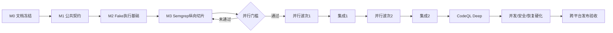

# V1 完整开发计划

## 1. 目标

从当前代码骨架交付一个可以在 macOS ARM64 完整运行 Quick/Standard/Deep，并在 Ubuntu 22.04 x86_64 自动构建和验收的 Java 代码审计介质。开发由冻结文档驱动；先串行建立共享骨架和一个纵向闭环，达到门槛后才使用 Git worktree 并行。

## 2. 全程路线



## 3. 里程碑

### M0：规范冻结（串行）

交付：

- `docs/v1/` 全部规范；
- 本地工具包、文件持久化和跨平台 ADR；
- README、SECURITY、CONTRIBUTING 与冻结范围一致；
- Quick/Standard/Deep YAML 与 V1 一致；
- 开发总目标和验收项可直接引用。

退出条件：文档链接/术语/扫描器列表一致，JDK 17 `mvn clean verify` 通过，文档 PR 可审阅。

### M1：公共领域与 Schema（串行）

任务：

- 重构 Maven 多模块：`source-intake`、`scanner-spi`、`scanner-adapters`、`local-process-runner`、`file-storage`、`report-service`；
- ScanJob/EngineTask 状态机；
- Profile YAML 加载、Schema 和 DAG 验证；
- Finding/Location/Evidence/Component/DataFlow/Coverage 模型；
- JSON Report、Job、Manifest、Coverage Schema；
- Error Code 和 API DTO；
- 原子文件写入与单实例锁接口；
- 时钟、ID、文件系统等测试替身接口。

退出条件：公共接口通过架构评审；状态机、Schema和DAG单测完成；之后分支不能自行修改公共协议。

### M2：Fake Scanner 执行基础（串行）

任务：

- `ExecutionBackend` 和 `LocalProcessExecutionBackend`；
- stdout/stderr并发排空、有界日志；
- 超时、取消、进程树清理；
- EngineTask许可生命周期；
- Fake 可执行程序/脚本：success、finding、failure、timeout、large-output、spawn-child、invalid-report；
- Scanner Adapter test kit；
- 任务目录、原始产物和恢复骨架；
- 健康检查和工具探测接口。

退出条件：所有异常路径无线程/许可/子进程泄漏；不需要真实第三方工具即可验证执行链。

### M3：Semgrep 纵向切片（串行）

必须跑通：

```text
ZIP上传
→ 安全解压
→ 单一Maven根预检
→ 创建任务/DAG
→ 本地Semgrep
→ 保存原始JSON
→ 归一化Finding
→ 代码片段和脱敏
→ HTML/JSON/SARIF
→ 下载归档
→ 删除成功工作区
```

同时完成：

- macOS ARM64 Semgrep工具包；
- Linux x86_64工具包和CI冒烟；
- 工具 manifest、SHA256、版本/许可证记录；
- Parser Golden Fixture；
- 一个 clean 和一个 vulnerable Java Fixture；
- API E2E。

### 并行门槛 G1

只有以下全部满足才创建多个 worktree：

- Scanner Adapter接口冻结；
- ExecutionSpec/Result冻结；
- Finding、Evidence、Coverage和Report Schema冻结；
- Job/Engine状态机冻结；
- 目录和原子写入约定冻结；
- Profile配置是唯一引擎来源；
- Fake Scanner覆盖成功/失败/超时/大输出/子进程/坏报告；
- Semgrep纵向切片在Mac和Linux CI通过；
- 根POM和共享模块不再频繁变化。

若未通过，继续串行修骨架。提前并行只会把同一接口冲突复制到多个 worktree。

### 并行波次1

#### Track A：执行与并发

- ScanJob有界队列；
- DAG就绪调度；
- 公平轮转；
- 全局/任务/权重/工具许可；
- 429、取消、优雅停机；
- Maven Process Adapter和构建状态；
- 恢复运行中任务为 INTERRUPTED。

#### Track B：Finding、存储与报告

- 完整Finding模型；
- 严重性映射、规则族和指纹；
- 跨引擎去重；
- suppression/path exclusions；
- 代码片段和统一脱敏；
- HTML/JSON/SARIF、manifest、coverage、archive；
- 保留和清理。

#### Track C：Quick扫描器

- Gitleaks；
- PMD；
- PMD CPD；
- Checkstyle；
- Trivy Repository；
- 工具健康、manifest、Golden Fixture和Mac/Linux冒烟。

### 集成关卡 I1

- 三个Track合入 `codex/v1-integration`；
- Quick全量真实E2E；
- 20任务并发调度测试；
- 报告统计一致性；
- ZIP安全和磁盘阈值；
- JDK17全仓 `mvn clean verify`；
- Mac介质Quick验收；
- Linux CI Quick验收。

I1失败先集中修复，不继续扩展Standard。

### 并行波次2

#### Track D：字节码与 Maven治理

- Maven预检和单一Reactor识别；
- system Maven/JDK17健康；
- SpotBugs + FindSecBugs共享执行；
- Maven Dependency Analysis；
- Maven Enforcer；
- 构建失败后的依赖跳过和部分报告。

#### Track E：供应链

- Dependency-Check；
- OSV-Scanner；
- CycloneDX；
- Trivy Artifact；
- 漏洞数据库更新/锁/原子切换；
- 组件/PURL/CVE去重；
- SBOM与Finding统计隔离。

#### Track F：输入与质量硬化

- SVN匿名/临时凭据/revision；
- 多Maven根错误；
- ZIP bomb/symlink/path traversal；
- restart recovery；
- cleanup/retention；
- API错误模型和下载安全；
- 中英文规则模板验收集。

### 集成关卡 I2

- Standard真实E2E：单模块、多模块、构建失败、依赖漏洞；
- Quick在Maven失败时仍完整；
- 引擎失败产生 `COMPLETED_WITH_ERRORS`；
- SBOM组件不进入问题总数；
- Mac Standard介质验收；
- Linux日常CI Standard验收；
- 并发/取消/超时/恢复回归通过。

### M4：CodeQL Deep（先串行接骨架，可独立实现适配器）

任务：

- 本地CodeQL安装发现、版本/查询包兼容检查；
- 使用资格策略和明确错误；
- Java数据库创建、构建提取和 analyze；
- Source/Sink/path SARIF解析；
- 资源 `--ram/--threads` 和单并发；
- CodeQL DB临时目录和清理；
- Mac ARM64真实开源Fixture Deep；
- Linux发布/手工工作流真实Deep；
- 与Semgrep/FindSecBugs的SQL注入去重样例。

退出条件：Mac三个档位全真测；Linux发布工作流Deep真测；CodeQL缺失时Deep明确不可用且其他档位正常。

### M5：系统硬化

- 20任务/高容量配置并发测试；
- 公平性、资源权重和工具信号量；
- 子进程/线程/文件句柄泄漏；
- 磁盘低水位和自动清理；
- 服务强制终止后的恢复；
- 日志和归档canary secret扫描；
- Parser fuzz/坏输入；
- 报告Schema/哈希/不可变性；
- 小/中/大项目性能基线。

### M6：跨平台介质与发布

- Mac/Linux启动、停止、status和acceptance脚本；
- 外部YAML和环境变量覆盖；
- systemd示例；
- 两个平台只包含本平台工具；
- 工具包锁定校验、介质完整性和许可证清单；
- Linux日常/发布两级CI；
- macOS ARM64最终Quick/Standard/Deep；
- Ubuntu 22.04 x86_64自动验收；
- 实际Linux服务器验收脚本（非阻塞）。

## 4. 合并顺序

```text
公共协议
→ 执行与并发
→ 存储与报告
→ Quick扫描器
→ Maven/字节码
→ 供应链
→ SVN/安全/恢复
→ CodeQL
→ 发布与全量验收
```

每次集成后先修红灯再开始下一波。不得在多个分支分别“临时修”公共接口。

## 5. 每项工作完成标准

- 实现和文档一致；
- 单元测试；
- 适用时Golden Fixture；
- Fake Process异常测试；
- 至少一个真实工具冒烟；
- 错误/部分/无问题三种结果可区分；
- 原始证据和覆盖可下载；
- 没有明文凭据；
- 没有进程、线程、文件句柄和许可泄漏；
- JDK17 `mvn verify`通过；
- 合入集成分支后相关E2E通过。

## 6. 进度记录

执行总目标后，本文件增加里程碑状态表，只允许：`PENDING`、`IN_PROGRESS`、`BLOCKED`、`DONE`。完成必须链接到提交、测试证据或发布产物；不能仅凭“代码已写”标记完成。

| 里程碑 | 状态 | 提交/证据 |
| --- | --- | --- |
| M0 规范冻结 | DONE | `docs/v1/` 冻结文档和 Accepted ADR |
| M1 公共领域与 Schema | DONE | `78ce4ce`，Finding/Job/Plan/Schema 契约测试 |
| M2 Fake 执行基础 | DONE | `e7ac0b4`，进程树、大日志、超时/取消测试 |
| M3 Semgrep 纵向切片 | DONE | `7a25dc7`，后续扩展为 Quick 六引擎 `a4c6a54` |
| G1 并行门槛 | DONE | 公共契约冻结后使用 worktree 完成 execution/reporting/scanners 三轨，各轨独立 verify |
| M4 Standard/Deep | DONE | Standard `b4d5919`，CodeQL `0a47866`，完整集成 `7bfc291` |
| M5 系统硬化 | DONE | 报告/数据库/恢复/介质硬化 `c80f404`…`ccf5623`，194 tests 零失败 |
| M6 跨平台介质与发布 | DONE | [验收证据索引](acceptance-evidence.md)，Mac 三档、Linux Standard/Deep 真实 E2E |

## 7. 需要再次请求用户决策的条件

- 改变冻结产品范围；
- 工具许可证阻止预期使用或分发；
- JDK17下没有合理替代；
- 需要数据库、容器或独立服务；
- 修改报告统计口径；
- 威胁模型从可信项目变为不可信上传；
- 两个硬性验收标准不可同时满足。

普通实现选择、Parser差异、测试失败和性能调参不需要暂停询问。
