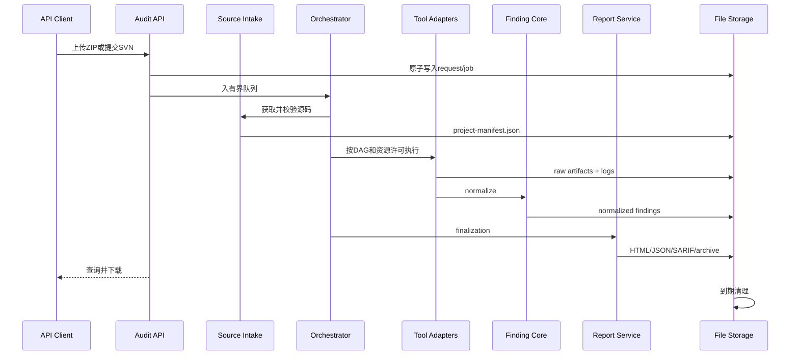

# 扫描生命周期

## 1. 端到端流程



## 2. 阶段定义

### 2.1 请求接收

1. 校验 Profile、Maven Profile/属性和上传元数据；
2. 检查任务队列容量和磁盘最低水位；
3. 生成不可猜测的 `scanId`；
4. 创建任务目录和 `job.json.tmp`；
5. 原子改名为 `job.json`；
6. ZIP 以流方式写入暂存文件并校验1 GB上限；
7. 任务进入 `QUEUED`。

队列满返回 HTTP 429；磁盘不足返回 HTTP 507。失败请求不得残留可被恢复为任务的半成品 `job.json`。

### 2.2 源码获取

ZIP：

- 逐条规范化路径；
- 拒绝绝对路径、`..` 逃逸、设备文件和危险符号链接；
- 边解压边统计文件数、展开大小、单文件大小和压缩比；
- 超限立即停止并清理已展开内容；
- 成功后删除原始 ZIP。

SVN：

- 仅允许 `http`、`https`、`svn`；
- 使用 `HEAD` 或请求指定 revision；
- 用户名/密码只存在于内存中的 `SourceCredential`；
- 日志中的 URL 用户信息必须脱敏；
- 检出完成后记录最终 revision 并清除凭据引用；
- V1 不获取历史 revision 内容。

### 2.3 项目预检

预检生成 `project-manifest.json`：

```json
{
  "root": ".",
  "rootPom": "pom.xml",
  "javaVersion": "17",
  "packaging": "pom",
  "modules": ["module-a", "module-b"],
  "sourceRevision": "svn:1234",
  "eligibleProfiles": ["QUICK", "STANDARD", "DEEP"],
  "warnings": []
}
```

识别规则：

- 恰好一个顶层 Maven Reactor 根；
- `<modules>` 引用的子 POM 属于该 Reactor，不算独立根；
- 发现多个互不隶属的候选根时任务 `FAILED`，错误返回候选相对路径；
- 用户需重新打包单个项目或提交更具体的 SVN URL；
- 检查 Maven Compiler、properties、toolchains 等是否要求 Java 17；
- V1 不自动改写目标项目 Java 版本。

### 2.4 计划生成

根据 Profile 配置、项目能力、工具健康和 CodeQL 策略生成不可变 `scan-plan.json`。每个 EngineTask 写明：

- ID、适配器和工具版本；
- 前置任务；
- 输入路径；
- 资源等级、权重和工具信号量；
- 超时；
- 预期产物；
- 失败传播规则；
- 跳过条件。

Deep 缺少 CodeQL 时预检失败，不能改成 Standard。Standard 构建后失败时，源码类引擎继续，依赖字节码的下游标记 `SKIPPED_DEPENDENCY_FAILED`。

### 2.5 Maven 构建

默认参数数组：

```text
mvn
--batch-mode
--no-transfer-progress
-DskipTests
[validated -P profiles]
[validated -D properties]
package
```

- 不使用 Shell；
- V1 不自动使用 `mvnw`；
- Maven Goal 固定为 `package`；
- `settings.xml` 由服务器外部配置；
- API 不能提供任意 settings 路径或额外 goal；
- Maven 进程使用 JDK 17；
- 即使跳过测试，构建插件仍可能执行代码；
- 保存构建日志、最终参数（敏感值脱敏）、版本、模块成功率和产物清单。

### 2.6 引擎执行

一个 EngineTask 的原子步骤：

1. 等待 DAG 前置完成；
2. 等待全局、任务内、权重和工具专属许可；
3. 将状态原子更新为 `RUNNING`；
4. 准备只属于本任务的输出目录；
5. 启动进程并并发读取 stdout/stderr；
6. 处理取消或超时，终止整个进程树；
7. 校验退出码和预期产物；
8. 保存原始产物；
9. 归一化并写入 Finding；
10. 更新局部统计；
11. 释放全部许可。

许可释放必须放在 `finally` 路径，并通过失败、超时和 Parser 异常测试证明。

### 2.7 最终化

所有 EngineTask 进入终态后：

1. 汇总原始命中；
2. 应用规则族和严重性映射；
3. 计算稳定指纹；
4. 跨引擎去重并保留全部证据；
5. 应用路径排除和规则抑制；
6. 从源码提取有限代码片段并统一脱敏；
7. 计算唯一问题、严重性、12类问题、引擎、模块和覆盖统计；
8. 生成 HTML、JSON、SARIF、coverage、manifest 和下载包；
9. 将报告目录标记为不可变；
10. 删除成功任务的源码、target、CodeQL DB 和临时文件；
11. 任务进入 `COMPLETED` 或 `COMPLETED_WITH_ERRORS`。

报告生成失败不删除原始结果；任务保持可诊断状态并允许重试“只生成报告”，但不重新执行扫描器。

## 3. 取消

- `QUEUED`：从队列移除并标记 `CANCELLED`；
- 源码获取/解压：设置取消标志，停止流并清理暂存文件；
- `RUNNING`：停止调度新引擎，通知运行引擎，宽限期后强制终止进程树；
- `FINALIZING`：允许完成已开始的原子文件写入，再停止后续步骤；
- 终态任务取消返回幂等结果，不改变终态。

取消不能直接删除任务；删除是独立 API，运行任务必须先取消并等待全部子进程退出。

## 4. 重启恢复

启动扫描本地 `data/jobs/*/job.json`：

| 重启前状态 | 恢复行为 |
| --- | --- |
| QUEUED | 校验输入仍存在后重新入队 |
| ACQUIRING_SOURCE（匿名/ZIP） | 标记 `INTERRUPTED`；V1 不自动猜测断点 |
| ACQUIRING_SOURCE（有凭据SVN） | 标记 `SOURCE_CREDENTIALS_EXPIRED`/`INTERRUPTED`，要求重新提交 |
| PREFLIGHT/RUNNING/FINALIZING | 标记 `INTERRUPTED`，保留已有日志和原始结果 |
| COMPLETED/COMPLETED_WITH_ERRORS/FAILED/CANCELLED/INTERRUPTED | 只恢复为可查询终态 |

V1 不自动重跑已经执行一半的扫描器，防止产生重复或不可复现的外部副作用。

## 5. 停止与失败路径

- 源码不合法、容量超限、多个 Maven 根：整个任务 `FAILED`；
- 选定 Profile 所需工具在计划前缺失：请求/预检失败；
- Maven 构建失败：源码引擎保留，下游按依赖跳过，任务通常 `COMPLETED_WITH_ERRORS`；
- 单个独立引擎失败/超时：其他引擎继续；
- 漏洞数据库不存在：相关引擎失败，不报告零漏洞；
- 报告中必须显示每条失败链和未覆盖模块。

## 6. 清理

- 成功：报告完成后立即删源码、构建目录、CodeQL DB和临时文件；报告包等保留30天；
- 失败/取消/超时：工作区保留24小时，日志和已有结果保留7天；
- 服务启动和每小时执行到期清理；
- 低于50 GB时，拒绝新任务并优先清理最早终态任务；
- 永不自动清理运行中的任务；
- 手工删除必须留下最小审计日志，但不保留源码或 Finding 内容。
