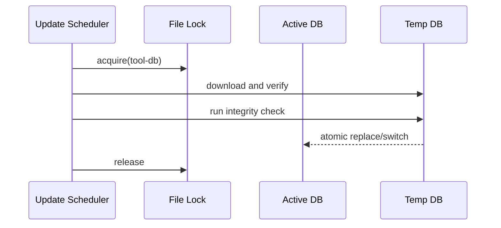

# 跨平台工具包与介质规范

## 1. 结论

核心 JAR、规则、配置、Schema 和 Java 工具尽量跨平台复用；原生工具按 `darwin-arm64` 与 `linux-x86_64` 分开。JDK 17 和 Maven 3.9+ 由机器预先安装，不进入介质。

```text
repository
├── app/                         # 构建输出，不提交
├── bin/                         # 启动、停止、健康和验收脚本
├── config/                      # 公共配置
├── tools/
│   ├── manifest/                # 版本、SHA256、来源、许可，提交
│   ├── downloads/tool-pack/     # 脚本组装的介质输入，gitignored
│   │   ├── common/              # SpotBugs/FindSecBugs 等公共 Java 工具
│   │   ├── darwin-arm64/        # Mac ARM64 原生工具
│   │   └── linux-x86_64/        # Linux x86_64 原生工具
│   └── local/                   # CodeQL 本机安装，gitignored，不进入公共介质
└── data/                        # 运行数据，gitignored
```

最终发布：

```text
java-code-audit-platform-v1-darwin-arm64.zip
java-code-audit-platform-v1-linux-x86_64.zip
```

两个包的 JAR、配置、规则和报告协议完全一致；只携带目标平台需要的原生文件。

## 2. 工具分发分类

| 类别 | 内容 | 仓库策略 | 运行时策略 |
| --- | --- | --- | --- |
| 系统前置 | JDK 17、Maven 3.9+ | 不提交 | 启动时严格检查 |
| 公共 Java 工具 | SpotBugs、FindSecBugs、PMD、Checkstyle、Dependency-Check | 许可复核后由脚本下载官方发布并校验 SHA256 | 组装进发布包；本地缓存不提交 |
| 平台原生工具 | Gitleaks、Trivy、OSV-Scanner、Semgrep运行包 | 许可复核后由脚本按平台下载并校验 SHA256 | 只装载当前 OS/CPU 目录 |
| Maven 插件 | Dependency Plugin、Enforcer、CycloneDX及必要插件 | 版本坐标进入清单；是否离线缓存由介质组装实现 | 联网解析到受控 Maven 缓存 |
| CodeQL | CLI/Bundle | **不提交、不再分发**；仅保存版本约束和安装说明 | 用户从官方源下载安装到 `tools/local/codeql` |
| 规则/查询 | Semgrep rules、Checkstyle/PMD rules、CodeQL query packs | 按各自许可提交并锁定 commit/version | 报告记录规则版本 |
| 动态数据 | NVD、Trivy DB、Java DB、OSV缓存 | 不提交，进入 `.gitignore` | 启动检查；运维脚本受控更新和原子切换 |
| 运行缓存 | `.m2`、CodeQL DB、任务工作区和报告 | 不提交 | 保存到 `data/` 并按保留策略清理 |

## 3. 平台复用矩阵

| 内容 | Mac/Linux 是否直接共用 | 说明 |
| --- | --- | --- |
| Spring Boot JAR | 是 | 同一构建产物，Java 17 class major 61 |
| YAML、规则、Schema、模板 | 是 | 注意路径统一使用 `/` 语义并由 Java Path 解析 |
| SpotBugs/FindSecBugs/PMD/Checkstyle/Dependency-Check | 通常是 | Java 运行；最终版本必须在两端真测 |
| Maven 插件坐标 | 是 | 下载缓存各平台分开，不搬运 `.m2` |
| CycloneDX SBOM Schema | 是 | 输出协议相同 |
| Semgrep CLI运行包 | 否 | Mac ARM64 与 manylinux x86_64 分开；需解决自包含 Python 运行时 |
| Gitleaks/Trivy/OSV-Scanner | 否 | 下载对应 OS/CPU 的官方资产 |
| CodeQL CLI/Bundle | 否 | Mac 与 Linux 分开安装；查询包版本必须与 CLI 兼容 |
| 漏洞数据库 | 视工具格式而定 | 优先独立下载；只有官方保证格式兼容时才复用 |
| 启动/服务脚本 | 部分 | 公共参数一致，Mac launch 脚本与 Linux systemd 文件分开 |

Mac 跑通不能自动证明 Linux 原生工具可用，因此 Linux CI 必须真实执行 Quick/Standard，发布工作流必须真实执行 Deep。

## 4. 工具清单

`tools-manifest.yaml` 是第三方工具的唯一版本事实源，至少包含：

```yaml
schemaVersion: 1
tools:
  - id: semgrep
    version: 0.0.0-pinned
    distribution: lfs
    parserSchemaVersion: 1
    license: LGPL-2.1-or-later
    platforms:
      darwin-arm64:
        path: tools/distributable/darwin-arm64/semgrep/bin/semgrep
        sha256: to-be-pinned
        sourceUrl: https://pypi.org/project/semgrep/
      linux-x86_64:
        path: tools/distributable/linux-x86_64/semgrep/bin/semgrep
        sha256: to-be-pinned
        sourceUrl: https://pypi.org/project/semgrep/
```

正式提交二进制前，清单必须具备：

- 精确版本，禁止 `latest`；
- 每个平台实际文件 SHA256；
- 官方来源 URL；
- SPDX 许可证或专用条款标识；
- 是否允许公共再分发的复核结果；
- Parser Schema 版本；
- `--version` 期望输出；
- 最低 JDK/Python/glibc 等运行条件；
- 对应 Golden Fixture 版本。

## 5. 版本选择流程

版本选择属于开发 M1 阶段，不直接采用“当日最新版本”：

1. 读取官方发布、系统要求和许可证；
2. 选择在 JDK 17、macOS ARM64、Ubuntu 22.04 x86_64 上可运行的候选；
3. 校验签名、checksum 或发布资产 SHA256；
4. 两个平台运行 `--version` 和最小真实扫描；
5. 保存原始输出作为 Parser Fixture；
6. 通过许可复核后才允许组装进发布包；
7. 锁定版本、校验值和解析协议；
8. 任何升级重复执行全部步骤。

截至文档冻结日，可从以下官方入口选择版本：

- [SpotBugs Releases](https://github.com/spotbugs/spotbugs/releases)
- [FindSecBugs Releases](https://github.com/find-sec-bugs/find-sec-bugs/releases)
- [Semgrep Releases / PyPI](https://pypi.org/project/semgrep/)
- [PMD Releases](https://github.com/pmd/pmd/releases)
- [Checkstyle Releases](https://github.com/checkstyle/checkstyle/releases)
- [OWASP Dependency-Check Releases](https://github.com/dependency-check/DependencyCheck/releases)
- [OSV-Scanner Releases](https://github.com/google/osv-scanner/releases)
- [Gitleaks Releases](https://github.com/gitleaks/gitleaks/releases)
- [Trivy Releases](https://github.com/aquasecurity/trivy/releases)
- [CycloneDX Maven Plugin](https://github.com/CycloneDX/cyclonedx-maven-plugin)
- [CodeQL CLI setup](https://docs.github.com/en/code-security/how-tos/find-and-fix-code-vulnerabilities/scan-from-the-command-line/set-up-codeql-cli)
- [CodeQL Terms](https://github.com/github/codeql-cli-binaries/blob/main/LICENSE.md)

## 6. CodeQL 本地安装

CodeQL 不是常驻服务。安装后由 Java 进程调用 CLI：

```text
tools/local/codeql-v2.26.2/
└── codeql/
    ├── codeql
    └── ...

tools/local/codeql-packs/codeql/java-queries/1.11.7/
├── qlpack.yml
└── codeql-suites/java-code-scanning.qls
```

规则：

- 路径由配置指定，V1默认 `tools/local/codeql-v2.26.2/codeql`（其下的 CLI 文件仍名为 `codeql`）；
- 目录被 `.gitignore` 排除；
- 启动时检查 CLI 和查询包版本兼容；
- 目标项目必须通过使用资格策略；
- 服务端必须同时设置 `AUDIT_CODEQL_ENABLED=true` 与
  `AUDIT_CODEQL_TERMS_ACCEPTED=true`；任一缺失时 Deep 健康状态返回明确 reason code，
  不影响 Quick/Standard；
- 未安装时 Quick/Standard 可用，Deep 显示不可用；
- Deep 请求不能静默退化；
- CodeQL 数据库只存在于任务工作区，报告完成后删除；
- Mac Apple Silicon 按官方要求具备 Xcode Command Line Tools 和 Rosetta 2。

## 7. 动态数据库更新



- 服务启动时检查可用性、版本和新鲜度，不在启动线程中下载；
- 管理员通过 `bin/update-vulnerability-data.sh` 或源码树中的
  `scripts/update-standard-vulnerability-data.sh` 按运维周期触发更新；
- 扫描继续读取上一份完整数据库；
- 更新失败保留旧数据并记录错误；
- 超过7天未成功更新，报告和健康接口显示陈旧警告；
- 从未有可用数据时依赖漏洞引擎失败，不能返回零漏洞；
- 更新进程和扫描进程不能同时写同一数据库目录。

## 8. 可复现组装和 `.gitignore`

仓库不提交第三方工具二进制，也不使用 Git LFS 承载这些大文件。
`scripts/build-*-pack.sh` 只从清单中的固定官方 URL 下载，校验官方包与最终入口 SHA256，
并把完整许可文件保留在本地工具包。`build-distribution.sh` 只接受完整的 Quick、Standard Analysis
和 Standard Supply 工具包，任一必需输入缺失即失败。

忽略范围至少包括：

```gitignore
/data/
/tools/local/
/tools/downloads/
/.m2/
```

工具升级必须同时修改 manifest、组装脚本、Golden Fixture 和两平台真实冒烟证据。

## 9. 启动健康检查

服务启动时输出并持久化一份健康快照：

- OS、CPU、glibc（Linux）；
- Java 版本必须为17；
- Maven 版本必须为3.9+，且 Maven 使用同一 JDK 17；
- 数据目录写权限、剩余磁盘、文件锁；
- 每个工具路径、SHA256、版本和可用状态；
- CodeQL 安装与策略状态；
- 漏洞数据库版本和更新时间；
- 当前可用档位。

JDK、Maven、数据目录或文件锁失败时拒绝启动；普通引擎缺失时服务以 `DEGRADED` 启动，但对应 Profile 请求在预检阶段明确失败。
